# Spring Boot Concepts — Interview Notes (This Project)

> Beginner-friendly, chapter-wise notes based on the **actual code in this repo**.
> Each chapter = one interview topic, with a diagram + short explanation + where it lives in this project.
> Diagrams use Mermaid — they render on GitHub, VS Code (with Mermaid extension), and most modern markdown viewers.

---

## Table of Contents — by Umbrella (click any chapter to jump to it)

Every chapter sits under ONE of these 8 umbrellas — knowing the umbrella tells you *why* a chapter exists and what comes conceptually before/after it, even though the numbering stays in the order the repo naturally builds up in (this tree is a navigation aid, not a re-ordering). Click any chapter name to jump straight to it.

<pre>
Spring Boot Concepts (this repo)
│
├── 🧭 ORIENTATION
│   └── <a href="#1-big-picture--how-a-request-flows">1. Big Picture — How a Request Flows</a>
│
├── 🏗️ CORE SPRING FUNDAMENTALS  (the container itself)
│   ├── <a href="#2-spring-boot-bootstrapping">2. Spring Boot Bootstrapping</a>
│   ├── <a href="#3-ioc-container--dependency-injection">3. IoC Container & Dependency Injection</a>
│   ├── <a href="#4-stereotype-annotations-component-service-repository-controller">4. Stereotype Annotations</a>
│   ├── <a href="#5-bean-lifecycle">5. Bean Lifecycle</a>
│   └── <a href="#6-java-based-configuration-configuration--bean">6. Java-Based Configuration (@Configuration + @Bean)</a>
│
├── 🌐 WEB LAYER  (talking to the outside world)
│   ├── <a href="#7-rest-controllers--request-mapping">7. REST Controllers & Request Mapping</a>
│   ├── <a href="#8-dtos-lombok--records">8. DTOs, Lombok & Records</a>
│   └── <a href="#11-file-upload-handling">11. File Upload Handling</a>
│
├── 🚨 CROSS-CUTTING CONCERNS  (wraps around every request)
│   ├── <a href="#9-centralized-exception-handling">9. Centralized Exception Handling</a>
│   └── <a href="#10-spring-security--stateful-vs-stateless">10. Spring Security — Stateful vs Stateless</a>
│
├── 📨 MESSAGING  (async, decoupled communication)
│   └── <a href="#12-spring-kafka-event-driven-messaging">12. Spring Kafka (Event-Driven Messaging)</a>
│
├── 🗄️ DATA LAYER
│   └── <a href="#14-jpa--orm-entities-exist-dependency-still-missing--build-currently-fails">14. JPA / ORM + PostgreSQL/CockroachDB Terminal Practice</a>
│
├── ⚙️ CONFIG, BUILD & TESTING
│   ├── <a href="#13-externalized-configuration-applicationproperties--value">13. Externalized Configuration (application.properties + @Value)</a>
│   ├── <a href="#15-testing">15. Testing</a>
│   └── <a href="#16-gradle-build-basics">16. Gradle Build Basics</a>
│
└── 🎯 INTERVIEW & SYSTEM-DESIGN BRIDGE  (read these last — they tie everything above together)
    ├── <a href="#17-interview-cheat-sheet">17. Interview Cheat Sheet</a>
    ├── <a href="#18-system-design-big-picture--how-it-all-connects">18. System Design Big Picture — How It All Connects</a>
    └── <a href="#19-oop--the-four-pillars-in-real-code">19. OOP — The Four Pillars, in Real Code</a>
</pre>

🧠 **Memorize this line:** *"Orientation first, then the container (Core Fundamentals), then how it talks to the outside world (Web Layer) and wraps every request (Cross-Cutting), then the two big I/O concerns (Messaging, Data), then Config/Build/Testing keeps it running — and the Interview & System-Design bridge at the end reframes everything above as 'why this matters at scale.'"*

*(Ordering logic checked against the standard recommended Spring learning path — Core/DI → Web/REST → Data/JPA → Security → Messaging → Testing/Build — [Spring Boot Roadmap 2026, Scaler](https://www.scaler.com/blog/spring-boot-roadmap-2026-step-by-step-learning-path/); [Spring Boot & Microservices Roadmap 2026, JavaGuides](https://www.javaguides.net/2025/12/spring-boot-microservices-roadmap-2026.html).)*

---

## 1. Big Picture — How a Request Flows

Layman explanation: A request from Postman/browser doesn't hit your method directly. Spring's front gate (`DispatcherServlet`) catches it, finds the right controller, and hands it over. Your controller talks to services, services talk to Kafka/DB/other beans, and the response bubbles back up. If anything throws an error, it gets caught centrally instead of crashing the app.

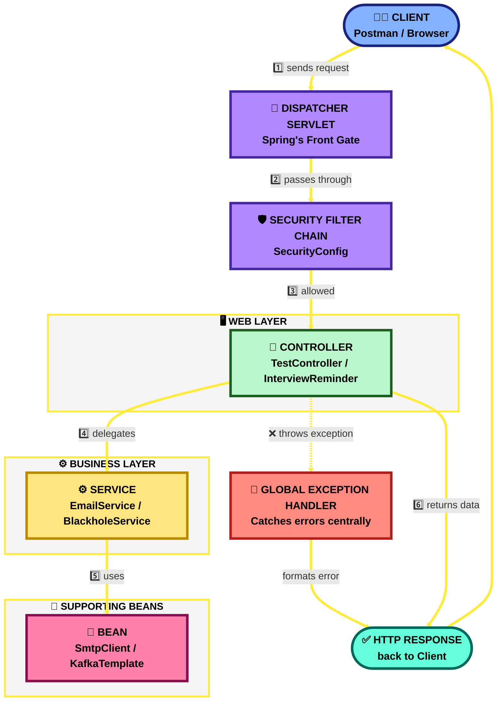

**Why it matters:** Interviewers love asking "what happens when a request hits your app?" — this diagram is your answer.

🏗️ **System Design Angle:** This is the "layered architecture" pattern (Web → Business → Data) that every large system uses to separate concerns. In a real system design interview, the `DispatcherServlet` slot is where you'd draw an **API Gateway / Load Balancer** sitting in front of many identical app instances — the request-flow shape doesn't change, it just repeats N times behind the gateway.

---

## 2. Spring Boot Bootstrapping

**Where in code:** `MicroserviceApplication.java` — `@SpringBootApplication` + an explicit `@ComponentScan(basePackages = {"com.gradle.microservice", "com.gradle.stateless"})`, `SpringApplication.run(...)` in `main`.

Layman explanation:
- `@SpringBootApplication` is 3 annotations glued together:
  - `@Configuration` — this class can define beans.
  - `@EnableAutoConfiguration` — Spring guesses sensible defaults (starts Tomcat, sets up JSON conversion, etc.) based on jars on the classpath.
  - `@ComponentScan` — scans the current package (and sub-packages) for `@Component`/`@Service`/`@RestController` classes to register as beans.
- This project **overrides** the scan with an explicit `@ComponentScan(basePackages = {...})` — notice `com.gradle.stateful` is **not** listed, so `SessionAuthController` only works if it's picked up some other way (a common real bug to explain in interviews: "components outside the scanned packages are silently ignored").

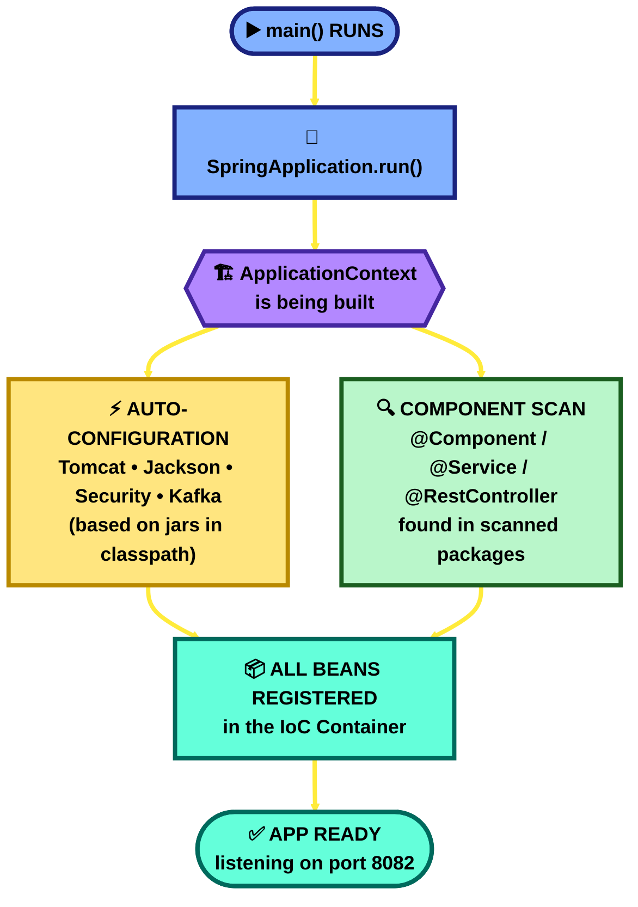

**Interview one-liner:** *"`@SpringBootApplication` = `@Configuration` + `@EnableAutoConfiguration` + `@ComponentScan`."*

🏗️ **System Design Angle:** Auto-configuration + convention-over-configuration is what makes it possible to spin up many **identical, disposable service instances** quickly (think: a Kubernetes Deployment scaling pods 1→10) — every instance boots into the exact same state with zero manual setup. That predictability is a prerequisite for horizontal scaling.

---

## 3. IoC Container & Dependency Injection

**Files:** `TestController.java`, `EmailService.java`, `SmtpClient.java`, `BeanLifecycle.java`

Layman explanation: Normally in Java, you write `new EmailService()` yourself. In Spring, you **don't** — you just declare "I need an EmailService" and Spring hands you a ready-made object. Spring is doing the "new-ing" for you, behind the scenes, in a big object warehouse called the **IoC Container** (Inversion of Control — control over object creation is inverted, from you to the framework).

**Where in code:** `TestController.java` — `@Autowired EmailService emailService;` and `@Autowired SmtpClient smtpClient;` (field injection); `BlackholeService.java` — constructor injection of `KafkaTemplate` (preferred style).

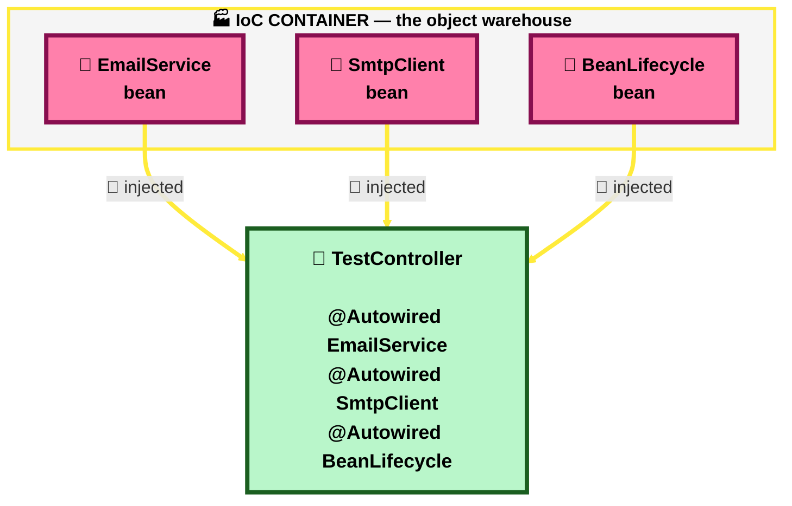

**Two ways to inject (both used in this project):**
| Style | Example in repo | Pros/Cons |
|---|---|---|
| Field injection | `@Autowired EmailService emailService;` in `TestController` | Quick to write, but hard to unit-test / hides required dependencies |
| Constructor injection | `BlackholeService(KafkaTemplate<String,Object> kafkaTemplate)` | **Preferred in real projects** — dependency is final, testable, no reflection needed |

**Interview one-liner:** *"DI means objects don't create their own dependencies — the container creates and hands them over. It enables loose coupling and easy testing/mocking."*

🏗️ **System Design Angle:** Loose coupling via DI is exactly what lets you swap `EmailService` for a different provider, or swap an in-memory `SmtpClient` for a real SMTP/SES client, **without touching any class that depends on it**. At system-design scale, this is the same principle behind swapping a monolith's in-process call for a network call to a microservice, or swapping a database vendor behind a repository interface — the caller never needs to know.

---

## 4. Stereotype Annotations (`@Component`, `@Service`, `@Repository`, `@Controller`)

Layman explanation: These are all "please register me as a bean" labels. They're functionally almost identical — Spring treats them the same way under the hood — but they **communicate intent** to other developers (and some tools add extra behavior, e.g. `@Repository` auto-translates DB exceptions).

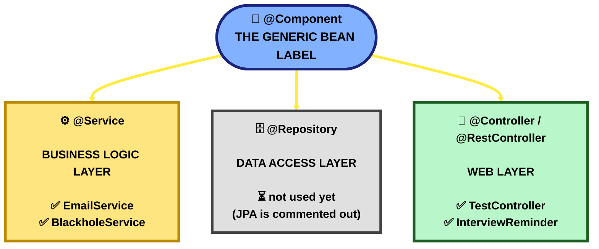

| Annotation | Used where in this repo |
|---|---|
| `@Component` | `EmailService`, `BeanLifecycle`, `JwtUtil` |
| `@Service` | `BlackholeService` |
| `@RestController` | `TestController`, `InterviewReminder`, `SolarController`, `FileUploadController`, `SessionAuthController`, `JwtAuthController` |
| `@Repository` | none yet (would appear once JPA is enabled) |

**Interview one-liner:** *"`@Service`, `@Repository`, `@Controller` are all specializations of `@Component` — same mechanism, different layer semantics."*

🏗️ **System Design Angle:** This Controller → Service → Repository split **is** the classic 3-tier system design (presentation / business / data). Drawing this exact box diagram on a whiteboard, then saying "each tier can be scaled or replaced independently," is usually enough to satisfy the "how is your app structured?" system-design warm-up question.

---

## 5. Bean Lifecycle

**File:** `BeanLifecycle.java` — this file exists *specifically* to demonstrate this concept.

Layman explanation: A bean isn't just "created and forgotten." It goes through stages, like a human life cycle: born → grows up (gets its dependencies) → works → retires (cleanup). Spring gives you hooks at each stage.

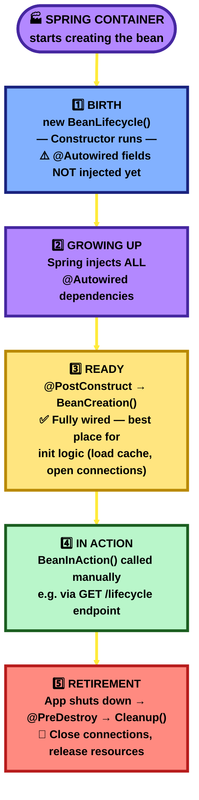

**Order:** Constructor → dependency injection → `@PostConstruct` → (bean is used) → `@PreDestroy` (on shutdown).

**Interview one-liner:** *"`@PostConstruct` runs once, right after dependency injection completes — use it for init logic. `@PreDestroy` runs right before the bean is destroyed — use it for cleanup like closing connections."*

🏗️ **System Design Angle:** `@PreDestroy` maps directly to **graceful shutdown** — the same mechanism that lets a pod finish in-flight requests, close DB/Kafka connections, and deregister from a load balancer before Kubernetes sends `SIGKILL`. Skipping this is a classic cause of dropped requests during deploys/rolling-restarts in real production systems.

---

## 6. Java-Based Configuration (`@Configuration` + `@Bean`)

**Files:** `AppConfig.java`, `KafkaConfig.java`, `SecurityConfig.java`

Layman explanation: Sometimes the object you need isn't your own class you can slap `@Component` on (e.g. it comes from a library like Kafka, or needs custom construction logic). For those, you write a **factory method** inside a `@Configuration` class, annotate it `@Bean`, and Spring calls that method once and stores the result in the container.

**Where in code:** `AppConfig.java` — `@Bean smtpClient()` manually constructing a `SmtpClient`. `KafkaConfig.java` / `SecurityConfig.java` — same pattern for Kafka factories and the `SecurityFilterChain`.

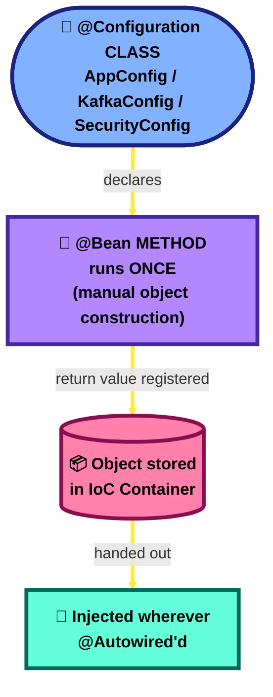

| Difference | `@Component` | `@Bean` |
|---|---|---|
| Where | On the class itself | On a method inside `@Configuration` |
| Used for | Your own classes | Third-party classes / custom construction logic |
| Example here | `EmailService` | `smtpClient()`, `kafkaTemplate()`, `securityFilterChain()` |

**Interview one-liner:** *"`@Component` marks a class you own; `@Bean` is a method that manually builds/returns an object you don't own (or need custom logic for) and registers it in the container."*

🏗️ **System Design Angle:** `@Bean` methods are exactly where you'd centralize construction of **shared infrastructure clients** — HTTP clients with connection pools, Kafka templates, cache clients — so that timeouts, retries, and circuit-breaker settings live in one place instead of being duplicated across every caller. This centralization is what makes resilience patterns (retry/circuit-breaker/timeout) manageable at scale.

---

## 7. REST Controllers & Request Mapping

**Files:** `InterviewReminder.java`, `SolarController.java`, `FileUploadController.java`

Layman explanation: `@RestController` = "this class handles web requests, and every method's return value goes straight into the HTTP response body as JSON" (no HTML views). `@RequestMapping` sets the base URL path; the HTTP-verb-specific annotations map methods to GET/POST/PUT/DELETE.

**Where in code:** `InterviewReminder.java` — `@RequestMapping("/interview")` with `@GetMapping`/`@GetMapping("/{id}")`/`@PostMapping`/`@PutMapping("/{id}")`/`@DeleteMapping("/{id}")`. `SolarController.java`, `FileUploadController.java` — same verb-mapping pattern.

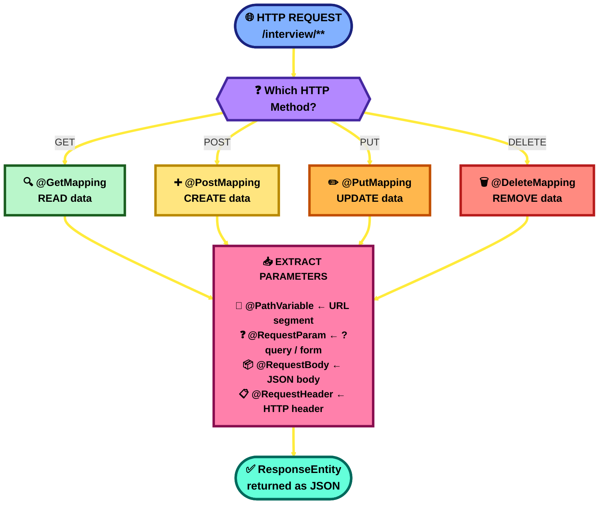

| Annotation | Pulls from | Example in repo |
|---|---|---|
| `@PathVariable` | URL segment | `getById(@PathVariable int id)` |
| `@RequestParam` | Query string / form field | `fileUpload(@RequestParam("file") MultipartFile file)` |
| `@RequestBody` | JSON request body | `create(@RequestBody Map<String,String> body)` |
| `@RequestHeader` | HTTP header | `profile(@RequestHeader("Authorization") String header)` |

This project stores data in a plain `HashMap`/`ConcurrentHashMap` (no database yet) — this is CRUD taught with in-memory storage, a good stepping stone before JPA.

**Interview one-liner:** *"`@RestController` = `@Controller` + `@ResponseBody` — every method's return value is serialized directly to the HTTP response (usually JSON), not rendered as an HTML view."*

🏗️ **System Design Angle:** GET/PUT/DELETE being **idempotent** (repeating them has the same effect) vs POST being **non-idempotent** is a real system-design concern: idempotent operations are safe to blindly retry after a network timeout, which is exactly what load balancers and clients do. Designing your API verbs correctly up front avoids duplicate-charge / duplicate-record bugs at scale.

📌 **Follow-up worth knowing:** `SolarController`'s `/api/solar/planets` endpoint here is exactly what `Springboot Lab`'s `EarthService` calls over HTTP — see `System Design.md` Q27 for what happens (today: nothing good) if this service is down while that one is still running, and how to fix it.

📌 **Also worth knowing:** `InterviewReminder.create()` above computes its ID as `store.size() + 1` — under concurrent requests, two threads can read the same size and collide on the same ID, silently overwriting one record instead of creating two. See `System Design.md` Q28 for the fix (the exact same bug also exists in `Springboot Lab`'s `WriteController.java`).

📌 **One more worth knowing:** `InterviewReminder.update()` blindly does `store.put(id, ...)` with no check on the existing value at all — a live "lost update" example, and since `store` is a plain (non-concurrent) `HashMap`, concurrent writes can even corrupt it structurally, not just lose one value. See `System Design.md` Q29 for the general fix (`@Version`/optimistic locking) and how it applies here.

---

## 8. DTOs, Lombok & Records

**Files:** `LightRequestDTO.java`, `LightResponseDTO.java`, `SmtpClient.java`

Layman explanation: A **DTO (Data Transfer Object)** is a plain object whose only job is to carry data between layers (e.g., JSON in a request → Java object). Writing getters/setters/constructors by hand is tedious — **Lombok** generates them for you at compile time via annotations.

**Where in code:** `LightRequestDTO.java` / `LightResponseDTO.java` — `@Data @NoArgsConstructor @AllArgsConstructor`. `SmtpClient.java` — a Java **record** (`public record SmtpClient(String host) {}`), a modern Lombok-free alternative; note the accessor is `host()`, not `getHost()` — a common gotcha.

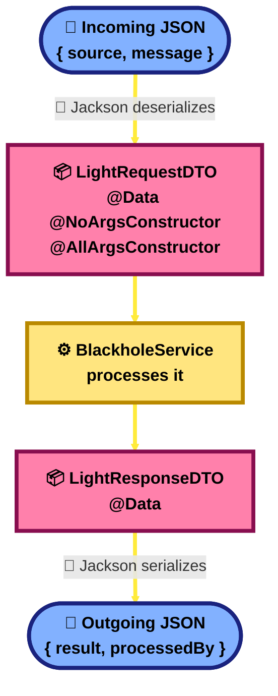

**Interview one-liner:** *"Lombok removes boilerplate via annotations processed at compile time; records (Java 16+) give you an immutable, boilerplate-free data class natively, with accessor methods named after the field, not `getX()`."*

🏗️ **System Design Angle:** DTOs decouple your **API contract** from your **internal domain model** — a system-design essential. It means you can refactor internal entities/database columns freely without breaking every client that calls your API; you only need to keep the DTO shape stable (or version it, e.g. `/v1/`, `/v2/`).

---

## 9. Centralized Exception Handling

**File:** `GlobalExceptionHandler.java`

Layman explanation: Instead of writing try/catch in every controller method, you write **one** class that catches specific exception types thrown *anywhere* in the app and converts them into a proper HTTP response with the right status code.

**Where in code:** `GlobalExceptionHandler.java` — `@RestControllerAdvice` with `@ExceptionHandler` methods for `IllegalArgumentException`/`MethodArgumentNotValidException` (400), `SecurityException` (401), `IllegalAccessException` (403), `RuntimeException` (404), `IllegalStateException` (409), and a catch-all `Exception` (500).

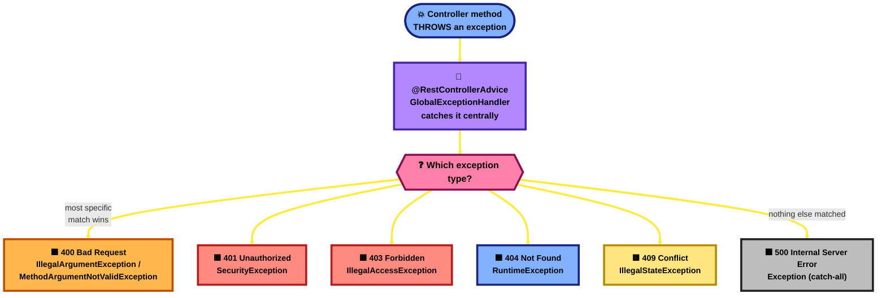

⚠️ **Real-world gotcha worth mentioning in interviews:** Spring matches the **most specific exception handler first**. Since `IllegalArgumentException`, `IllegalStateException` etc. are all subclasses of `RuntimeException`, and `RuntimeException` is a subclass of `Exception`, the ordering of specific-to-generic matters — Spring picks the closest match in the class hierarchy, not declaration order.

**Interview one-liner:** *"`@RestControllerAdvice` + `@ExceptionHandler` centralizes error handling across all controllers — no repeated try/catch, and consistent error response shape."*

🏗️ **System Design Angle:** A **consistent, predictable error contract** across every endpoint is what lets downstream systems (monitoring dashboards, alerting rules, client SDKs, other microservices) reliably detect and react to failures — this is the foundation of **observability** and fault-tolerant system design, not just a coding-style nicety.

---

## 10. Spring Security — Stateful vs Stateless

**Files:** `SecurityConfig.java`, `SessionAuthController.java` (stateful), `JwtAuthController.java` + `JwtUtil.java` (stateless)

This project deliberately implements **both** approaches side by side to compare them — a great interview topic.

### 10a. Current Security Config
**Where in code:** `SecurityConfig.java` — `@Bean securityFilterChain(HttpSecurity http)` with `csrf().disable()` and `authorizeHttpRequests(auth -> auth.anyRequest().permitAll())`. Every request currently passes through Spring Security's filter chain but is `permitAll()` — security is *scaffolded* but not yet *enforced*. Good to mention: "this is intentionally open for local testing; in production you'd restrict `authorizeHttpRequests`."

### 10b. Stateful (session-based) — `/stateful/**`
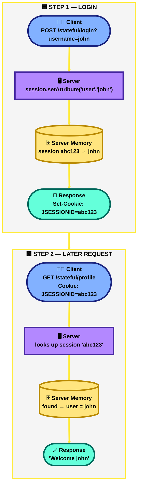
Server **remembers** you via a session stored in server memory, identified by a cookie. Simple, but doesn't scale well across multiple servers unless sessions are shared (e.g. via Redis).

### 10c. Stateless (JWT-based) — `/stateless/**`
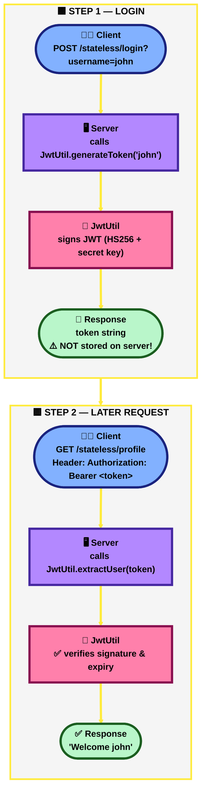
Server **remembers nothing**. The token itself carries the identity, cryptographically signed so it can't be tampered with. Any server instance can verify it independently — great for microservices/horizontal scaling.

| | Stateful (Session) | Stateless (JWT) |
|---|---|---|
| Server stores session? | Yes (in memory) | No |
| Scales horizontally? | Needs shared session store | Yes, naturally |
| Client holds | Cookie (`JSESSIONID`) | Token string (in `Authorization` header) |
| Revoke instantly? | Easy (delete session) | Hard (must wait for expiry or maintain a blacklist) |
| Used here for | `SessionAuthController` | `JwtAuthController` |

**Interview one-liner:** *"Session auth = server remembers you (stateful); JWT auth = the token itself proves who you are, server stays stateless — trading easy revocation for scalability."*

🏗️ **System Design Angle:** This is **the** classic system-design trade-off: **stateful vs stateless services**.
- Stateful (sessions) → needs **sticky sessions** at the load balancer *or* a shared session store (e.g. Redis) once you run more than one server instance. Adds an operational dependency.
- Stateless (JWT) → **any** server instance can handle **any** request — the textbook enabler of horizontal scaling behind a plain round-robin load balancer, and the default choice for microservices.
This exact comparison is a near-guaranteed system-design interview question: *"how would you handle authentication across multiple server instances?"*

---

## 11. File Upload Handling

**Where in code:** `FileUploadController.java` — `@PostMapping` with `@RequestParam("file") MultipartFile file`, storing into an in-memory `ConcurrentHashMap<String, FileUploadModel>` (not disk/DB).

Layman explanation: `MultipartFile` is Spring's abstraction over an uploaded file (form-data). You get the filename and raw bytes without manually parsing the HTTP multipart body. This demo keeps files in a `ConcurrentHashMap` (thread-safe in-memory map) instead of a real filesystem/DB — fine for a lab, not for production (restart = data lost).

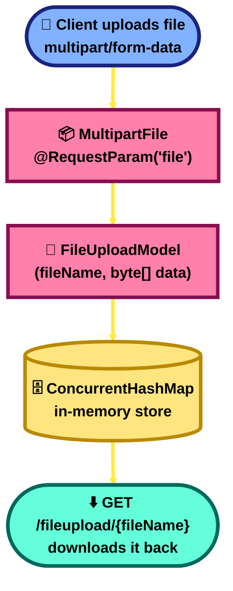

**Interview one-liner:** *"`MultipartFile` is Spring's wrapper for handling `multipart/form-data` uploads — gives you filename, content-type, and byte content directly."*

🏗️ **System Design Angle:** Storing uploaded files in an **in-memory `ConcurrentHashMap`** is exactly what you'd flag as a design flaw in a system-design interview: it doesn't survive a restart, doesn't scale past one server's RAM, and isn't shared across instances. The real-world fix — and a common interview follow-up — is to stream large files instead of loading them fully into memory, and store them in **object storage** (S3/Blob Storage) behind a **CDN**, keeping only metadata (filename, size, storage URL) in your database.

---

## 12. Spring Kafka (Event-Driven Messaging)

**Files:** `KafkaConfig.java`, `BlackholeService.java`

Layman explanation: Instead of one service calling another directly (tightly coupled, both must be up at the same time), a **producer** drops a message onto a named "topic," and any number of **consumers** listening to that topic pick it up whenever they're ready. This is asynchronous, decoupled communication.

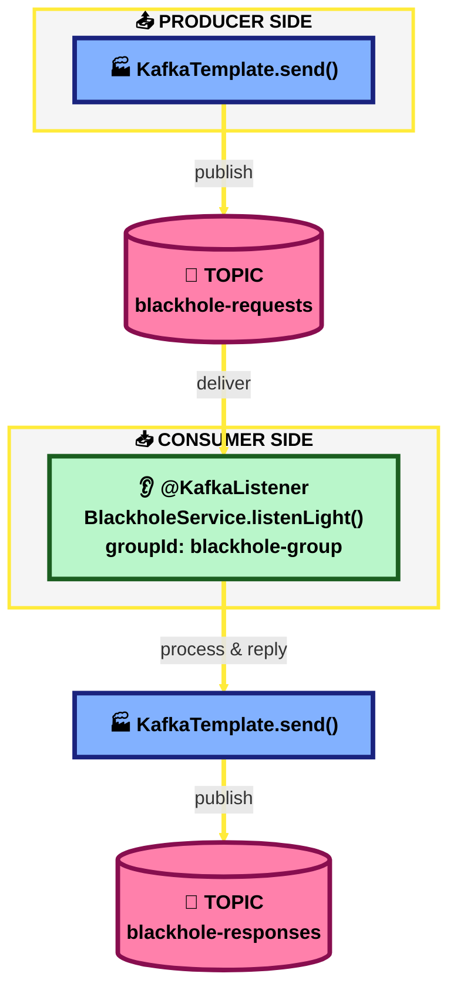

**Where in code:** `BlackholeService.java` — constructor-injected `KafkaTemplate<String, Object>`, `@KafkaListener(topics = "blackhole-requests", groupId = "blackhole-group")` on `listenLight()`, replying via `kafkaTemplate.send("blackhole-responses", response)`.

Key building blocks configured in `KafkaConfig.java`:
- `ProducerFactory` / `ConsumerFactory` — how to connect & (de)serialize messages.
- `KafkaTemplate` — the object you call `.send()` on to publish messages.
- `ConcurrentKafkaListenerContainerFactory` — powers `@KafkaListener` methods; note `setAutoStartup(kafkaAutoStartup)` is wired to `spring.kafka.listener.auto-startup=false` in properties, so **listeners are currently disabled** unless a broker is running.
- `groupId` — consumers sharing a group ID split the work of a topic between them (load balancing); this matters for scaling consumers.

**Interview one-liner:** *"Kafka decouples producers and consumers via topics — producers don't know or care who (or how many) consumers exist; `groupId` controls load-balancing across consumer instances."*

🏗️ **System Design Angle:** Message queues/event streams are how you design systems that survive traffic spikes and partial outages:
- **Decoupling** — the producer doesn't block waiting for the consumer; if `BlackholeService` is down, requests simply queue up in the topic instead of failing.
- **Back-pressure absorption** — a sudden burst of requests gets smoothed out instead of crashing the consumer.
- **Horizontal scaling of consumers** — add more consumer instances under the same `groupId` and Kafka automatically splits the topic's partitions between them.
This is the backbone of **event-driven microservice architecture** — a near-universal system design topic.

---

## 13. Externalized Configuration (`application.properties` + `@Value`)

**Where in code:** `application.properties` — `server.port`, `spring.kafka.bootstrap-servers`, `spring.kafka.listener.auto-startup`. `KafkaConfig.java` — `@Value("${spring.kafka.listener.auto-startup:true}")` (`:true` = inline default if the key is missing).

Layman explanation: Hard-coding values (ports, URLs, feature flags) inside Java means recompiling every time something changes. `application.properties` lets you change behavior **without touching code** — and `@Value` pulls a property into a field, with an optional `:defaultValue` fallback if the key is absent.

**Interview one-liner:** *"`@Value("${key:default}")` injects a config property, with a fallback default if not defined — enables environment-specific behavior (dev/test/prod) without code changes."*

🏗️ **System Design Angle:** Externalized config is Factor #3 of the **Twelve-Factor App** methodology — the same *build artifact* (JAR/container image) should run in dev, staging, and prod, differing only by environment variables/config, never by rebuilding code. At scale this is what a **Config Server** (e.g. Spring Cloud Config) or **Kubernetes ConfigMaps/Secrets** centralizes across dozens of microservice instances.

---

## 14. JPA / ORM (Entities Exist, Dependency Still Missing — Build Currently Fails)

**Files:** `BaseEntity.java` (`@MappedSuperclass`, audit timestamps), `ApiAudit.java` (`@Entity`), `WeatherData.java` (`@Entity`, Hibernate Envers `@Audited`), `HostelRepository.java`/`ApiAuditRepository.java`/`WeatherRepository.java` (all `extends JpaRepository`) — plus `Hostel.java`/`RoomFloor.java` (still commented-out stubs) and a **still-commented-out** `spring-boot-starter-data-jpa` in `build.gradle`.

⚠️ **This is no longer just a documentation note — it's a real, verified build failure.** Running `./gradlew compileJava` in this repo currently fails with **83 errors**. The JPA-related ones:
```
error: package jakarta.persistence does not exist          (BaseEntity, ApiAudit, WeatherData)
error: package org.springframework.data.jpa.repository does not exist   (HostelRepository, ApiAuditRepository, WeatherRepository)
error: package org.springframework.data.annotation does not exist       (BaseEntity — @CreatedDate/@LastModifiedDate)
error: package org.hibernate.envers does not exist                      (WeatherData — @Audited/@AuditTable)
```
Real, fully-annotated `@Entity` classes with Lombok and Hibernate Envers auditing were written (`ApiAudit`, `WeatherData` extending `BaseEntity`), and their repositories too — but `spring-boot-starter-data-jpa` (and a DB driver / `hibernate-envers`) were never added to `build.gradle` to back them. The same compile run also failed on unrelated missing dependencies added alongside these entities: `spring-boot-starter-webflux`/`reactor-netty` (for `WebClientConfig`/`WeatherService`'s `WebClient`), `spring-boot-starter-validation` (for `jakarta.validation` in `WeatherController`/`WeatherRequestDTO`), and `resilience4j-spring-boot3` (for `@CircuitBreaker`/`@RateLimiter`/`@Retry` in `WeatherService`). Separately, `HostelRepository extends JpaRepository<Hostel, Long>` would still be broken even with JPA enabled, since `Hostel` itself has its `@Entity` annotation commented out.

**Where in code:** `Hostel.java`/`RoomFloor.java` — still fully commented out, but a good *reference* for what a from-scratch JPA entity looks like before any dependency is wired: `@Entity`, `@Table(name=..., schema=...)`, `@Id @GeneratedValue`, `@OneToMany(mappedBy = "hostel")`.

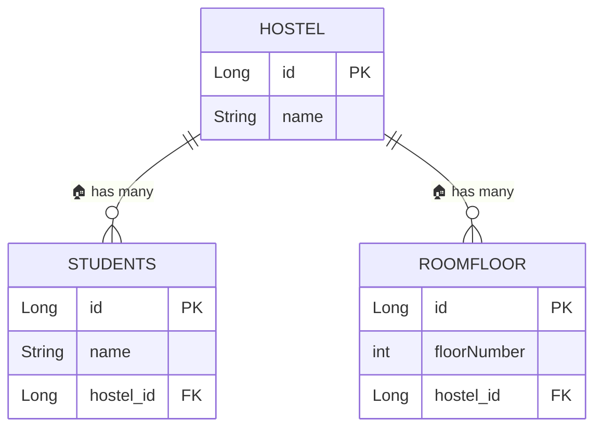

| Annotation | Meaning |
|---|---|
| `@Entity` | This class maps to a database table |
| `@Table(name=..., schema=...)` | Customize table/schema name |
| `@Id` | Marks the primary key field |
| `@GeneratedValue` | DB auto-generates the ID (e.g. auto-increment) |
| `@OneToMany(mappedBy=...)` | One row here relates to many rows in another table |

**Interview one-liner:** *"JPA/Hibernate maps Java objects to database rows (ORM). `@Entity` = table, `@Id` = primary key, `@OneToMany`/`@ManyToOne` describe relationships — `mappedBy` says which side owns the foreign key."*

🏗️ **System Design Angle:** This is where **database design** enters the picture — a huge system-design topic on its own: choosing primary/foreign keys, indexing for query performance, and being alert to the classic ORM pitfall, the **N+1 query problem** (fetching a `Hostel` then lazily triggering one extra query *per* student instead of one JOIN). At scale, this single mistake is a common cause of database overload.

### 14.1 Practising against both real databases from the terminal

**Where in code:** `scripts/db-shell.ps1` is the safe terminal launcher. It reads machine-specific passwords and cloud connection details from Windows environment variables; it never stores or prints a password. On this original PC it can also discover the sibling Maven workspace's cloud settings for backward compatibility, but a new machine should use the portable environment-variable setup below. The Maven workspace remains read-only.

This machine has two PostgreSQL-wire-compatible databases:

| Target | Actual database engine | Location | Verified contents on 29 Aug 2026 |
|---|---|---|---|
| `local` | PostgreSQL 18 | `localhost:5432`, database `postgres` | 14 user tables across `public`, `hostel`, `master`, and `transaction` |
| `cloud` | CockroachDB Cloud v26.2.5 | hosted cluster, database `defaultdb` | `public.customer` and `public.product` |

CockroachDB is **not PostgreSQL internally**, but it speaks PostgreSQL's wire protocol. That is why the same `psql` client and PostgreSQL JDBC driver can connect to both. Most everyday SQL/JPA practice transfers, while some PostgreSQL-specific extensions, locking details, transaction-retry behaviour, and administration commands differ.

From PowerShell in this workspace:

```powershell
# Verify identity/version without opening an interactive session
.\scripts\db-shell.ps1 local -Check
.\scripts\db-shell.ps1 cloud -Check

# Inspect tables without changing data
.\scripts\db-shell.ps1 local -ListTables
.\scripts\db-shell.ps1 cloud -ListTables

# Open an interactive SQL shell
.\scripts\db-shell.ps1 local
.\scripts\db-shell.ps1 cloud
```

From Command Prompt (`cmd.exe`), call the same PowerShell launcher:

```bat
powershell -NoProfile -ExecutionPolicy Bypass -File scripts\db-shell.ps1 local
powershell -NoProfile -ExecutionPolicy Bypass -File scripts\db-shell.ps1 cloud
```

#### One-time setup on Windows (Command Prompt — recommended)

`setx` saves a user-level variable for future CMD, PowerShell, IDE, and coding-agent sessions. Run these commands once, substituting the real values locally. Do **not** paste the completed commands into Git, chat, screenshots, or documentation:

```bat
setx DB_LOCAL_PASSWORD "your-local-postgres-password"
setx DB_CLOUD_URL "jdbc:postgresql://your-cluster-host:26257/defaultdb?sslmode=verify-full"
setx DB_CLOUD_USERNAME "your-cloud-username"
setx DB_CLOUD_PASSWORD "your-cloud-password"
setx DB_CLOUD_ROOT_CERT "C:\path\to\root.crt"
setx JWT_SECRET "generate-a-long-random-secret-for-this-machine"
```

Close and reopen CMD after `setx`; existing terminals do not receive newly saved variables. Check only whether variables exist—do not print secret values:

```bat
if defined DB_LOCAL_PASSWORD (echo local DB password is configured) else (echo missing DB_LOCAL_PASSWORD)
if defined DB_CLOUD_PASSWORD (echo cloud DB password is configured) else (echo missing DB_CLOUD_PASSWORD)
powershell -NoProfile -ExecutionPolicy Bypass -File scripts\db-shell.ps1 local -Check
powershell -NoProfile -ExecutionPolicy Bypass -File scripts\db-shell.ps1 cloud -Check
```

PowerShell can save the same variables with `[Environment]::SetEnvironmentVariable('NAME', 'value', 'User')`. Open a new terminal afterward. `$env:NAME = 'value'` affects only the current PowerShell process and is useful for a temporary session.

#### Reproducing the workspace on another computer

1. Clone the GitHub repository; MEGA syncing is optional and is not the source of truth for Git history.
2. Install JDK 17 and PostgreSQL command-line tools (`psql`). The launcher auto-detects `psql` on PATH or under `C:\Program Files\PostgreSQL\*\bin`.
3. Download/copy the CockroachDB CA certificate to a machine-local path (certificate files are Git-ignored).
4. Run the `setx` commands above with that machine's values, then open a new terminal.
5. Run both `-Check` commands. Coding agents should read `AGENTS.md` before acting; it contains the durable project context and safety boundaries.

Useful commands once `psql` is open:

| Command | Purpose |
|---|---|
| `\conninfo` | show the current server/database/user and SSL connection |
| `\dn` | list schemas |
| `\dt *.*` | list tables in every schema |
| `\d public.customer` | describe a table's columns/indexes |
| `SELECT current_database(), current_user;` | verify where and as whom the query runs |
| `\q` | exit `psql` |

Start interview practice with read-only queries such as `SELECT`, catalog inspection, joins, grouping, and `EXPLAIN`. Before practising `INSERT`, `UPDATE`, `DELETE`, or DDL, use disposable rows/tables and confirm the target shown by `\conninfo`—especially on the hosted database.

The launcher reads secrets from the machine's environment, supplies the selected password to the child process only through `PGPASSWORD`, clears it afterward, and uses `sslmode=verify-full` plus the configured CA certificate for CockroachDB. This prevents putting a password in shell history and verifies that the remote server certificate matches the cluster host. Production systems should use a managed secret store rather than developer-machine environment variables.

🧠 **Memorize this line:** *"JDBC is how the Spring application connects; `psql` is how I connect interactively. Both PostgreSQL and CockroachDB accept the PostgreSQL protocol, but CockroachDB is a distributed SQL database with compatibility boundaries, not merely hosted PostgreSQL."*

### 14.2 Switching the Spring Boot database per practice scenario

Terminal access and application routing are two separate things: `db-shell.ps1` opens an interactive SQL connection, while a **Spring profile** tells the microservice which datasource its repositories should use.

| Scenario choice | Spring profile | Configuration file | Database that receives repository writes |
|---|---|---|---|
| Local practice (default) | `local-db` | `application-local-db.properties` | PostgreSQL `postgres` on `localhost:5432` |
| Distributed/cloud practice | `cloud-db` | `application-cloud-db.properties` | CockroachDB Cloud `defaultdb` |

The shared `application.properties` contains `spring.profiles.active=${DB_PROFILE:local-db}`. Therefore, forgetting to choose defaults to the local database—not the hosted database. Never activate both profiles together because both define the same datasource keys and the winning value would depend on property precedence.

#### Recommended CMD workflow for every scenario

Open CMD in the workspace and explicitly select the target:

```bat
rem Verify local PostgreSQL, then select it in this CMD window
call scripts\use-db.cmd local
gradlew.bat bootRun

rem OR verify CockroachDB Cloud, then select it in this CMD window
call scripts\use-db.cmd cloud
gradlew.bat bootRun
```

`use-db.cmd` first runs a real connection check. Only after that succeeds does it set `DB_PROFILE` and print which database will receive writes. The variable belongs to that CMD window, so switching one terminal does not silently change another running scenario.

Without the helper, the equivalent commands are:

```bat
set DB_PROFILE=local-db
gradlew.bat bootRun

set DB_PROFILE=cloud-db
gradlew.bat bootRun
```

PowerShell equivalent:

```powershell
$env:DB_PROFILE = 'local-db'   # or 'cloud-db'
.\gradlew.bat bootRun
```

**Important current-code boundary:** these two datasource profiles are now configured, but `spring-boot-starter-data-jpa` and the PostgreSQL driver are still commented out in `build.gradle`, as explained at the start of Chapter 14. Until those dependencies and the existing broken entity/repository code are repaired, the application cannot perform JPA writes. The profile switch is the routing foundation; each new working database scenario must state its intended profile and have the required tables/schema on that target.

🧠 **Memorize this line:** *"I select one Spring profile per scenario: `local-db` for safe local practice or `cloud-db` for CockroachDB. The profile changes datasource configuration, while credentials remain external environment variables."*

**See also:** `D:\Le\Springboot Lab\Springboot Lab.md`, Chapter 16 (Worked Interview Answer — Fetching All Active Customers) — that service has JPA **fully wired** to a live Postgres instance (`spring-boot-starter-data-jpa` active, real `CustomerEntity`/`CustomerRepository` that actually run), the working counterpart to this chapter's broken-but-written entities. Same concept, opposite wiring state.

---

## 15. Testing

**Where in code:** `MicroserviceApplicationTests.java` — `@SpringBootTest` class with an empty `contextLoads()` test.

Layman explanation: `@SpringBootTest` boots up the **entire** Spring application context (all beans, all configuration) just like the real app — used for integration tests. `contextLoads()` with an empty body is a classic **smoke test**: if the app context fails to wire together (missing bean, bad config), this test fails immediately, catching configuration errors before they hit production.

**Interview one-liner:** *"`@SpringBootTest` loads the full application context for integration testing — as opposed to `@WebMvcTest` (web layer only) or plain unit tests with Mockito, which don't touch Spring at all."*

🏗️ **System Design Angle:** Automated tests are what let a **CI/CD pipeline** safely deploy multiple times a day — the `contextLoads()` smoke test is the cheapest possible gate that catches a broken bean wiring *before* it reaches production and takes down a live service. Reliability engineering at scale depends on catching failures this early, not in production.

---

## 16. Gradle Build Basics

**Where in code:** `build.gradle` — `org.springframework.boot` + `io.spring.dependency-management` plugins; `implementation` deps `spring-boot-starter-web`/`-security`, `spring-kafka`; `compileOnly` + `annotationProcessor` for `lombok`. `settings.gradle` — project name.

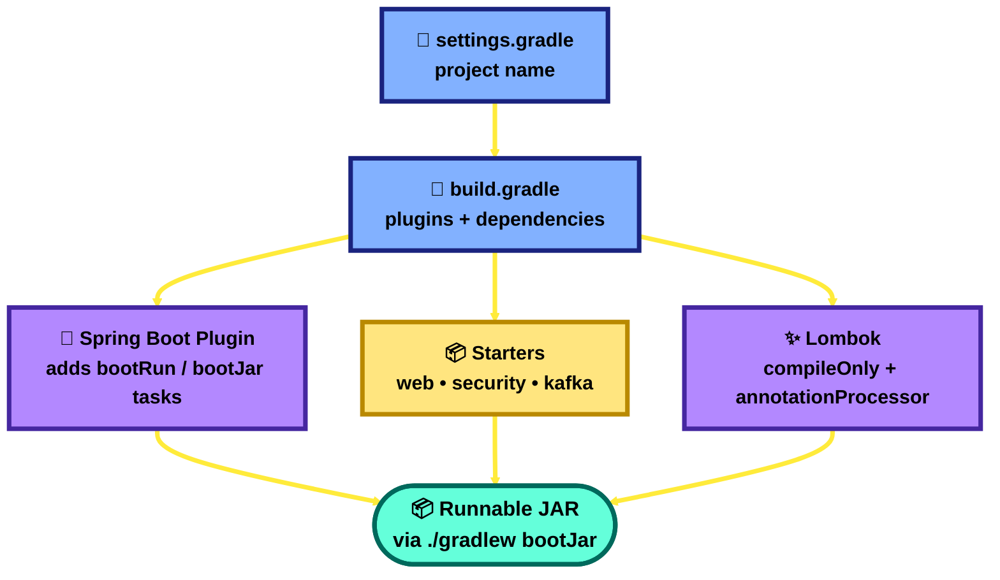

- **`settings.gradle`** — declares the project name (`rootProject.name = 'microservice'`); for multi-module projects, this is where you'd list all sub-modules.
- **`build.gradle`** — declares plugins, Java version, and dependencies. "Starters" (`spring-boot-starter-*`) are curated dependency bundles — `starter-web` alone pulls in Tomcat, Jackson, and Spring MVC together.
- **`compileOnly` + `annotationProcessor`** for Lombok — needed twice: once so the compiler sees Lombok's annotations, once so the annotation processor actually generates the boilerplate code.

**Interview one-liner:** *"Spring Boot 'starters' are curated dependency bundles that pull in everything needed for a feature (web, security, data) with compatible versions — no manual version-matching."*

🏗️ **System Design Angle:** A reproducible build (same dependency versions every time, everywhere) is what makes a **CI/CD pipeline** trustworthy — "works on my machine" bugs at scale usually trace back to dependency drift. `bootJar` producing one self-contained, runnable artifact is also exactly what gets packaged into a **container image** for deployment onto Kubernetes/ECS.

---

## 17. Interview Cheat Sheet

| Concept | One-line answer |
|---|---|
| IoC | Framework controls object creation/wiring instead of your code |
| DI | The mechanism IoC uses to hand objects their dependencies |
| `@Component` vs `@Bean` | Class-level auto-detection vs manual factory method for objects you don't own |
| `@Autowired` | Tells Spring "inject a matching bean here" |
| Bean lifecycle order | Constructor → DI → `@PostConstruct` → in use → `@PreDestroy` |
| `@RestController` | `@Controller` + `@ResponseBody` — returns data (JSON), not views |
| `@RequestBody` vs `@RequestParam` vs `@PathVariable` | JSON body vs query/form field vs URL segment |
| `@RestControllerAdvice` | Global, centralized exception handling across all controllers |
| Stateful vs stateless auth | Server remembers you (session/cookie) vs token proves identity itself (JWT) |
| Kafka producer/consumer | Decoupled async messaging via topics; `groupId` load-balances consumers |
| `@Value("${key:default}")` | Injects an externalized property with an optional fallback |
| `@SpringBootTest` | Boots the full app context for integration testing |
| `@Entity` / `@OneToMany` | ORM mapping of Java class → DB table / table relationships |

---

## 18. System Design Big Picture — How It All Connects

Layman explanation: Every chapter above is a **small Spring trick**. Zoom out, and each one is really just a beginner-friendly stand-in for a **big system-design idea**. This diagram is the map between the two — use it to jump from "I know `@Autowired`" to "I can talk about horizontally-scaled, event-driven microservices."

> 📱 **Vertical diagram — scroll down, not sideways.** Each pair reads top-to-bottom: the Spring trick, then the system-design idea it stands in for.

```mermaid
flowchart TD
    DI["🌱 IoC / DI<br/>@Autowired, @Component"] ==> LOOSE["🏗️ Loose Coupling<br/>swap implementations freely"]
    LOOSE ~~~ CFG["🌱 @Bean / @Configuration"]
    CFG ==> RESIL["🏗️ Resilience Patterns<br/>retry / circuit breaker / timeout"]
    RESIL ~~~ LIFE["🌱 Bean Lifecycle<br/>@PostConstruct / @PreDestroy"]
    LIFE ==> SHUT["🏗️ Graceful Shutdown<br/>zero-downtime deploys"]
    SHUT ~~~ SEC["🌱 Session vs JWT Auth"]
    SEC ==> SCALE["🏗️ Stateless Horizontal Scaling<br/>behind a Load Balancer"]
    SCALE ~~~ KAFKA["🌱 Spring Kafka<br/>Producer / Consumer"]
    KAFKA ==> EVENT["🏗️ Event-Driven Architecture<br/>decoupling + back-pressure"]
    EVENT ~~~ UPLOAD["🌱 MultipartFile<br/>in-memory Map"]
    UPLOAD ==> STORAGE["🏗️ Object Storage + CDN<br/>for large/static assets"]
    STORAGE ~~~ DTO["🌱 DTOs / Lombok"]
    DTO ==> CONTRACT["🏗️ API Contract & Versioning<br/>internal vs external model"]
    CONTRACT ~~~ EXC["🌱 @RestControllerAdvice"]
    EXC ==> OBS["🏗️ Observability<br/>consistent error contracts"]
    OBS ~~~ PROPS["🌱 application.properties<br/>@Value"]
    PROPS ==> CONFIG["🏗️ 12-Factor Config<br/>Config Server / K8s ConfigMaps"]
    CONFIG ~~~ GRADLE["🌱 Gradle Starters"]
    GRADLE ==> CICD["🏗️ CI/CD & Reproducible Builds<br/>container images"]

    linkStyle default stroke:#FFEB3B,stroke-width:4px

    classDef spring fill:#82B1FF,stroke:#1A237E,stroke-width:4px,color:#000,font-weight:bold,font-size:16px
    classDef design fill:#FFB74D,stroke:#C14E00,stroke-width:4px,color:#000,font-weight:bold,font-size:16px

    class DI,CFG,LIFE,SEC,KAFKA,UPLOAD,DTO,EXC,PROPS,GRADLE spring
    class LOOSE,RESIL,SHUT,SCALE,EVENT,STORAGE,CONTRACT,OBS,CONFIG,CICD design
```

### The bridge, spelled out

| Spring trick you coded | System design idea it teaches | Real interview question it prepares you for |
|---|---|---|
| `@Autowired` / DI | Loose coupling | "How would you make this service replaceable without a rewrite?" |
| `@PostConstruct` / `@PreDestroy` | Graceful startup/shutdown | "How do you deploy with zero downtime?" |
| Session vs JWT | Stateless horizontal scaling | "How does auth work across 10 servers behind a load balancer?" |
| Kafka producer/consumer | Event-driven architecture | "How do you decouple services so one outage doesn't cascade?" |
| `MultipartFile` → in-memory map | Object storage + CDN | "How would you handle 10,000 users uploading files at once?" |
| DTO vs domain model | API contract/versioning | "How do you change your database schema without breaking clients?" |
| `@RestControllerAdvice` | Observability / fault tolerance | "How do you detect and diagnose failures across microservices?" |
| `application.properties` + `@Value` | 12-factor config | "How do you run the same build in dev/staging/prod safely?" |
| Gradle starters + `bootJar` | CI/CD & reproducible builds | "How do you guarantee 'works on my machine' doesn't happen in prod?" |

**Golden interview move:** whenever you're asked about a Spring annotation, answer the "what" in one sentence, then immediately bridge to the "why it matters at scale" using this table — that's what separates a junior answer from a senior one.

---

## 19. OOP — The Four Pillars, in Real Code

**Plain English:** OOP (Object-Oriented Programming) means organizing code as "objects" that bundle data and behavior together, instead of loose functions floating around. Four ideas make this actually useful — and every one of them is already sitting in real code in this exact project, not just theory.

🧠 **Memorize the four names, in this order:** **E**ncapsulation → **A**bstraction → **I**nheritance → **P**olymorphism. (Mnemonic: "**E**very **A**pp **I**s **P**olymorphic.")

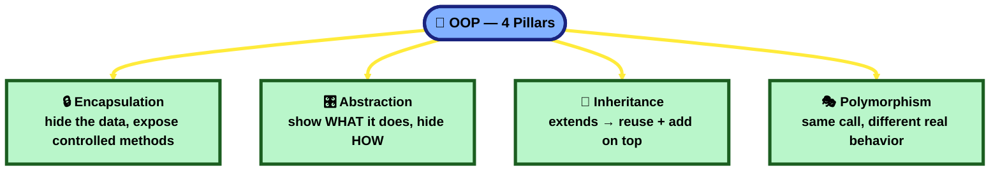

### 1️⃣ Encapsulation — hide the data, expose only controlled ways to touch it

🏦 **In the real HDFC project:** file `CloPortalException.java` (Channel API) keeps its fields `private`, and uses Lombok's `@Getter`/`@Setter` to generate the only doors in and out:
```java
// CloPortalException.java
@Getter @Setter
public class CloPortalException extends RuntimeException {
    private String errorCode;
    private String errorMessage;
    private ResponseVo responseVo;
}
```
Nobody outside this class can write `exception.errorCode = "..."` directly — only through the generated `getErrorCode()`/`setErrorCode(...)` methods.

**Simple explanation:** encapsulation = keep a class's data `private`, and only let the outside world read/change it through specific methods — like a medicine bottle: you can't just reach in and grab pills, you have to go through the cap.

**In this project:** `BaseEntity.java` does the same thing — `createdOn`/`updatedOn` are `private`, exposed only via Lombok's `@Getter`/`@Setter`. `SmtpClient` (a Java **record**, Chapter 8) goes stricter still: fields are implicitly `private final`, no setters exist at all — true immutability, the strongest form of encapsulation.

---

### 2️⃣ Abstraction — show WHAT it does, hide HOW it does it

🏦 **In the real HDFC project:** file `MstAppConfigServiceImpl.java` implements an interface, `MstAppConfigService` — calling code depends only on the interface, calls `getAllConfig()`, and never needs to know which table or query actually answers it.

**Simple explanation:** abstraction = expose the WHAT, hide the HOW — like a car's steering wheel: you turn it to steer, you don't need to know the mechanical linkage underneath.

**In this project:** `HostelRepository`/`ApiAuditRepository`/`WeatherRepository` (Chapter 14) all `extends JpaRepository<Entity, Long>` — you call `.save(...)`/`.findAll()`, and Spring Data generates the real implementation behind the scenes, without you writing or seeing it.

---

### 3️⃣ Inheritance — `extends` → reuse the parent's stuff, add your own on top

🏦 **In the real HDFC project:** three custom exceptions in the Channel API — `CloPortalException`, `ValidationException`, `InvalidInputException` — all write `extends RuntimeException`. Each instantly reuses everything `RuntimeException` already does (carry a message, build a stack trace, work with `try/catch`), then adds its own fields on top.

**Simple explanation:** inheritance = a new class says `extends SomeOtherClass`, and instantly reuses everything that class already has, while adding more of its own — like a child inheriting traits from a parent, plus developing their own.

**In THIS project — an even cleaner example, right here in your own code (Chapter 14):**
```java
// BaseEntity.java — the parent, holds only what's shared
@MappedSuperclass
public abstract class BaseEntity {
    @CreatedDate     private LocalDateTime createdOn;
    @LastModifiedDate private LocalDateTime updatedOn;
}
```
```java
// ApiAudit.java and WeatherData.java — both extend it
public class ApiAudit extends BaseEntity { private String apiName; /* + more */ }
public class WeatherData extends BaseEntity { /* its own weather fields */ }
```
One parent (`BaseEntity`), two real children (`ApiAudit`, `WeatherData`) — both get `createdOn`/`updatedOn` for free, zero duplicated code, and each adds its own specific fields on top. This is the cleanest possible real-world inheritance example, and it's sitting in this exact repo.

📌 **Worth knowing about `@MappedSuperclass` specifically:** it means `BaseEntity`'s fields get copied into EACH subclass's own database table (so `ApiAudit` and `WeatherData` each get their own separate `created_on`/`updated_on` columns) — but `BaseEntity` itself never gets a table, and can't be queried or persisted on its own (it's not an `@Entity`). See `System Design.md` Q34 for the full modifiers/OOP cross-question chart, including the classic follow-up: *"how would you make the parent itself queryable?"* (switch to `@Entity` + `@Inheritance` instead).

📌 **`BaseEntity` (abstract class) vs. `HostelRepository`/etc. (interfaces, Chapter 14) is the perfect real pair for "abstract class vs. interface" — see `System Design.md` Q34 for the full comparison, including why Java gives you interfaces at all when overriding a class's methods already lets you customize behavior.

---

### 4️⃣ Polymorphism — same method call, different real behavior underneath

🏦 **In the real HDFC project:** calling code depends on the `MstAppConfigService` interface type, not the concrete class. At runtime, Java runs whichever real implementation is actually behind that reference (`@Override public ResponseVo getAllConfig()` in `MstAppConfigServiceImpl`). A second implementation could be swapped in with zero changes to the calling code — same call, different real behavior, decided at runtime.

**Simple explanation:** polymorphism = the same method call can do something different depending on which real object is behind it — like a "Play" button: pressing Play does something different on a music app vs. a video app, same action, different real behavior.

**In this project:** every Lombok `@Data`-annotated DTO (`LightRequestDTO`, `LightResponseDTO`, `FileUploadModel`) is quietly using polymorphism already — Lombok generates `toString()`/`equals()`/`hashCode()` that **override** the default `Object` versions. Calling `.toString()` runs YOUR class's version, not the generic one — that's method overriding, the everyday form of polymorphism.

---

### 🏗️ How Spring Boot leans on all four at once

Spring's dependency injection (Chapter 3) is abstraction + polymorphism working together: you `@Autowired` an **interface** (abstraction — the caller only knows the contract), and Spring hands you whichever concrete bean actually implements it (polymorphism — the real behavior is decided by which bean got wired in). Swap the implementation, and every class depending on the interface needs zero changes.

**Interview one-liner:** *"Encapsulation hides data behind getters/setters, abstraction hides implementation behind an interface, inheritance lets a class reuse and extend a parent via `extends`, and polymorphism means the same method call runs different real code depending on the actual object — Spring's dependency injection is abstraction and polymorphism working together, since you depend on an interface and get whichever real implementation was wired in."*

**See also:** `Springboot Lab.md`, Chapter 17 — the same four pillars, grounded in that project's own `CustomerEntity`/`ImmutableCLS`/`CustomerRepository` examples.

---

### How to use these notes for interview prep
1. Pick a chapter, close the file, explain it out loud in your own words using the diagram as a mental map.
2. Trace a real request end-to-end (Chapter 1) and plug in details from later chapters as you go deeper.
3. Be ready to explain **trade-offs** (field vs constructor injection, session vs JWT, `@Component` vs `@Bean`) — interviewers care more about *why* than *what*.
