# System Design Notes — Q&A for Beginners

> Format: **Question → simple-English Answer → diagram (only when it genuinely helps)**.
> Every question is tagged `[HLD]` (High-Level Design — how big pieces of a system talk to each other) or `[LLD]` (Low-Level Design — how you'd actually write the classes/code for one piece).
> Goal: read this once, understand it, be able to explain it out loud — not memorize jargon.

---

## What even is HLD vs LLD? (read this first)

**Q: Someone says "let's do HLD then LLD" in an interview — what do they actually mean?** `[HLD]`

**A:** Think of designing a house.
- **HLD (High-Level Design)** = the blueprint of the whole house: where's the kitchen, where's the bedroom, where does water/electricity enter the house. In software: how many servers, where's the database, where's the cache, how do services talk to each other. No code yet — just boxes and arrows.
- **LLD (Low-Level Design)** = designing ONE room in detail: exact furniture placement, exact wiring. In software: the actual classes, methods, interfaces, and design patterns for ONE part of the system (e.g. "design the class structure for a parking lot").

**Rule of thumb:** if the question is "how do 1 million users use this app without it crashing" → that's HLD. If the question is "write the classes for a vending machine" → that's LLD.

---

## Table of Contents — by Part (click any question to jump to it)

Every question sits under ONE of these 5 parts — knowing the part tells you *why* a question exists and what comes conceptually before/after it. Recommended reading order: easiest/foundational first, your real project last as the "capstone." Click any question to jump straight to it.

<pre>
System Design Notes
│
├── 🧱 PART 1 — HLD FOUNDATIONS  (how big pieces of a system fit together)
│   ├── <a href="#1-what-is-scalability--vertical-vs-horizontal-scaling-hld">1. Scalability — Vertical vs Horizontal</a>
│   ├── <a href="#2-what-is-a-load-balancer-and-why-do-i-need-one-hld">2. Load Balancer</a>
│   ├── <a href="#3-what-is-caching-and-where-do-i-put-it-hld">3. Caching</a>
│   ├── <a href="#4-what-is-a-cdn-hld">4. CDN</a>
│   ├── <a href="#5-what-is-database-replication-masterslave-hld">5. Database Replication</a>
│   ├── <a href="#6-what-is-database-sharding-partitioning-hld">6. Database Sharding</a>
│   ├── <a href="#7-why-would-you-use-sql-and-why-would-you-use-nosql-when-should-each-be-chosen-hld">7. SQL vs NoSQL — why and when for each</a>
│   ├── <a href="#8-what-is-the-cap-theorem-hld">8. CAP Theorem</a>
│   ├── <a href="#9-what-is-a-message-queue-and-why-decouple-services-with-one-hld">9. Message Queues</a>
│   ├── <a href="#10-what-is-an-api-gateway-hld">10. API Gateway</a>
│   ├── <a href="#11-what-is-rate-limiting-hld">11. Rate Limiting</a>
│   ├── <a href="#12-monolith-vs-microservices--which-one-should-i-pick-hld">12. Monolith vs Microservices</a>
│   ├── <a href="#13-what-is-a-single-point-of-failure-spof-hld">13. Single Point of Failure</a>
│   ├── <a href="#14-whats-the-difference-between-latency-and-throughput-hld">14. Latency vs Throughput</a>
│   ├── <a href="#15-what-is-consistent-hashing-hld">15. Consistent Hashing</a>
│   ├── <a href="#16-strong-consistency-vs-eventual-consistency-hld">16. Strong vs Eventual Consistency</a>
│   ├── <a href="#41-when-would-you-choose-nodejs-instead-of-java-spring-boot-and-when-would-java-be-the-stronger-choice-hld">41. Node.js vs Java Spring Boot — when to pick which</a>
│   ├── <a href="#42-how-does-the-nodejs-event-loop-handle-concurrent-requests-hld">42. How the Node.js event loop handles concurrent requests</a>
│   ├── <a href="#44-how-do-promises-asyncawait-callback-execution-and-the-event-loop-work-together-hld">44. Promises, async/await & the event loop, tied together</a>
│   ├── <a href="#46-what-is-the-difference-between-server-side-rendering-and-static-rendering-hld">46. Server-Side Rendering vs Static Rendering</a>
│   └── <a href="#48-what-is-the-difference-between-global-css-and-css-modules-hld">48. Global CSS vs CSS Modules</a>
│
├── 🧩 PART 2 — LLD FOUNDATIONS  (designing the actual classes/code for one piece)
│   ├── <a href="#17-what-is-an-lld-interview-question-actually-asking-me-to-do-lld">17. What LLD interview questions really want</a>
│   ├── <a href="#18-what-are-the-solid-principles-lld">18. SOLID Principles</a>
│   ├── <a href="#19-what-is-the-singleton-pattern-lld">19. Singleton Pattern</a>
│   ├── <a href="#20-what-is-the-factory-pattern-lld">20. Factory Pattern</a>
│   ├── <a href="#21-what-is-the-observer-pattern-lld">21. Observer Pattern</a>
│   ├── <a href="#22-what-is-the-strategy-pattern-lld">22. Strategy Pattern</a>
│   ├── <a href="#23-composition-vs-inheritance--why-does-this-come-up-in-every-lld-round-lld">23. Composition vs Inheritance</a>
│   ├── <a href="#34-java-modifiers--oop-mechanics--the-cross-question-chart-lld">34. Java Modifiers & OOP Mechanics — The Cross-Question Chart</a>
│   ├── <a href="#24-worked-example-design-the-classes-for-a-parking-lot-lld">24. Worked Example: Design a Parking Lot</a>
│   └── <a href="#25-what-concurrencythread-safety-basics-should-i-mention-in-lld-lld">25. Thread-Safety Basics</a>
│
├── 🔥 PART 3 — REAL-WORLD PRODUCTION SCENARIOS  ("something broke, what do you do")
│   ├── <a href="#26-your-rest-api-suddenly-becomes-slow-in-production-how-will-you-investigate-hld">26. REST API suddenly slow in production</a>
│   ├── <a href="#27-one-microservice-is-down-how-will-you-prevent-the-entire-application-from-failing-hld">27. One microservice is down</a>
│   ├── <a href="#28-duplicate-records-are-getting-inserted-how-will-you-identify-and-fix-the-issue-hld">28. Duplicate records getting inserted</a>
│   ├── <a href="#29-two-users-update-the-same-record-simultaneously-how-will-you-prevent-lost-updates-hld">29. Two users update the same record — lost updates</a>
│   ├── <a href="#30-a-transaction-updates-the-database-and-then-fails-while-calling-another-service-what-will-you-do-hld">30. DB update succeeds, then the call to another service fails</a>
│   ├── <a href="#43-explain-the-saga-pattern-and-how-it-handles-distributed-transaction-failures-hld">43. Saga Pattern — distributed transaction failures</a>
│   ├── <a href="#31-the-database-connection-pool-is-exhausted-how-will-you-handle-it-hld">31. Database connection pool exhausted</a>
│   ├── <a href="#32-multiple-angular-components-call-the-same-api-and-duplicate-requests-are-generated-how-will-you-optimise-it-hld">32. Multiple Angular components triggering duplicate API calls</a>
│   ├── <a href="#33-do-you-always-need-to-call-save-inside-transactional-hld">33. Do you always need to call save() inside @Transactional?</a>
│   ├── <a href="#38-one-microservice-is-unavailable-how-do-timeout-retry-circuit-breaker-and-fallback-prevent-cascading-failure-hld">38. Timeout, Retry, Circuit Breaker, Fallback</a>
│   ├── <a href="#47-two-apis-must-be-called-synchronously-if-one-fails-how-do-you-ensure-the-other-still-executes-while-returning-a-proper-error-and-response-hld">47. Two APIs, one fails — isolate + partial-success response</a>
│   ├── <a href="#39-how-would-you-diagnose-a-production-issue-using-dynatrace-and-splunk-hld">39. Diagnosing a production issue with Dynatrace and Splunk</a>
│   ├── <a href="#40-how-would-you-protect-sensitive-healthcare-data-in-transit-at-rest-and-in-application-logs-hld">40. Protecting sensitive data — in transit, at rest, and in logs</a>
│   └── <a href="#45-what-security-vulnerabilities-vapt-style-findings-exist-in-my-real-hdfc-project-and-what-security-concept-does-each-map-to-hld">45. Real VAPT findings — vulnerabilities + concept mapping</a>
│
├── 🏛️ PART 4 — "DESIGN A SYSTEM FROM SCRATCH"  (whiteboard a whole service)
│   ├── <a href="#36-design-a-scalable-and-secure-healthcare-appointment--patient-record-service-hld">36. Design a Scalable and Secure Healthcare Appointment / Patient-Record Service</a>
│   └── <a href="#37-how-would-you-design-a-rest-api-with-request-validation-status-codes-dtos-and-consistent-error-responses-hld">37. Design a REST API — validation, status codes, DTOs, consistent errors</a>
│
├── 🏦 PART 5 — MY REAL HDFC PROJECT  (the capstone — uses ideas from every part above)
│   └── <a href="#35-my-project-its-architecture-and-a-feature-i-built">35. My Project, Its Architecture, and a Feature I Built</a> — incl. §D.1 Creational/Structural/Behavioral
│
└── 🔥 BONUS — TOPIC DEEP-DIVES  (one topic, pulled together across every part/doc)
    └── <a href="#kafka-deep-dive">Kafka — Everything in One Place</a> — architecture basics → concept → Spring mechanics → design pattern → real HDFC usage → deeper guarantees → utilization + headroom
</pre>

🧠 **Memorize this line:** *"Foundations first (HLD then LLD), then how those foundations get stress-tested in real production scenarios, then a from-scratch design exercise, and finally my real project — which is really just Parts 1–4 applied to one system I've actually worked on."*

---

# Part 1 — HLD Foundations

## 1. What is Scalability — Vertical vs Horizontal Scaling? `[HLD]`

**Scenario:** Your app has 100 users and works fine on 1 server. Now it suddenly has 1 million users and starts crashing. What do you do?

**A:** You have two options:
- **Vertical scaling** = buy a bigger, more powerful server (more RAM/CPU) for the one server you have. Simple, but there's a ceiling — you can't buy an infinitely powerful machine, and if that one server dies, everything dies.
- **Horizontal scaling** = instead of one bigger server, add MORE servers of the same size, and split the traffic between them. This is how big companies actually do it — it scales almost infinitely, and if one server dies, the others keep working.

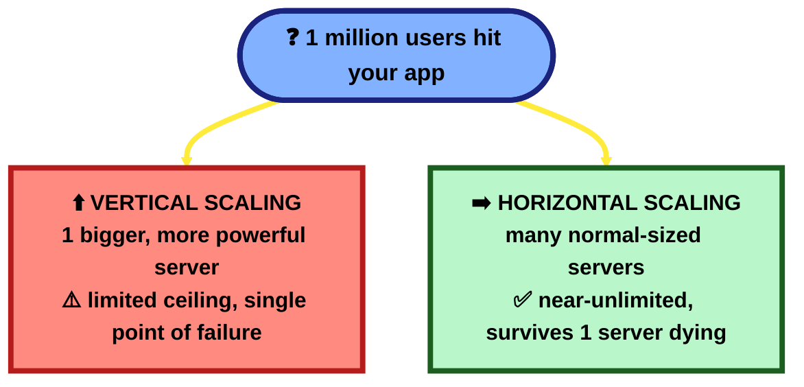

**Interview one-liner:** *"Vertical scaling = one bigger machine; horizontal scaling = more machines of the same size. Real-world systems prefer horizontal scaling because it avoids a single point of failure and has no hard ceiling."*

---

## 2. What is a Load Balancer, and why do I need one? `[HLD]`

**Scenario:** You just went horizontal — you now have 5 servers instead of 1. But how does a user's request know WHICH of the 5 servers to go to?

**A:** A **Load Balancer** sits in front of all your servers. Every request from a user hits the load balancer first, and it decides which server should handle it — usually spreading requests evenly (round-robin), or sending to whichever server is least busy. This way, no single server gets overwhelmed, and if one server goes down, the load balancer simply stops sending traffic to it.

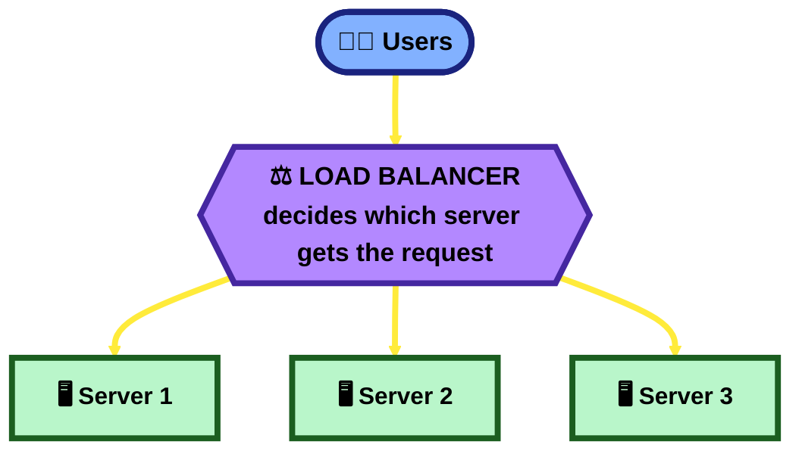

**Interview one-liner:** *"A load balancer is the traffic cop in front of multiple servers — it spreads requests evenly and reroutes around dead servers automatically."*

---

## 3. What is Caching, and where do I put it? `[HLD]`

**Scenario:** Your homepage shows "Top 10 trending products," fetched from the database. 10,000 users load the homepage every second — you don't want to hit the database 10,000 times a second for the exact same data.

**A:** A **cache** is a small, super-fast storage layer (usually in RAM, e.g. Redis) that holds a copy of data you'll need again soon. Instead of asking the slow database every time, you ask the fast cache first. If the cache has the answer ("cache hit"), you're done in milliseconds. If not ("cache miss"), you ask the database, then save the answer in the cache for next time.

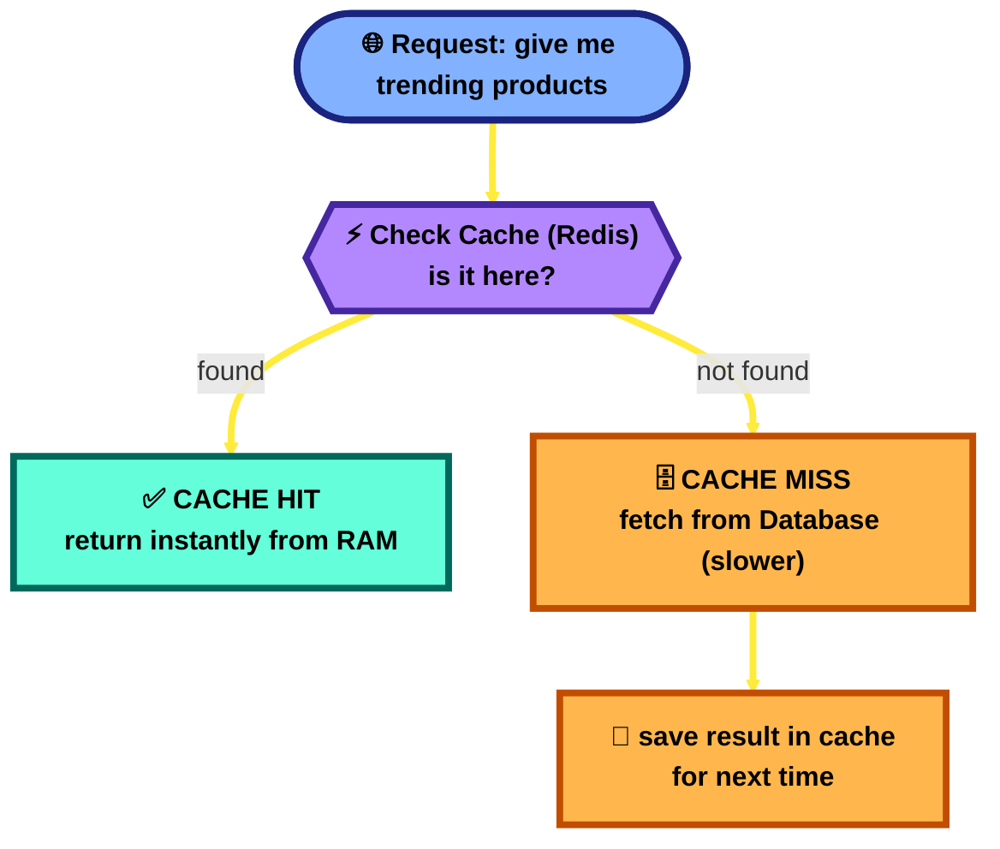

**Bonus (common follow-up question):** *"What if the data in the database changes but the cache still has the old value?"* — This is called a **stale cache**, and it's THE classic caching problem. Fixes: give cached data an expiry time (TTL — "time to live"), or explicitly clear/update the cache the moment the database changes.

**Interview one-liner:** *"Cache = fast temporary copy of frequently-read data, so you don't hammer the slow database for the same thing over and over. The hard part isn't caching — it's knowing when to invalidate (clear) the cache."*

---

## 4. What is a CDN? `[HLD]`

**Scenario:** Your company is based in India, but you have users in the US watching videos on your site. Every video request travelling all the way to your India server and back is slow.

**A:** A **CDN (Content Delivery Network)** is a network of servers spread across the world that store copies of your static files (images, videos, CSS, JS). When a US user requests a video, they get it from a nearby US server instead of a far-away India server — much faster. CDNs are basically "caching, but geographically distributed."

**Interview one-liner:** *"A CDN puts copies of your static content physically close to users all over the world, so they don't have to wait for data to travel across the planet."*

---

## 5. What is Database Replication (Master-Slave)? `[HLD]`

**Scenario:** Your one database server is getting hit with both "write this new order" and "read my order history" requests at the same time, and it's struggling to keep up. Also — what happens if that ONE database server crashes? You lose everything.

**A:** **Replication** means keeping multiple copies of your database in sync. The usual setup:
- **1 Master (Primary)** — handles all WRITES (create/update/delete).
- **Several Replicas (Slaves/Read Replicas)** — each is a live copy of the master, and handles READS only.

This does two things: it spreads out read traffic across many machines (most apps read way more than they write), AND if the master dies, a replica can be promoted to take over — you don't lose your data.

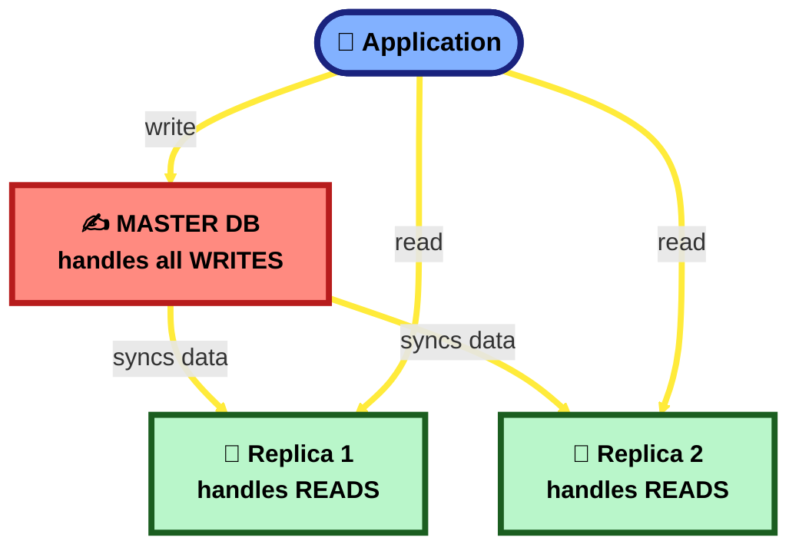

**Interview one-liner:** *"Replication = one master DB for writes, multiple read replicas for reads — it scales read traffic and gives you a backup if the master dies."*

---

## 6. What is Database Sharding (Partitioning)? `[HLD]`

**Scenario:** Replication is great for spreading out READS, but your single master database is now so huge (say, 500 million user rows) that even WRITES are slow, and the whole thing barely fits on one machine.

**A:** **Sharding** means splitting your data across multiple databases, where EACH database only holds a slice (a "shard") of the total data — instead of every server having a full copy (that's replication), every server has a different piece. A common way to split: by user ID range (users 1–1,000,000 on Shard A, users 1,000,001–2,000,000 on Shard B, etc.).

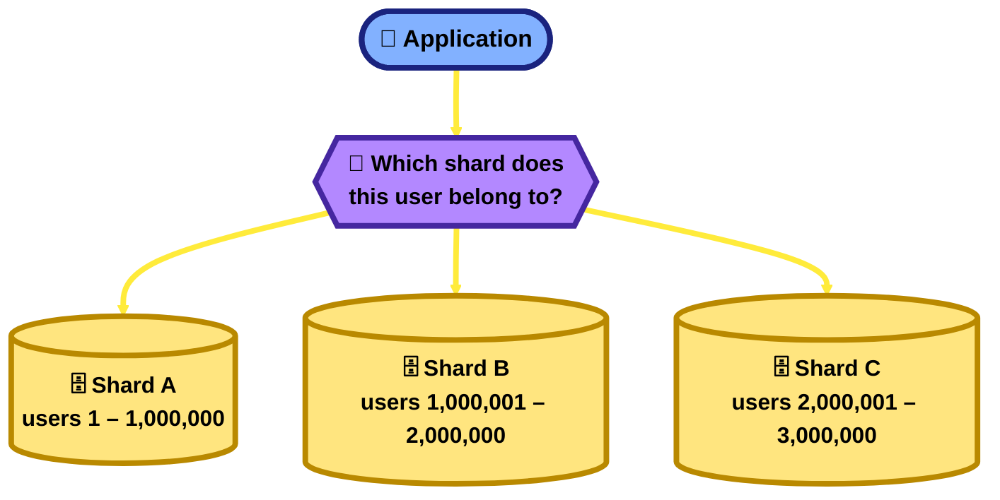

**Sharding vs Replication — don't mix these up:**
| | Replication | Sharding |
|---|---|---|
| What each server holds | A FULL copy of all the data | Only a SLICE/piece of the data |
| Solves | Too many reads, need backups | Too much total data / too many writes for one machine |

**Interview one-liner:** *"Replication = same data copied on many servers (helps reads & backup). Sharding = data split into pieces across many servers (helps when the data itself is too big for one machine)."*

---

## 7. Why would you use SQL, and why would you use NoSQL? When should each be chosen? `[HLD]`

**Simple explanation first:** SQL is a filing cabinet — every drawer (table) has a fixed label and fixed-shape folders, and drawers can reference each other ("see Customer #42's folder for details"). NoSQL is a big box where you can just drop in whatever shape of document you have right now — no drawer labels to agree on up front, and nothing forces two items in the box to look alike.

**A:**
- **SQL (relational — MySQL, PostgreSQL, Oracle):** data lives in tables with a fixed schema (columns defined up front), and tables link together via foreign keys/joins. Choose it when your data has real, stable relationships (Orders belong to Customers, Borrowers belong to Applications) and you need **strong consistency + real transactions** — an operation either fully happens or fully doesn't, across multiple tables at once (see Q29's `@Transactional`).
- **NoSQL (MongoDB, Cassandra, DynamoDB, Redis, Neo4j):** an umbrella term for several *different* non-relational models, not one thing — pick based on which shape matches your data:

| NoSQL type | Shape | Example | Good for |
|---|---|---|---|
| **Document** | JSON-like documents, flexible fields | MongoDB | Content that varies a lot per item (product catalogs with different attributes per category) |
| **Key-Value** | Just a key → a value, nothing else | Redis, DynamoDB | Caching, session storage, anything needing extremely fast simple lookups |
| **Column-family** | Rows can have wildly different columns, optimized for huge write volume | Cassandra | Time-series data, huge write-heavy logs/events |
| **Graph** | Nodes + relationships as first-class citizens | Neo4j | Data that IS the relationships (social networks, fraud-ring detection) |

| | SQL | NoSQL |
|---|---|---|
| Schema | Fixed, defined up front (schema-on-write) | Flexible, often no schema enforced (schema-on-read) |
| Relationships | First-class — real joins across tables | Usually denormalized/embedded instead of joined |
| Consistency model | **ACID** — strong, transactional | Often **BASE** — eventually consistent, trading strictness for scale (Q16) |
| Scaling approach | Traditionally vertical (bigger server); horizontal is possible but harder (sharding, Q6) | Built for horizontal scaling from day one |
| Best fit | Structured data, real relationships, correctness-critical (banking, inventory) | Huge/fast-growing/loosely-structured data, or a shape SQL doesn't fit well (cache, graph, time-series) |

🆕 **New terms:**
- **ACID** (Atomicity, Consistency, Isolation, Durability) — the guarantee a relational transaction gives you: it either fully happens or fully doesn't, and concurrent transactions don't corrupt each other.
- **BASE** (Basically Available, Soft state, Eventually consistent) — the looser guarantee many NoSQL systems favor instead, trading strict correctness for availability/scale (ties directly to Q16's strong-vs-eventual-consistency and the CAP theorem, Q8).
- **Schema-on-write vs schema-on-read** — SQL validates your data's shape when you WRITE it (the table structure is fixed); NoSQL often only figures out the shape when you READ it (whatever fields happen to be in that document).

🏦 **Real-project grounding:** the real HDFC loan-origination system is **100% relational SQL** — JPA/Hibernate repositories throughout, a HikariCP connection pool (Q31), and schema changes managed via a dedicated, versioned Liquibase repo (Q35 §B). I haven't found any NoSQL usage anywhere in this codebase — and that's the right call, not a gap: a `LoanApplication` genuinely has real, stable relationships to `Borrower`, `Collateral`, `Documents`, and `Proposal` records, the data needs to survive audits, and correctness (never losing or duplicating a loan record) matters far more than raw write throughput. This is a good real example of "boring, structured, relational data → SQL is the obvious right answer," not a case that needed NoSQL's flexibility.

**Interview one-liner:** *"SQL when your data is genuinely structured, relationships matter, and correctness/transactions are critical (banking, my real HDFC project). NoSQL when your data is huge, fast-growing, or a shape SQL doesn't naturally fit — document for flexible/varied records, key-value for pure speed, column-family for massive write volume, graph for relationship-heavy data like fraud detection. NoSQL isn't 'the modern one' — it's a family of different trade-offs, and picking the wrong member of that family is as bad as picking SQL when you didn't need to."*

---

## 8. What is the CAP Theorem? `[HLD]`

**Scenario:** Your database is now sharded/replicated across 3 servers in 3 different cities. One day, the network connection between City A and City B breaks (this is called a "network partition"). What should happen now?

**A:** CAP theorem says: when a network partition happens, you can only pick ONE of these two (the third, Partition tolerance, is basically mandatory in any distributed system):
- **Consistency (C)** — every server shows the exact same, latest data. But to guarantee this during a network break, some servers may have to refuse requests (they can't confirm they have the latest data).
- **Availability (A)** — every server keeps responding to requests, even during the network break. But some servers might give slightly outdated ("stale") data since they couldn't sync.

**In one sentence:** during a network failure, you must choose between "always correct but might say no" (Consistent) or "always says yes but might be slightly outdated" (Available). Banking systems usually lean Consistent; social media feeds usually lean Available.

**Interview one-liner:** *"CAP theorem: during a network partition, a distributed system must choose Consistency (always correct, may refuse) or Availability (always responds, may be stale) — you can't have both at the same time."*

---

## 9. What is a Message Queue, and why decouple services with one? `[HLD]`

**Scenario:** When a user places an order, your OrderService needs to: charge their card, send a confirmation email, update inventory, and notify the delivery partner. If OrderService calls all 4 of these directly and ANY one of them is slow or down, the whole order fails.

**A:** A **Message Queue** (like Kafka, RabbitMQ, SQS) sits between services. Instead of OrderService calling each service directly, it just drops a message ("order #123 placed") onto the queue and moves on immediately. Each interested service (Email, Inventory, Delivery) picks up that message **whenever it's ready**, independently. If EmailService is down for 5 minutes, the message just waits in the queue — the order still succeeds, and the email goes out later once EmailService is back.

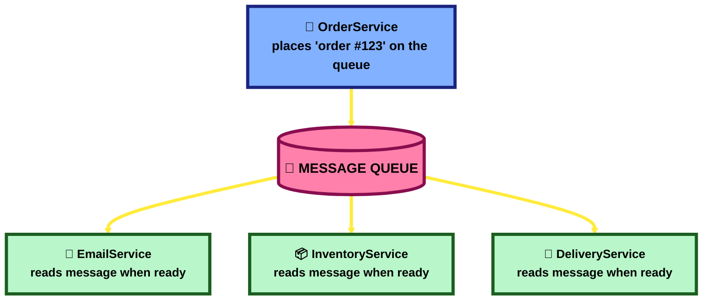

**Interview one-liner:** *"A message queue decouples services — the sender doesn't wait for the receiver, so one slow/down service doesn't take down the whole flow, and traffic spikes get smoothed out instead of crashing everyone."*

*(This is exactly the Kafka setup already documented for the actual project — see `Springboot Gradle Lab.md`, Chapter 12, for the real code.)*

---

## 10. What is an API Gateway? `[HLD]`

**Scenario:** You've split your app into 10 microservices (Users, Orders, Payments, etc). Should your mobile app really need to know all 10 different server addresses and call each one directly?

**A:** An **API Gateway** is a single front door that all client requests go through first. It then routes each request to the correct microservice behind the scenes. It's also a convenient single place to handle things every request needs anyway — authentication, rate limiting, logging — instead of repeating that logic in all 10 microservices.

**Interview one-liner:** *"An API Gateway is the single entry point for clients — it routes requests to the right microservice and handles cross-cutting stuff (auth, rate-limiting, logging) in one place instead of duplicating it everywhere."*

---

## 11. What is Rate Limiting? `[HLD]`

**Scenario:** Someone writes a script that calls your `/login` API 10,000 times per second, trying to guess passwords (or just accidentally overwhelming your server).

**A:** **Rate limiting** caps how many requests a single user/IP/API-key can make in a given time window (e.g. "max 100 requests per minute"). Once they hit the limit, further requests get rejected (usually with an HTTP `429 Too Many Requests`) until the window resets. This protects your servers from abuse, bugs, and traffic spikes from any single source.

**Interview one-liner:** *"Rate limiting caps how many requests one client can make in a time window, protecting the system from abuse or runaway scripts — a very common thing to bolt onto an API Gateway."*

---

## 12. Monolith vs Microservices — which one should I pick? `[HLD]`

**A:**
- **Monolith** = the entire application (users, orders, payments, everything) is ONE codebase, deployed as ONE unit. Simple to build and deploy early on, but as it grows, everything is tangled together — a small change means redeploying the whole thing, and one bug can crash the entire app.
- **Microservices** = the application is split into small, independent services (UserService, OrderService, PaymentService), each with its own codebase, its own database (usually), deployed and scaled independently. More flexible and resilient at scale, but adds real complexity — network calls between services, harder debugging, needs an API Gateway/message queue/service discovery.

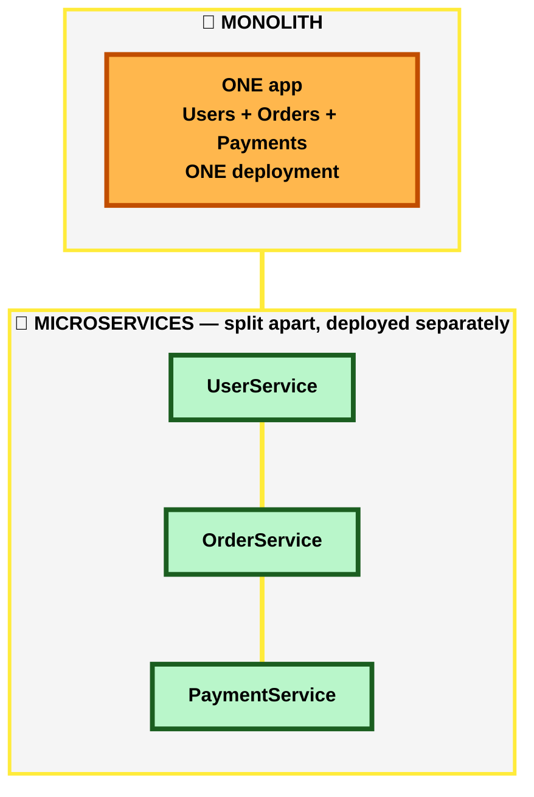

**Interview one-liner:** *"Start with a monolith when you're small and moving fast — split into microservices only once team size / scale / independent-deployability actually demands it. Microservices aren't automatically 'better,' they trade simplicity for flexibility."*

---

## 13. What is a Single Point of Failure (SPOF)? `[HLD]`

**A:** A SPOF is any ONE component in your system that, if it goes down, takes the ENTIRE system down with it. Example: if you only have one load balancer, one database, or one server with no backup — each of those is a SPOF. The fix is always the same idea: **redundancy** — have more than one of everything critical (multiple servers behind the load balancer, a replica database ready to take over, even a backup load balancer).

**Interview one-liner:** *"A SPOF is any single piece whose failure kills the whole system. You find SPOFs by asking 'what if THIS one thing died right now?' for every box in your diagram, and fix them with redundancy."*

---

## 14. What's the difference between Latency and Throughput? `[HLD]`

**A:** Simple analogy — a highway:
- **Latency** = how long it takes ONE car to travel from start to end (e.g. "this API responds in 200ms"). Lower is better.
- **Throughput** = how many cars can pass through per minute (e.g. "this API can handle 5,000 requests per second"). Higher is better.

You can have low latency but low throughput (a fast but narrow road), or high throughput but high latency (a slow but very wide road). Good system design usually needs to balance both, depending on what the product actually needs.

**Interview one-liner:** *"Latency = how fast ONE request is. Throughput = how MANY requests the system handles per second. They're different axes — optimizing one doesn't automatically fix the other."*

---

## 15. What is Consistent Hashing? `[HLD]`

**Scenario:** You have sharded your cache across 4 servers using a simple rule like `server = userId % 4`. One server crashes and you go down to 3 servers. Now `userId % 3` gives a COMPLETELY different answer for almost every user — nearly all your cached data suddenly "belongs" to the wrong server, and your cache hit rate crashes to near zero.

**A:** **Consistent hashing** is a smarter way to assign data to servers so that when a server is added or removed, only a SMALL fraction of the data needs to move — not almost all of it. It works by placing both servers and data keys on an imaginary circle ("hash ring"); each piece of data goes to the next server clockwise from it on the ring. Removing one server only affects the data that was pointing to that one server — everyone else's mapping stays the same.

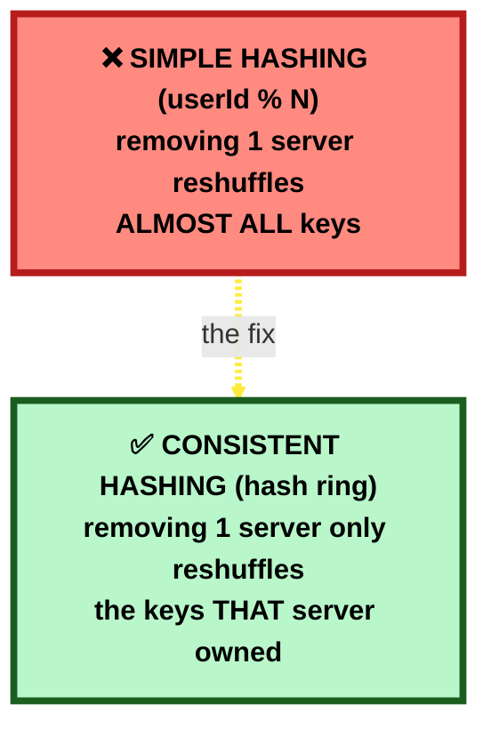

**Interview one-liner:** *"Consistent hashing minimizes how much data gets reshuffled when servers are added/removed — instead of nearly everything moving, only the data that belonged to the changed server moves."* (Used in distributed caches like Memcached/Redis Cluster, and in DynamoDB/Cassandra.)

---

## 16. Strong Consistency vs Eventual Consistency `[HLD]`

**A:**
- **Strong consistency** — the moment you write data, EVERY subsequent read, from anywhere, sees that new value immediately. Simple to reason about, but slower/harder to achieve across many servers (ties back to the CAP theorem above).
- **Eventual consistency** — after a write, different servers might show the old value for a short while, but they will ALL converge to the correct value eventually (usually within milliseconds to seconds). Faster and easier to scale, but your application has to tolerate briefly-stale reads.

**Real example:** when you post something on social media, your own phone shows it instantly, but a friend on the other side of the world might see it appear 1-2 seconds later — that's eventual consistency in action, and it's a perfectly acceptable trade-off there.

**Interview one-liner:** *"Strong consistency = always up to date, costs speed/availability. Eventual consistency = might be briefly stale, but faster and more scalable — pick based on whether staleness is actually harmful for that specific feature (banking: no. Like counts: sure)."*

---

## 41. When would you choose Node.js instead of Java Spring Boot, and when would Java be the stronger choice? `[HLD]`

**A:** It mostly comes down to what kind of work the server spends most of its time doing — waiting on I/O, or crunching CPU — plus how big/regulated the system is.

**Node.js — pick it when:**
- The workload is **I/O-bound with high concurrency**: lots of simultaneous connections that mostly just wait on a network call, a database query, or a file read (real-time chat, WebSocket-heavy apps, a lightweight API gateway/BFF that just fans out to other services and stitches responses together). Node's single-threaded event loop handles thousands of "waiting" connections cheaply, because it doesn't block a dedicated thread per connection the way a traditional servlet model does.
- You want the **same language on frontend and backend** (JS/TypeScript) — e.g. a Node "Backend-for-Frontend" (BFF) layer in front of an Angular/React app can share types/DTOs with the UI team, and full-stack developers work across both without switching languages.
- You need **fast startup and a low memory footprint** — small microservices, serverless functions (AWS Lambda, etc.) where cold-start time matters; the JVM's startup/warm-up cost is a real disadvantage there.
- Rapid prototyping or a small team that needs to ship fast, backed by a huge `npm` ecosystem for quick integrations.

**Java/Spring Boot — pick it when:**
- The workload is **CPU-heavy or does real parallel computation** — business rule engines, batch processing, heavy calculations, cryptography. The JVM gives you true multi-threading; in plain Node, CPU-heavy work blocks the single event loop and stalls every other request until it's done (you'd need worker threads/clustering to work around that, which Java gives you for free).
- It's a **large, long-lived, regulated enterprise system** — strong static typing catches whole classes of bugs at compile time instead of in production, which matters enormously as a codebase grows past what one team can hold in their head. Banking/financial systems lean on this hard.
- You need **mature transaction management and ORM** — Spring's `@Transactional` + JPA/Hibernate, pessimistic/optimistic locking (Q29), and a database-heavy domain model are first-class in the Spring ecosystem in a way Node's ORMs (Prisma, TypeORM, Sequelize) don't yet match for complex enterprise schemas.
- You need the **breadth of one mature, integrated ecosystem** — Spring Security, Spring Data, Spring Batch, Spring Cloud, Kafka integration, Actuator/observability, all designed to work together — which matters once a system has 100+ controllers and 15+ external integrations (like the real HDFC project, Q35).
- **Hiring and maintainability at enterprise scale** — large orgs like banks have deep, stable Java talent pools and value the predictability of a statically-typed, long-established ecosystem for mission-critical systems.

**Real example, from the actual HDFC project ([Q35](#35-my-project-its-architecture-and-a-feature-i-built)):** the entire Loan Origination System — Channel API, Masters, Initiation, Integrator — is 100% Java/Spring Boot, and that's not an accident: it's a regulated financial system with complex business rules (BRE decisioning), heavy transactional-integrity requirements (pessimistic locking on site-visit records, Q29), and 15+ external interface integrations via Kafka ([Q35 §H](#kafka-deep-dive)) — exactly the profile where Java's strengths (compile-time type safety, mature transaction/ORM tooling, true multi-threading for CPU-heavy BRE/validation logic) outweigh Node's strengths. I don't have a real Node.js example from that codebase to point to — the honest comparison point for "when Node wins" is what it's good at in general (best illustrated by a lightweight BFF layer in front of an Angular UI, a common real-world pattern), not something actually present in this project.

**Honest nuance — it's not strictly "Node = I/O, Java = CPU":** Node can scale CPU work via worker threads/clustering, and Spring has a fully non-blocking stack too (Spring WebFlux, built on Project Reactor) that competes with Node on I/O-bound concurrency. In practice the decision is driven as much by **existing team expertise, existing infrastructure, and ecosystem maturity for your specific domain** as by the raw technical model — present this in an interview as "here's the default lean and why," not as a hard rule.

🧠 **Memorize this line:** *"Node.js wins on I/O-bound, high-concurrency, fast-to-ship services — especially when sharing a language with the frontend. Java/Spring wins on CPU-heavy, transactionally-strict, large regulated enterprise systems — which is exactly why a bank's loan origination platform, like the real one I work on, is built entirely in Java."*

---

## 42. How does the Node.js event loop handle concurrent requests? `[HLD]`

**Simple explanation first:** Picture ONE waiter (Node has a single main thread for your JavaScript) serving many tables (requests). The waiter never stands at a table waiting for the kitchen to finish cooking — they drop the order off, immediately go take the next table's order, and come back to deliver a dish only once the kitchen rings a bell saying it's ready. One waiter can "serve" a hundred tables this way, as long as the waiter themselves never gets stuck doing the cooking.

**A:** Node.js handles concurrency with **one single thread running your JavaScript**, plus a non-blocking way of dealing with slow work (network calls, file reads, database queries):

1. A request comes in — Node starts running its handler code immediately, on the single main thread.
2. The moment that code hits something slow (a DB query, a file read, an HTTP call to another service), Node does **not** wait there. It hands that slow operation off to **libuv** (a C library Node is built on) — which either uses the operating system's own async I/O, or, for things the OS can't do async natively (like file-system access), a small background **thread pool** (4 threads by default).
3. The main thread is now free — it immediately moves on to the NEXT request's code, and the next, and the next, never blocking on any of them.
4. When a slow operation finishes, its callback doesn't run instantly — it's placed on a **callback queue**. The event loop (a continuous loop that never stops) keeps checking: "is the main thread free? is there a completed callback waiting?" — and when both are true, it picks the callback up and runs it, on that same single main thread.
5. This repeats forever: pick up new requests, delegate slow work, run callbacks as their results come back — all interleaved on one thread, giving the appearance of doing many things "at once."

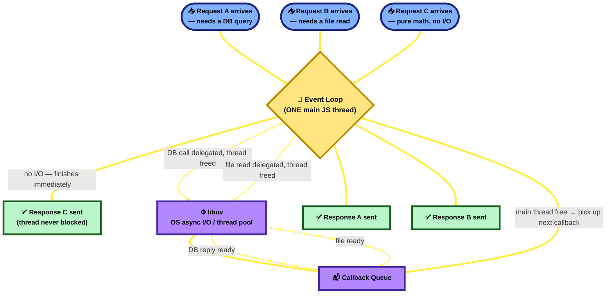

🆕 **New terms:**
- **libuv** — the C library Node.js is built on, which actually provides the event loop and hands off blocking OS-level work (sockets, files, DNS, some crypto) to the operating system's async APIs or to its own small background thread pool.
- **Callback queue** — where a finished async operation's callback waits until the main thread is free to run it. (Modern Node/JS also has a separate, higher-priority **microtask queue** for Promises — resolved promises jump ahead of regular callbacks, but the core idea is the same: wait your turn, run on the one thread.)
- **Non-blocking I/O** — starting a slow operation without stopping the calling code to wait for it to finish; you get notified via a callback/Promise when it's done instead.

**The critical catch — what this does NOT solve:** the event loop only helps with **I/O-bound** waiting. If request C's handler ran a genuinely slow **CPU-bound** loop (e.g. hashing something huge, processing a large in-memory array synchronously) instead of doing math instantly, that work runs directly ON the single main thread — nothing can delegate it away automatically, so it blocks EVERY other request until it finishes. This is exactly the point made in [Q41](#41-when-would-you-choose-nodejs-instead-of-java-spring-boot-and-when-would-java-be-the-stronger-choice-hld): Node's model is excellent for many-connections-mostly-waiting, and a real weak spot for CPU-heavy work — the fix (`worker_threads`, clustering across processes) exists, but it's opt-in extra work, not the default behavior the way Java's thread-per-request model gives you real OS-level parallelism out of the box.

**Honest note on real-project grounding:** neither lab codebase has a substantive Node.js example — there's one bare, empty `http.createServer()` stub (`D:\Le\NodeJs\createServer.js`) with no real request-handling logic in it, so there's nothing genuine to point to here beyond the general mechanism. The HDFC project (Q35) is 100% Java/Spring, so it doesn't offer a real Node comparison point either — this answer is conceptual, not grounded in either real codebase, and it's worth saying so plainly if asked.

🧠 **Memorize this line:** *"Node handles concurrency with ONE thread plus non-blocking I/O — slow work gets delegated to libuv, and the thread keeps serving other requests instead of waiting, picking callbacks back up off a queue as results arrive. It's concurrency through never blocking, not through parallel execution — a genuinely CPU-heavy task still blocks that one thread, since nothing delegates pure computation away for you automatically."*

---

## 44. How do Promises, async/await, callback execution, and the event loop work together? `[HLD]`

**Simple explanation first, extending the waiter analogy from Q42:** A **callback** is handing the kitchen a note: "call me back on this exact instruction the moment it's ready." A **Promise** is the kitchen instead handing YOU a buzzer that will light up later — either with your food (fulfilled) or an apology (rejected) — and you decide what to do when it lights up. **`async`/`await`** is choosing to stand right there and wait for your OWN buzzer before doing your own next task — but crucially, nobody else in the restaurant is forced to wait just because you are; the kitchen and every other table keep moving.

**A:** These four things are layers on top of each other, not four separate mechanisms:

1. **Callback** — the original approach: pass a function as an argument, to be invoked once work finishes. Works fine for one async step; nesting many dependent steps produces "callback hell" (deep, hard-to-read pyramids of nested functions).
2. **Promise** — an object representing a value that doesn't exist yet. Exactly one of three states: **pending** → **fulfilled** or **rejected**, and once settled, it never changes again. `.then()` registers what runs on success, `.catch()` on failure, `.finally()` runs either way — and they chain flat (`.then().then().catch()`) instead of nesting.
3. **`async`/`await`** — syntax sugar over Promises, not a different mechanism. An `async function` **always returns a Promise** (even a plain `return 5` gets auto-wrapped into a resolved Promise). `await` pauses execution of *that one function* until the Promise it's waiting on settles — it does **not** block the single main thread; the event loop keeps running everything else while that function is paused.
4. **The event loop mechanic that actually ties them together — TWO separate queues, not one:**
   - The **macrotask queue** (Q42's "callback queue") — `setTimeout` callbacks, I/O completions, UI events.
   - The **microtask queue** — Promise `.then()/.catch()/.finally()` callbacks, and the code that runs after an `await`. **Higher priority than macrotasks.**
   - **The rule:** once the currently-running script (or the current macrotask) finishes, the event loop drains the **entire** microtask queue — including new microtasks added while draining — before picking up even ONE more macrotask.

**The classic interview trace — proves the rule:**
```js
console.log('1');
setTimeout(() => console.log('2'), 0);
Promise.resolve().then(() => console.log('3'));
console.log('4');
// Real output: 1, 4, 3, 2  — NOT 1, 2, 3, 4
```

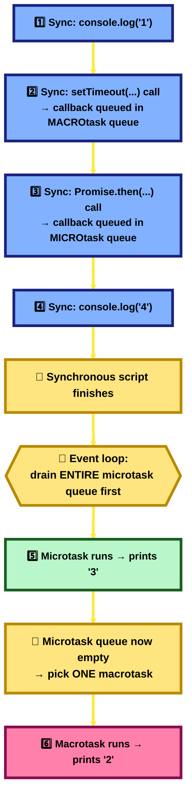

🆕 **New terms:**
- **Macrotask (task) queue** — one task per event-loop cycle; `setTimeout`, `setInterval`, I/O callbacks live here (same queue introduced in Q42's callback queue).
- **Microtask queue** — Promise callbacks and `await` continuations; fully drained after every single macrotask, before the next one starts — this is *why* Promises/`async`-`await` code consistently "jumps the queue" ahead of `setTimeout`, even a `setTimeout(fn, 0)`.
- **"An `async` function always returns a Promise"** — even if you never write `return new Promise(...)` yourself; the `async` keyword does the wrapping automatically, which is what makes `await`-ing the result of another `async` function work at all.

🏦 **Real-project grounding:** the real HDFC Angular UI genuinely uses `async`/`await` — e.g. `urc-number.component.ts`: `async validateUdyam() { ... let noOfError: number = await this.revalidate(); ... }`, pausing just that method until `revalidate()`'s Promise settles, while the rest of the UI stays responsive. One honest caveat: a browser's event loop (this UI) and Node's event loop are conceptually the same model but not identical implementations — a browser adds rendering/paint steps into the cycle that Node doesn't have — so the exact queue names differ slightly by spec, but the core rule (microtasks fully drain before the next macrotask) holds in both. Neither lab codebase (Q42) has a real Node.js backend example to compare against.

🧠 **Memorize this line:** *"Callbacks are the raw mechanism; Promises wrap that in a pending/fulfilled/rejected object you can chain instead of nest; async/await is just syntax sugar over Promises that pauses one function without blocking the thread. Underneath all three, the event loop always fully drains the microtask queue (Promises/await) before touching the next macrotask (setTimeout/I/O) — that ordering rule is the actual mechanism, not a coincidence."*

---

## 46. What is the difference between Server-Side Rendering and Static Rendering? `[HLD]`

**Simple explanation first:** Imagine ordering food. **Client-Side Rendering (CSR)** is a meal kit — the delivery is fast, but you still have to cook it yourself before you can eat (the browser downloads a mostly-empty page plus a JS bundle, then builds the real content itself). **Server-Side Rendering (SSR)** is a restaurant cooking your exact order fresh, right when you ask for it — you get a finished plate, but the kitchen does real work every single time. **Static Rendering (SSG — Static Site Generation)** is a bakery that made a batch of the same pastries this morning — instant to grab, but everyone gets the same pre-made thing, not something made fresh for them.

**A:** The real difference between SSR and Static comes down to **when** the HTML actually gets built:

| | CSR (plain SPA) | SSR | Static (SSG) |
|---|---|---|---|
| HTML built... | in the browser, after JS downloads and runs | on the server, **fresh, on every request** | **once, at build time** — same file served to everyone |
| First paint speed | Slowest — blank screen until JS loads and runs | Fast — server sends already-populated HTML | Fastest — a pre-built file served straight from a CDN |
| Server cost per request | None (just serves the static JS bundle) | Real compute cost, every single request | None — serving a pre-built file is nearly free |
| Can show per-user/live data in the initial HTML? | No (fetched after load, via API calls) | Yes — rendered fresh per request | No — content is frozen at build time |
| SEO | Poor by default (crawlers may not run JS) | Good (real content is already in the HTML) | Best (pure static HTML, nothing to execute) |
| Good fit | Internal apps/dashboards behind login, where SEO doesn't matter | Content that changes often AND needs SEO (news, e-commerce product pages) | Content that rarely changes (marketing pages, docs, blogs) |

🆕 **New terms:**
- **Hydration** — after SSR sends ready-made HTML, the browser still downloads the JS and "wakes it up" to become interactive (attaches event listeners, etc.) — the page LOOKS ready before it's actually clickable.
- **CDN** — see Q4; static rendering's speed advantage comes specifically from being cacheable at the CDN edge, since the file never changes per-request.

🏦 **Real-project grounding:** the real HDFC Angular UI is genuine **CSR** — confirmed by checking `package.json`: no Angular Universal / SSR package is present. This is a reasonable, deliberate-looking fit, not an oversight: it's an internal, authenticated loan-processing portal — nobody needs it indexed by Google, and users are already logged in before they see it, so CSR's main weaknesses (slow first paint, poor SEO) barely matter here. This is a good real example of "the right rendering strategy depends entirely on what you're building," not "SSR/SSG are just strictly better."

🧠 **Memorize this line:** *"CSR builds the page in the browser after JS loads — cheap for the server, slow first paint, poor SEO. SSR builds it on the server, fresh, per request — fast first paint, real per-request compute cost. Static builds it once at build time and serves the same file to everyone — fastest and cheapest, but frozen content. Our real HDFC UI is plain CSR, which is the right call for an internal, authenticated app where SEO and first-paint speed just don't matter much."*

---

## 48. What is the difference between global CSS and CSS Modules? `[HLD]`

**Simple explanation first:** Global CSS is one shared notice board — if two people both pin a note titled "header," whichever went up last wins, and everyone else's "header" note is gone. CSS Modules gives every person their OWN private board, so two "header" notes can exist side by side without ever colliding.

**A:**
- **Global CSS** — every class name lives in ONE shared namespace across the whole app. Simple to start with, but at scale it causes real problems: two components using `.card` for different things silently clash, "which file actually controls this element" gets hard to trace, and teams end up needing manual naming conventions (like BEM — `block__element--modifier`) just to *simulate* scoping by hand.
- **CSS Modules** — a **build-time** feature (a webpack/Vite loader): each `.module.css` file's class names get automatically renamed/hashed to be locally unique (`.header` becomes something like `.header_a3f9x` under the hood), and you import the class names as a JS object (`className={styles.header}`) instead of typing a raw string. A typo or a collision becomes a lookup error at build time, not a silent runtime clash.

| | Global CSS | CSS Modules |
|---|---|---|
| Scope | Whole app, one shared namespace | Per-file, auto-scoped/hashed |
| Collision risk | High at scale | Effectively zero — unique by construction |
| How you reference a class | Raw string: `class="header"` | Imported object: `styles.header` |
| Naming discipline needed | Manual (BEM, prefixes) | None — the build tool handles it |
| Good for | Truly global concerns: resets, typography, design tokens, third-party overrides | Component-specific styles in a component-based framework |

🆕 **New terms:**
- **BEM (Block Element Modifier)** — a manual class-naming convention (`.card__title--active`) used to fake scoping when you're stuck with plain global CSS.
- **CSS-in-JS** — a related but different alternative (styled-components, Emotion) — styles are written directly in JS/TS and scoped automatically at runtime instead of via a build-time class rename.

🏦 **Real-project grounding — and an honest correction on terminology:** the real HDFC Angular UI genuinely uses **both halves of this comparison**, but Angular doesn't literally use "CSS Modules" — that's specifically a React/Vue/webpack-ecosystem term. What's actually real here:
- **Global CSS, confirmed:** `angular.json`'s `styles` array wires in real app-wide stylesheets — Bootstrap, Font Awesome, PrimeIcons, plus custom global sheets (`rlo-style.scss`, `rlo_style.css`) — these apply everywhere, genuinely global.
- **Scoped component styles, confirmed:** every component's own style file is scoped by Angular's own mechanism, **`ViewEncapsulation.Emulated`** (Angular's default — no component in the codebase overrides it to `.None`, confirmed by search). Instead of renaming class names at build time like CSS Modules does, Angular adds a unique auto-generated attribute to every element in a component's template and rewrites that component's CSS selectors to also require that attribute — different mechanism, same practical goal: one component's styles can't leak into another's.

If asked this in an Angular-specific interview, the accurate answer is *"we don't use CSS Modules specifically — Angular's default View Encapsulation solves the same scoping problem a different way,"* not *"yes we use CSS Modules."* Getting this distinction right shows you understand the CONCEPT, not just a memorized buzzword.

🧠 **Memorize this line:** *"Global CSS is one shared namespace — simple, but collisions and specificity wars at scale. CSS Modules (React/Vue/webpack) scopes styles by renaming class names at build time. Angular solves the identical problem differently — View Encapsulation, which scopes via an auto-generated attribute instead of a renamed class — same goal, different mechanism, and our real HDFC UI genuinely uses both global stylesheets (Bootstrap, Font Awesome) and Angular's default scoped component styles side by side."*

---

# Part 2 — LLD Foundations

## 17. What is an LLD interview question actually asking me to do? `[LLD]`

**A:** LLD questions ("design a parking lot", "design a vending machine", "design an elevator system") are NOT asking about servers/databases/scaling. They're asking: **can you turn a real-world problem into clean classes, interfaces, and relationships?** The interviewer wants to see:
1. You identify the right **entities/objects** (nouns: `ParkingSpot`, `Vehicle`, `Ticket`).
2. You define clean **interfaces/abstractions** so the design is extensible (e.g. adding a new vehicle type shouldn't require rewriting everything).
3. You apply relevant **design patterns** where they genuinely fit (not just for the sake of it).
4. You can reason about **edge cases** (what if the parking lot is full? what if two threads book the same spot at once?).

---

## 18. What are the SOLID principles? `[LLD]`

**A:** Five simple rules for writing classes that are easy to extend without breaking existing code:
- **S — Single Responsibility:** a class should do ONE job. (A `Report` class shouldn't also know how to email itself — that's a separate `ReportMailer` class's job.)
- **O — Open/Closed:** you should be able to ADD new behavior without MODIFYING existing, working code. (Add a new `PaymentMethod` by creating a new class, not by editing an `if/else` chain inside `PaymentProcessor`.)
- **L — Liskov Substitution:** a subclass should be usable anywhere its parent class is expected, without breaking things. (If `Square extends Rectangle` but breaks when you resize width/height independently, that's a violation.)
- **I — Interface Segregation:** don't force a class to implement methods it doesn't need. (Don't make every `Worker` implement `eat()` if `RobotWorker` doesn't eat — split into smaller interfaces.)
- **D — Dependency Inversion:** depend on interfaces/abstractions, not concrete classes. (A `NotificationService` should depend on a `MessageSender` interface, not directly on `EmailSender` — so you can swap in `SmsSender` later without changing `NotificationService`.)

**Interview one-liner:** *"SOLID keeps classes small, swappable, and safe to extend — the single most-asked LLD theory question, and the same idea behind [[3-ioc-container--dependency-injection]]-style dependency injection in Spring."*

---

## 19. What is the Singleton Pattern? `[LLD]`

**Scenario:** Your app needs exactly ONE shared configuration object / logger / database-connection-pool — creating a new one every time would waste resources or cause inconsistent state.

**A:** **Singleton** ensures a class has exactly ONE instance for the entire application, and gives everyone a way to access that same instance (usually a static `getInstance()` method). The constructor is made private so nobody else can create additional copies.

**Interview one-liner:** *"Singleton = exactly one instance, globally accessible. Common uses: config objects, logging, connection pools. Overusing it is a common anti-pattern — it can quietly become global mutable state and make testing harder."*

*(Spring beans are singletons by default already — see `Springboot Gradle Lab.md`, Chapter 3, IoC Container.)*

---

## 20. What is the Factory Pattern? `[LLD]`

**Scenario:** You have `CreditCardPayment`, `UpiPayment`, and `WalletPayment` classes. The calling code shouldn't need to know the exact class name to create the right one — it should just say "give me a payment handler for UPI" and get the right object back.

**A:** A **Factory** is a class whose whole job is creating objects, hiding the "which exact class do I instantiate" decision from the rest of the code. The caller just asks the factory for what they need (by a type/name), and the factory decides which concrete class to construct and return.

**Interview one-liner:** *"Factory pattern hides object-creation logic behind one method, so the rest of your code depends on an interface/type, not on a specific class — makes it trivial to add a new payment type later without touching existing calling code (this is the Open/Closed principle in action)."*

---

## 21. What is the Observer Pattern? `[LLD]`

**Scenario:** When a `YouTubeChannel` uploads a new video, every one of its 1 million subscribers should get notified — but the channel shouldn't need to know each subscriber's specific notification logic (email? push notification? SMS?).

**A:** **Observer** lets one object (the "Subject" — `YouTubeChannel`) keep a list of interested objects ("Observers" — subscribers), and automatically notify ALL of them whenever something happens, without knowing the details of what each observer does with that notification.

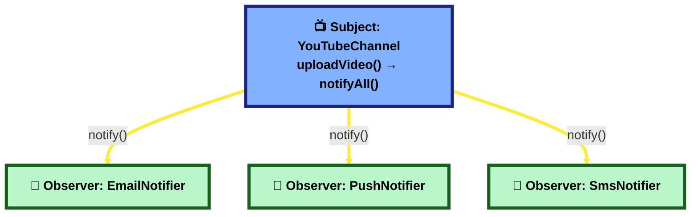

**Interview one-liner:** *"Observer pattern = one-to-many 'notify everyone interested when something changes,' without the subject needing to know each observer's implementation details. It's the same core idea behind pub/sub and message queues (see Q9) — just in-process instead of across services."*

---

## 22. What is the Strategy Pattern? `[LLD]`

**Scenario:** Your checkout flow needs to calculate shipping cost, but the calculation rule changes based on shipping type — Standard, Express, or Overnight. You don't want a giant `if/else` block inside `Checkout`.

**A:** **Strategy** lets you define a family of interchangeable algorithms (each implementing the same interface, e.g. `ShippingStrategy`), and plug in whichever one you need at runtime, instead of hard-coding the logic with `if/else`. `Checkout` just calls `shippingStrategy.calculate()` — it doesn't care which concrete strategy is plugged in.

**Interview one-liner:** *"Strategy pattern swaps out an algorithm at runtime behind a common interface — turns a growing if/else chain into clean, independently-testable, independently-addable classes."*

---

## 23. Composition vs Inheritance — why does this come up in every LLD round? `[LLD]`

**A:**
- **Inheritance** ("is-a" relationship) — `Car extends Vehicle`. Tight coupling: changes to `Vehicle` can silently break every subclass, and a class can usually only extend ONE parent.
- **Composition** ("has-a" relationship) — `Car` HAS an `Engine` object as a field, and calls `engine.start()`. Looser coupling: you can swap in a different `Engine` implementation at runtime, and combine multiple behaviors freely.

**The famous interview guidance:** *"favor composition over inheritance"* — because deep inheritance hierarchies get fragile and hard to change, while composition keeps pieces swappable and independently testable (this is also why the Strategy pattern above uses composition, not inheritance, to swap algorithms).

**Interview one-liner:** *"Inheritance = rigid 'is-a', hard to change later. Composition = flexible 'has-a', swappable at runtime. Default to composition unless there's a genuinely clean 'is-a' relationship."*

---

## 34. Java Modifiers & OOP Mechanics — The Cross-Question Chart `[LLD]`

**Why this exists:** interviewers rarely stop at "what is `final`?" — they immediately ask a follow-up designed to catch someone who memorized the definition but never thought about the mechanics. This chart pairs every keyword with the exact follow-up that actually gets asked.

🧠 **Memorize this line first:** *"`final` = something can't be CHANGED. `static` = something belongs to the CLASS, not an object, and is decided at COMPILE time. `abstract` = something MUST be filled in by a subclass. Overriding = runtime, needs inheritance. Overloading = compile-time, same class."*

### Access modifiers — who can see it

| Modifier | Visible from | Real example |
|---|---|---|
| `private` | only inside the same class | `CustomerEntity`'s private fields (Maven Lab, Ch. 11) |
| *(default, no keyword)* | same package only | |
| `protected` | same package, **plus** subclasses even in other packages | |
| `public` | everywhere | |

**Cross-question:** *"If you `@Override` a method, can you make it MORE private than the parent's version (e.g. `public` → `private`)?"* → **No.** Overriding can only keep the same visibility or make it WIDER, never narrower — otherwise code that legally called the `public` parent method through a subclass reference would suddenly break, which breaks substitutability (the same idea behind the Liskov Substitution Principle, Q18).

### `final` — depends entirely on WHAT it's applied to

| Applied to | Meaning | Cross-question |
|---|---|---|
| `final` variable | can be **assigned** only once | *"Can a `final List` still be modified?"* → **Yes!** `final` locks the reference (which object the variable points to), not the object's internal state — `list.add(...)` still works; `list = new ArrayList<>()` does not. |
| `final` method | **cannot be overridden** by any subclass | *"Can a `final` method still be overloaded?"* → **Yes** — overloading is a same-class, different-parameters concept, completely unrelated to `final`. |
| `final` class | **cannot be extended** at all — no subclasses, ever | *"Name a `final` class you already use daily."* → `String` and every wrapper class (`Integer`, `Long`, etc.) are `final` — one reason `String` is safe to share/cache everywhere. |

### `static` — belongs to the class, not the object

| Concept | Meaning | Cross-question |
|---|---|---|
| `static` variable | ONE copy shared by every instance of the class | *"If `WeatherData extends BaseEntity` and `BaseEntity` had a `static` field, does `WeatherData` get its own copy?"* → **No** — still the exact same one shared copy. |
| `static` method | belongs to the class; callable with no object at all | *"Can a `static` method be overridden?"* → **No.** A subclass can declare a same-named `static` method, but that's called **hiding**, not overriding — which version runs is decided at **compile time** by the reference's declared type, not the real object at runtime (unlike true overriding). |
| `static` block | runs once, the moment the class is first loaded | |

### `abstract` — must be filled in by a subclass

| Concept | Meaning | Cross-question |
|---|---|---|
| `abstract` class | cannot be instantiated directly (`new BaseEntity()` is illegal) — can mix `abstract` and normal methods | *"If you can't instantiate it, why does `BaseEntity` still get a constructor?"* → Because subclasses call it via `super()` the moment THEY get constructed — the abstract class's constructor still runs, just never on its own. |
| `abstract` method | has no body; every concrete subclass MUST implement it | *"Can an abstract method be `static`, `final`, or `private`?"* → **No** — direct contradiction. `abstract` means "a subclass MUST override this," but `static`/`final`/`private` methods can never be overridden at all. |

### Abstract class vs. Interface — and why bother with an interface at all?

🏦 **In your real HDFC project, you already have one clean real example of each, sitting side by side:**

```java
// BaseEntity.java — an ABSTRACT CLASS
@MappedSuperclass
public abstract class BaseEntity {
    @CreatedDate     private LocalDateTime createdOn;
    @LastModifiedDate private LocalDateTime updatedOn;
    // could also have a real, working method here, e.g.:
    public boolean isNew() { return createdOn == null; }
}
```
```java
// MstAppConfigService.java — an INTERFACE
public interface MstAppConfigService {
    ResponseVo getAllConfig();
    ResponseVo getConfigById(String configId);
}
```

**Simple explanation — the core difference:** an **abstract class** is a partly-built parent — it can hold real fields with real values (`createdOn`), and real, already-working methods, alongside methods that subclasses must still fill in. An **interface** is a *pure contract* — historically, just a list of method signatures with no fields and no bodies at all (modern Java allows `default` methods with a body too, but the everyday use is still "just the contract"). Think of it like this: an abstract class is a partly-filled-in form; an interface is just the LIST of questions the form must answer, with total freedom on how.

| | Abstract class | Interface |
|---|---|---|
| Can hold real (non-constant) fields? | Yes — `BaseEntity.createdOn` | No — only `public static final` constants |
| Can have a fully-working method? | Yes | Only via `default`/`static` methods (Java 8+) |
| How many can a class extend/implement? | **Only ONE** (`extends`) | **As many as it wants** (`implements A, B, C`) |
| Constructor? | Yes (called via `super()` by subclasses) | No |
| When to reach for it | Sharing actual state/behavior among closely related classes (e.g. every entity needing `createdOn`/`updatedOn`) | Defining a contract multiple, possibly UNrelated classes can all promise to fulfill |

🧠 **Memorize this line:** *"An abstract class is a partly-built parent that can hold real state — you can only extend ONE. An interface is a pure contract with no state — a class can implement as MANY as it needs."*

**Now the actual question — "why use an interface when you can just override a class's methods?"** Two real reasons:

1. **Java only allows extending ONE class, but implementing MANY interfaces.** If `RegistrationEntity` needed to both inherit `BaseEntity`'s audit fields AND separately promise it can be validated, AND separately promise it's cacheable — it can only `extends BaseEntity` once, but it CAN do `implements Validatable, Cacheable` on top, with no limit. Overriding a class's methods doesn't get you this — you're still capped at one parent.
2. **An interface lets UNRELATED classes share a contract with zero shared code.** `MstAppConfigServiceImpl` and some completely different class could both `implements MstAppConfigService` without being related to each other at all in any class hierarchy — the interface is the only thing they have in common. That's real abstraction: callers depend on the interface, never on which unrelated classes happen to implement it.

**New word alert:** **`default` method** = a method inside an interface that DOES have a body (added in Java 8) — lets you add a new method to an interface later without breaking every existing class that already implements it (they just inherit the default behavior unless they choose to override it).

**Interview one-liner:** *"An abstract class is for closely related classes sharing real state and behavior, and you can only extend one. An interface is a pure contract with no state, and a class can implement as many as it needs — that's the real reason interfaces exist even though overriding already lets you customize behavior: multiple inheritance of type, and letting completely unrelated classes share a contract."*

### Overriding vs. Overloading — the one everyone mixes up

| | Overriding | Overloading |
|---|---|---|
| Method name | same | same |
| Parameters | **must be identical** | **must differ** (count, type, or order) |
| Return type | same, or a subtype (**covariant**) | can differ — but never by itself |
| Decided when | **runtime** — the real object decides (dynamic binding) | **compile time** — the declared argument types decide (static binding) |
| Needs inheritance? | yes (subclass or interface implementation) | no — same class is fine |

**Cross-question (the classic one):** *"Can you overload a method by changing ONLY its return type?"* → **No.** The compiler identifies a method by its name + parameter list — if those are identical, a different return type doesn't create a new overload, it's just a duplicate method declaration and won't compile.

**Real example, from this project:** `MstAppConfigServiceImpl` (HDFC) has `getAllConfig()` marked `@Override` — real overriding, resolved at runtime based on which actual object Spring wired in. `EarthController`'s two methods `getAllPlanets()` and `getPlanetByName(String name)` (Maven Lab) are simply two *different* methods, not an overload of each other — a genuine overload would be two methods with the **same name**, like `getPlanet(String name)` and `getPlanet(Long id)` sitting side by side.

**Interview one-liner:** *"`final` blocks change (of a variable's assignment, a method's overriding, or a class's extension, depending on where it's used); `static` belongs to the class and is resolved at compile time, so it can be hidden but never truly overridden; `abstract` forces a subclass to fill in the blank; overriding is a runtime decision requiring inheritance with an identical signature, while overloading is a compile-time decision requiring the same class with different parameters."*

Sources: [Java67 — Method Overloading/Overriding Interview Questions](https://www.java67.com/2015/08/top-10-method-overloading-overriding-interview-questions-answers-java.html), [Vlad Mihalcea — @MappedSuperclass with JPA/Hibernate](https://vladmihalcea.com/how-to-inherit-properties-from-a-base-class-entity-using-mappedsuperclass-with-jpa-and-hibernate/), [Baeldung — Hibernate Inheritance Mapping](https://www.baeldung.com/hibernate-inheritance)

---

## 24. Worked Example: Design the classes for a Parking Lot `[LLD]`

**A walk-through of how to actually think through an LLD question**, start to finish:

1. **Find the nouns (entities):** `ParkingLot`, `ParkingSpot`, `Vehicle`, `Ticket`.
2. **Find the variations that need abstraction:** vehicles come in different sizes (`Motorcycle`, `Car`, `Truck`) → make an abstract `Vehicle` class/interface, so `ParkingLot` code doesn't care about the exact subtype.
3. **Assign responsibilities (Single Responsibility):** `ParkingLot` finds a free spot and issues tickets; `ParkingSpot` just tracks its own occupied/free state; `Ticket` just stores entry time + spot reference.
4. **Think about edge cases out loud:** what if the lot is full (return `null`/throw a clear exception)? What if two vehicles try to grab the same spot at the exact same moment (this is a **thread-safety** question — see Q25)?

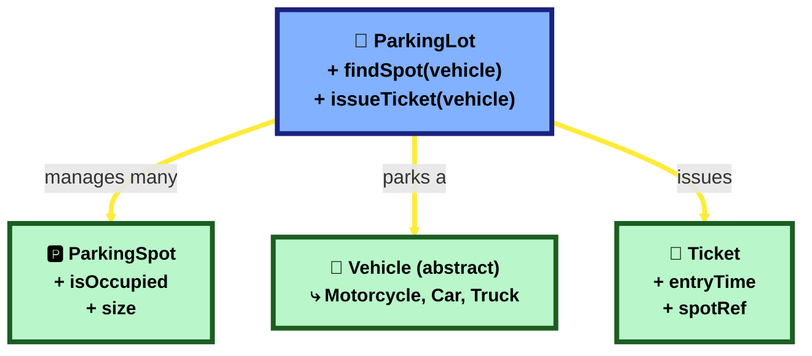

**Interview one-liner:** *"Any LLD question follows the same recipe: find the nouns → find what varies and abstract it → assign one clear responsibility per class → say the edge cases out loud before being asked."*

---

## 25. What concurrency/thread-safety basics should I mention in LLD? `[LLD]`

**Scenario:** Two people try to book the LAST parking spot at the exact same millisecond. Without any protection, both bookings could succeed — now you have 2 tickets for 1 spot.

**A:** This is a **race condition** — the outcome depends on unlucky timing. The standard fix: make the "check if the spot is free, then mark it occupied" sequence **atomic** (happens as one uninterruptible step) using a **lock** (e.g. Java's `synchronized` keyword, or a `Lock` object) around that critical section, so only one thread can be inside it at a time — the second thread waits its turn and correctly sees "already occupied."

**Interview one-liner:** *"Whenever two things can happen 'at the same time' to shared, mutable state, say the words 'race condition' and 'synchronization/locking' out loud — even a one-sentence mention shows the interviewer you're thinking about concurrency, which most beginner LLD answers skip entirely."*

---

# Part 3 — Real-World Production Scenarios

## 26. Your REST API suddenly becomes slow in production. How will you investigate? `[HLD]`

🏦 **In your real HDFC project:** file `InterfaceServiceDispatcher.java` (package `com.intellect.interfaceInt.service`, in the Integrator service) has this real method:

```java
// InterfaceServiceDispatcher.java
@Async("taskExecutor")
@Retryable(
        retryFor = { Exception.class },
        maxAttempts = 4,
        backoff = @Backoff(delay = 2000, multiplier = 2)
)
public void dispatch(String jsonString, String interfaceType, String topicName) throws Exception {
    logger.info(">>> [ASYNC START] | Interface: {} | Processing payload...", interfaceType);
    interfaceServiceCaller.triggerServiceV1(jsonString);   // the actual call to the other service
}
```

**How this flows, in plain words:** some other class in the app calls `dispatcher.dispatch(...)` to hand off work. Because of `@Async`, that caller doesn't wait around — this method runs on its own background thread. Inside, it calls `interfaceServiceCaller.triggerServiceV1(jsonString)` — a separate class whose job is to actually make the outbound call. `@Retryable` wraps this WHOLE method: if `triggerServiceV1(...)` throws any exception (the other service was slow, down, or errored), Spring automatically calls `dispatch(...)` again — up to 4 times total, waiting 2 seconds, then 4, then 8 between tries — instead of giving up on the first failure or hanging forever.

**Why it's there:** calling another service is exactly the kind of "external call" that can randomly hang or fail — `@Async` + `@Retryable` together mean one temporary hiccup in the other service doesn't fail the whole operation immediately, but also doesn't block the calling thread while it waits.

**Simple explanation:** Imagine a shop counter. One day, the shop worker (your API) suddenly takes forever to serve every customer. You don't guess what's wrong — you check things one by one, in order:
1. **Did something change recently?** A new code release, a config change, more visitors than usual? Most slowdowns start right after a change.
2. **Look at simple health numbers** — is the CPU/memory maxed out? (If you have no way to see this at all, that's the first problem to fix.)
3. **Is it EVERY request that's slow, or just one type?** Narrowing this down tells you where to look next.
4. **Check anything the API is "waiting on"** — usually the real cause is one of two things: the database is slow, or the API is waiting on ANOTHER service/API and that other service is slow.
5. **Fix the slow part specifically** — see below.

🧠 **Memorize this line:** *"First check what changed, then check the database and any outside calls — that's where 90% of real slowness hides."*

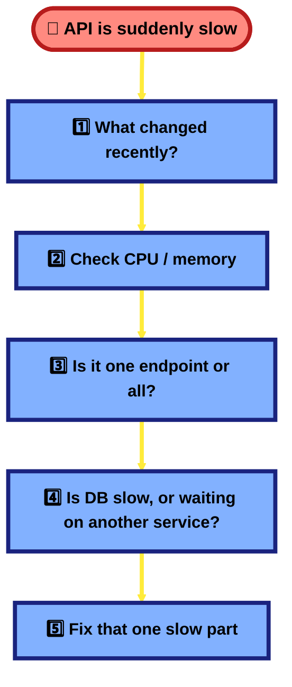

**How to actually fix it, in simple words:**
- **Database query is slow** → add an index. Think of it like adding a bookmark to a book — the database can jump straight to the row instead of reading every page.
- **Calling another service takes too long** → don't wait forever. Set a short timeout, and use "retry with a longer wait each time" (exactly what the real HDFC `@Retryable` example above does).
- **The same slow database call happens again and again for the same data** → save the answer in a fast temporary spot (a "cache") so you don't ask the slow database the same question repeatedly.
- **Logs are printing too much detail in production** → turn that down; writing huge logs on every request slows things down too.

**A simpler picture, from the practice lab (`Springboot Lab`):** `HttpUrlConnectionService.invoke()` calls another service and waits up to 10 seconds (5s to connect + 5s to read) before giving up. If that other service is slow, this one call alone can make the whole app feel stuck. The fix is the same idea as the real HDFC example above — don't wait blindly, retry smartly or give up faster.

**New word alert:** **Retry with backoff** = if something fails, try again — but wait a little longer each time (like knocking on a door again, but waiting a bit longer between knocks instead of knocking non-stop).

---

## 27. One microservice is down. How will you prevent the entire application from failing? `[HLD]`

🏦 **In your real HDFC project:** the same file as Q26 — `InterfaceServiceDispatcher.java` (`dispatch()` method, shown in full there) — is the example here too: when the Integrator service calls another service, it doesn't just give up on the first failure; `@Retryable` makes it try again a few times, waiting longer each try. That's a real, working piece of "don't let one dependency having trouble take everything else down with it." I specifically searched for a dedicated circuit-breaker library (Resilience4j) in your HDFC code and did not find one — just this retry pattern — which is itself a useful, honest thing to say in an interview: *"the real project I worked on used retry-with-backoff; a fuller fix would add a circuit breaker on top of that."*

**Simple explanation:** Imagine three shops in a row, all owned by the same company, and they're connected by a phone line. If Shop B's phone line goes dead, should Shop A and Shop C also shut down? No — they should notice Shop B isn't answering and work around it (maybe say "sorry, that item isn't available right now" instead of freezing up). That's the whole idea: **one broken part should never freeze the whole system.**

🧠 **Memorize this line:** *"Never let a request wait forever for a dependency — fail fast, tell the truth about the failure, and keep the rest of the app working."*

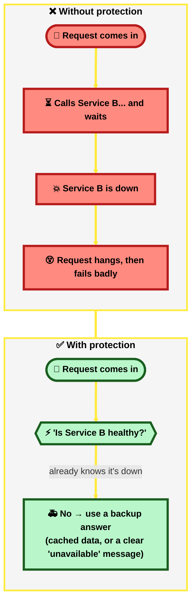

**How to actually fix it, in simple words:**
- **Retry, but smartly** (the real HDFC example) — try again a few times, waiting longer each time, instead of giving up instantly or hammering the dead service non-stop.
- **Add a "circuit breaker"** — after several failures in a row, stop even trying for a short while, and immediately return a backup answer instead of wasting time waiting. Think of it exactly like your home's electrical circuit breaker: too much trouble, and it trips — cutting things off on purpose, safely, instead of letting things burn.
- **Give an honest answer, not a fake "success"** — if something failed, say so clearly (an error message), don't quietly pretend it worked.
- **Keep a short timeout** — don't let one slow call hold everything up for 10+ seconds; a couple of seconds is usually enough to know something's wrong.

**A simpler picture, from the practice lab:** `Springboot Lab`'s `EarthController` calls `Springboot Gradle Lab`'s `/api/solar/planets` endpoint. Right now, if the Gradle Lab is turned off, the Maven Lab waits up to 10 seconds and then still replies "success" (HTTP 200) even though it actually failed — the worst possible outcome, since it's both slow AND lying about what happened. The fix is exactly the ideas above: add a retry/circuit-breaker, and reply honestly when something's actually wrong.

**New word alert:** **Circuit breaker** = a safety switch that says "this dependency has failed too many times, stop calling it for a bit and use a backup answer instead" — same idea as the electrical circuit breaker in your house.

---

## 28. Duplicate records are getting inserted. How will you identify and fix the issue? `[HLD]`

🏦 **In your real HDFC project:** file `PFAgentMasterEntity.java` (a master-data entity in the Channel API) has this real line:

```java
// PFAgentMasterEntity.java
@Column(name = "agent_code", nullable = false, unique = true)
private String agentCode;
```

**How this flows, in plain words:** this class is a JPA `@Entity` — it maps directly to a real database table. `unique = true` isn't just a Java-side note; when the table was created, this tells the DATABASE itself, at the lowest level: *"never allow two rows with the same `agent_code` value, no matter what."* Any code anywhere in the app — even a brand-new, buggy piece of code nobody reviewed carefully — literally cannot insert a duplicate `agentCode`, because the database itself will reject it with an error. That's why this is the single most important fix for this whole question: it doesn't depend on every developer remembering to check first.

**Simple explanation:** Imagine a guest list at a wedding gate. If two guards at two different gates both let in "Mr. Sharma" at the same time because neither checked with the other fast enough, you get Mr. Sharma on the list twice. That's a duplicate record. The real fix isn't "tell the guards to be more careful" (that's not reliable) — it's "put ONE final rule at the actual gate itself that physically refuses a second Mr. Sharma," which is exactly what a database "unique" rule does.

🧠 **Memorize this line:** *"Find duplicates with a simple count query, then fix it with a database rule that physically can't allow the same value twice — checking in your code first is a nice bonus, but the database rule is the one that actually can't fail."*

📌 **Confirmed live in the running pod, not just local source:** the Channel API's currently-deployed jar has a real, dedicated `LsDedupeController.class` — a whole controller specifically for lead/application-source deduplication. Worth mentioning if this comes up: your project doesn't just rely on a DB constraint for duplicates, it has a purpose-built check for at least one specific duplicate-prone flow.

**How to find them, in simple words:**
- Run a simple query: *"show me anything that appears more than once"* — for example, group by email and count how many times each one shows up.
- Check your logs — if you see an error about "duplicate" or "constraint," good news, something already tried to stop it. If you see NO error at all, that's actually worse — it means nothing was protecting you.

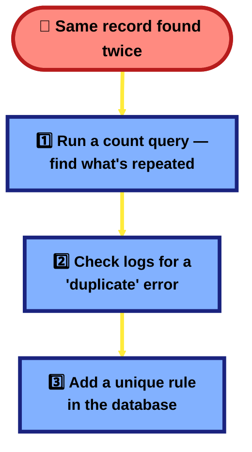

**How to actually fix it, in order of importance:**
1. **Add a "unique" rule in the database** (the real HDFC example above) — this is the one fix that can never be bypassed, even if two requests arrive at the exact same millisecond.
2. **Also check in your own code before saving**, just to give the user a nice, clear message ("this already exists") instead of a confusing error — but this check ALONE is not enough, because two requests can both check at the same moment and both think "looks free to me!"
3. **If a user might click Submit twice, or a network retry might resend the same request** — give each request a one-time ticket number (an "idempotency key") so the server recognizes "I already did this one" and doesn't repeat it.

**A simpler picture, from the practice labs:** both `Springboot Gradle Lab`'s `InterviewReminder.java` and `Springboot Lab`'s `WriteController.java` compute a new ID like this: `id = currentSize + 1`. If two people click "save" at almost the same time, both can compute the SAME id and one save quietly overwrites the other. The fix is simple: never calculate an ID yourself from "how many rows exist right now" — let the database (or a proper thread-safe counter) hand out the ID instead.

**New word alert:** **Idempotency key** = a one-time "ticket number" the app gives to a request, so if the same request accidentally gets sent twice, the server recognizes it and doesn't do the work twice.

---

## 29. Two users update the same record simultaneously. How will you prevent lost updates? `[HLD]`

🏦 **In your real HDFC project:** two real repository files use this exact fix:

```java
// TrnSiteVisitRepository.java
@Lock(LockModeType.PESSIMISTIC_WRITE)
@Query("select t from TrnSiteVisitEntity t where t.proposalId = :proposalId")
TrnSiteVisitEntity findByProposalIdWithLock(@Param("proposalId") Long proposalId);
```
```java
// RegistrationRepository.java
@Lock(LockModeType.PESSIMISTIC_WRITE)
@Procedure(value = "fn_get_colors_id_v2")
String getApprefNo();
```

**How this flows, in plain words:** when some service class calls `repository.findByProposalIdWithLock(proposalId)`, Spring Data JPA runs the `@Query` — but `@Lock(LockModeType.PESSIMISTIC_WRITE)` tells the DATABASE to physically lock that one row the moment it's read. If a second request calls the same method for the same `proposalId` a millisecond later, it doesn't get a copy of stale data — it simply WAITS until the first request's transaction finishes. The second method, `getApprefNo()`, does the same thing while calling a database stored procedure (`fn_get_colors_id_v2`) — almost certainly because it's generating a shared reference number, exactly the kind of value where two requests generating the "next number" at the same time would be a disaster.

This is a real, working example of one of the two standard fixes for this exact question, protecting real records (site-visit entries tied to a loan proposal, and shared reference numbers) that must never be edited by two people at once.

**Simple explanation:** Imagine two people trying to edit the same shared Google Doc at the exact same second, but without seeing each other's changes live — both start from the same old version, both make an edit, both hit save. Whoever saves LAST wins completely, and the other person's change just vanishes — with no warning at all. That's a "lost update," and the silence is what makes it dangerous.

🧠 **Memorize this line:** *"Either lock the record so only one person can edit it at a time, or check a version number and reject a save if someone else changed it first — both stop a silent overwrite."*

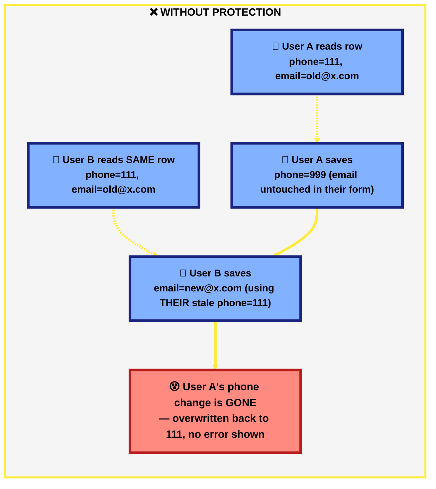

**Why just using `@Transactional` doesn't save you:** a transaction only makes ONE person's read-and-save safe by itself — it doesn't know or care that a SECOND person did the same thing at the same time. It's like a rule that says "finish your own turn properly" but doesn't stop two people from playing at once.

**How to actually fix it, in simple words — two options:**

1. **Lock the row (the real HDFC example)** — the moment someone starts editing a record, physically lock it so nobody else can touch it until they're done. The second person simply waits their turn. Best for records that get fought over a lot (e.g. a shared reference number, a loan proposal).
```java
// Real pattern used in your HDFC project — same idea, simplified:
@Lock(LockModeType.PESSIMISTIC_WRITE)
@Query("SELECT c FROM CustomerEntity c WHERE c.id = :id")
Optional<CustomerEntity> findByIdForUpdate(@Param("id") Long id);
// Whoever reads this row first "holds the pen" — the second person waits until the first is done.
```

2. **Add a version number and reject stale saves (a lighter option for records that RARELY clash)** — add a small counter field to the record. Every save bumps it by one. If someone tries to save using an old counter number, the system says "someone already changed this, please refresh" instead of silently overwriting.
```java
@Version
private Long version; // one field — JPA bumps it automatically on every save
// If your save uses an old version number, JPA throws an error instead of overwriting silently.
```

**A simpler picture, from the practice labs:** `Springboot Lab`'s `CustomerEntity` has no version field and no lock at all — a live example of the exact gap this question is about. `Springboot Gradle Lab`'s `InterviewReminder.update()` is even simpler to picture: it just overwrites the old value with `store.put(id, newValue)`, no check at all — the plainest possible version of "last write wins, silently."

**New word alert:** **Lost update** = two people edit the same thing at once, the second save quietly erases the first person's change, and nobody gets told it happened.

*(See also Q33 for a related, real HDFC example of exactly HOW `@Transactional` actually saves your changes — including a subtlety, "dirty checking," that's easy to get wrong if you don't know it exists.)*

---

## 30. A transaction updates the database and then fails while calling another service. What will you do? `[HLD]`

🏦 **In your real HDFC project:** I specifically checked for this exact pattern (called an "outbox") and did **not** find it used in your HDFC code. Being honest about that is actually useful — it means this is a good "textbook fix I'd bring to the team" answer rather than a "yes I've seen this in production" answer. So this one leans on the practice lab and plain explanation instead.

**Simple explanation:** Imagine you save a form, and right after saving, you're supposed to send an SMS to notify someone. The form save works fine — but the SMS sending fails (maybe the SMS service is down for a second). Now the form is saved, but nobody got told. That's the problem: **you can't make "save to database" and "tell another system" happen as one single, unbreakable step.** If the save works but the "tell someone" step fails, you're stuck in the middle.

🧠 **Memorize this line:** *"Never send the notification directly inside the same step as the database save — write down 'I need to send this' as a row in your own database first, then send it separately, so a failed send never leaves things half-done."*

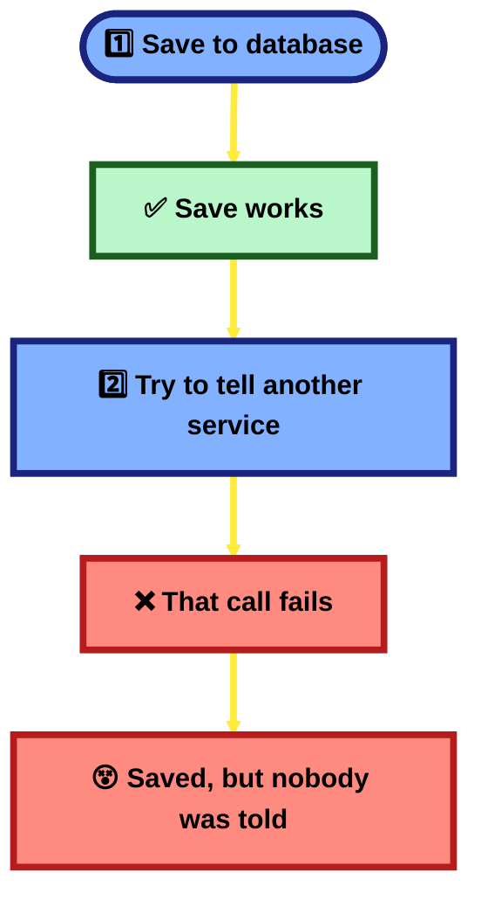

**How to actually fix it, in simple words:**
- **Don't call the other service directly inside the save.** Instead, write a small note to yourself, in the SAME database save: *"remember to notify someone about this."* Since it's now just one database doing one save, it either all works or all fails together — no more half-done state.
- **A separate little background job**, running every few seconds, reads those "remember to notify" notes and actually sends them — and this part is safe to retry as many times as needed, because it's no longer tied to the user's original request.
- This is called the **Outbox pattern** — "outbox" like a mailbox where you drop letters to be picked up and delivered later, instead of trying to hand-deliver them yourself on the spot.

**A simpler picture, from the practice lab:** `Springboot Lab`'s `ValidateSourceService.createCustomer()` saves a customer to the database. It doesn't currently send any notification after — but if someone added a "send a Kafka message" line right after the save, that's exactly where this bug would appear: the customer could get saved, but the notification could fail right after, and nobody would ever know.

**New word alert:** **Outbox pattern** = instead of sending a notification directly, write "please send this" as a row in your own database (safely, in the same save), and let a separate little job actually send it a moment later.

---

## 43. Explain the Saga pattern and how it handles distributed transaction failures. `[HLD]`

**Simple explanation first:** Booking a holiday package usually means three separate bookings: a flight, a hotel, and a rental car — often with three different companies, no single system that can book all three "atomically." If the flight and hotel succeed but the car rental fails, you don't want to be stuck with a flight+hotel and no car — someone needs to go back and **cancel the flight and hotel too**, so you end up either fully booked or not booked at all, never half-booked. A Saga is exactly that: a sequence of steps across different services, where a failure partway through triggers **undoing the earlier steps**, one by one, in reverse.

**A:** Q30 already covers the 2-step version of this problem (DB save + one downstream call). The **Saga pattern** is the general answer when a single business process spans **many** steps across **many** services/databases, and there's no way to wrap them all in one distributed ACID transaction (no cross-service `COMMIT`/`ROLLBACK` exists in a microservices world — see Q8, CAP theorem, and Q16, eventual consistency, for why). Instead of one big transaction, a Saga breaks the process into a chain of small **local transactions**, each with its own **compensating transaction** — a specific action that undoes just that one step if something later in the chain fails.

Two ways to implement it:
- **Choreography** — no central coordinator. Each service does its local transaction, then publishes an event ("OrderPlaced," "PaymentTaken"); the next service listens for that event and reacts. If a step fails, it publishes a "failed" event, and every earlier service listens for THAT and runs its own compensating action. Simple for a short chain, but gets hard to reason about as steps grow — no single place shows the whole flow.
- **Orchestration** — one central coordinator (an "orchestrator") explicitly calls each service in order, waits for success/failure, and on failure calls the compensating action for every step that already succeeded, in reverse order. Easier to follow and debug (one place owns the whole flow), at the cost of that orchestrator becoming a more central, more important piece of infrastructure.

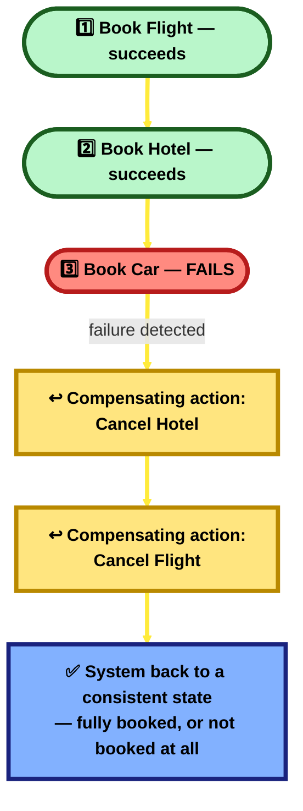

🆕 **New terms:**
- **Local transaction** — a normal, single-database transaction inside ONE service (the kind `@Transactional` already gives you, Q33) — a Saga is a CHAIN of these, not one big cross-service transaction.
- **Compensating transaction** — the specific "undo" action for one step (e.g. "CancelHotelBooking"), written by hand for that step — there's no automatic rollback across services the way there is inside one database, so every step needs its own deliberately-written compensating action.

**How it actually handles failures, step by step:** each local transaction commits for real (it's not "pending" or held open) — so by design, a Saga is NEVER truly atomic like a single DB transaction; it's temporarily inconsistent while in progress and becomes consistent again once every compensating action (if needed) has run. This is a direct, deliberate trade of strict correctness for the ability to span multiple independently-owned services — the same trade-off Q16 (Strong vs Eventual Consistency) describes in general.

🏦 **Real-project honesty check:** I searched the actual HDFC codebase (Channel API, Integrator) for `saga`/`compensat` and found **nothing** — same result as Q30's Outbox check. What I DID find is a local, single-database `EntityManager` rollback in `BorrowerService.java` (a normal `@Transactional`-style rollback on exception) — that's local ACID rollback, not a distributed Saga; it's a different, smaller-scoped tool solving a different problem. So, same as Q30: this is a genuine "textbook pattern I'd propose" answer, not a "yes we use this" answer. That said, the real loan-origination flow (Q35 §C: Registration → KYC → Documents → Decision → **handoff to core banking**) is EXACTLY the shape of process a Saga is built for — if the core-banking handoff step fails after KYC, documents, and a decision are already recorded, a real system would need either a Saga's compensating actions or a manual/ops-driven reconciliation process to reach a consistent state. Worth naming honestly as a gap/improvement idea rather than claiming it's implemented.

**How this connects to patterns already covered:** a Saga is usually BUILT on top of pieces you already know — Kafka/message queues (Q9, and the [Kafka deep-dive](#kafka-deep-dive)) for choreography's events, the Outbox pattern (Q30) so that "publish the next step's event" is itself reliable, and Retry+DLQ (Q35 §D.4) so a failed step is retried sensibly before giving up and triggering compensation.

🧠 **Memorize this line:** *"A Saga replaces one big distributed transaction (which doesn't exist across services) with a chain of small local transactions, each with its own hand-written compensating action to undo it if a later step fails — choreography does this via events with no central coordinator, orchestration does it via one coordinator that calls each step and drives the rollback. It trades strict atomicity for the ability to span independently-owned services, landing on eventual consistency instead."*

---

## 31. The database connection pool is exhausted. How will you handle it? `[HLD]`

🏦 **In your real HDFC project:** file `application.yml` (Channel API) has this real block:

```yaml
# application.yml
hikari:
  minimumIdle: 2
  maximumPoolSize: 20
  idleTimeout: 120000
  connectionTimeout: 120000
  leakDetectionThreshold: 120000
```

**How this flows, in plain words:** this config is read by Spring Boot at startup and used to build the HikariCP connection pool that every database call in the app shares. `maximumPoolSize: 20` means at most 20 database connections exist at once — no matter how many requests arrive, request #21 waits. `connectionTimeout: 120000` (120,000 ms = 2 minutes) is how long a request will wait in that queue before giving up. `leakDetectionThreshold: 120000` means: if any single connection is held for longer than 2 minutes without being given back, HikariCP logs a warning — this is how you'd actually catch a "connection leak" (Q31's new word) before it causes a full outage. None of these are Spring Boot's defaults — someone chose these numbers on purpose, which is exactly the fix this question is asking for.

**Simple explanation:** Think of a small bank with only 10 teller counters. Each customer needs a free counter to be served. If all 10 are busy at once, new customers just wait in line — and if they wait too long, they walk out (that's the "timeout" error). A "connection pool" is exactly that: a limited number of ready-to-use connections to the database, shared by every request. "Exhausted" simply means all of them are busy right now, and nobody's free.

🧠 **Memorize this line:** *"A connection pool has a limited number of database connections — if they're all busy for too long, new requests fail. Fix the slow work holding them, then size the pool properly, don't just make it bigger blindly."*

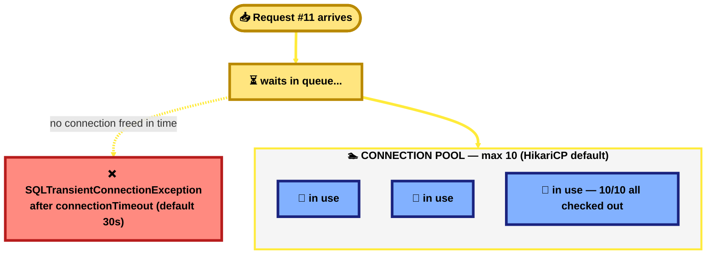

**Why it happens — the simple reasons:**
- **Not enough connections were set up** for how busy the app really gets.
- **Something slow is holding a connection too long** — like a slow database query, or (worse) calling another slow service WHILE still holding a database connection open.
- **A connection was taken and never given back** ("a leak") — like a customer who never leaves the teller counter.
- **A sudden rush of traffic** that's simply bigger than what was planned for.

**How to actually fix it, in simple words:**
1. **Set the numbers on purpose** (the real HDFC example) — decide how many connections you allow, and how long to wait before giving up, instead of leaving it on whatever the default is.
2. **Never do slow work (like calling another service) while still holding a database connection open.** Finish the database part quickly, close it, THEN do the slow part separately.
3. **Turn on "leak detection"** — a setting that warns you in the logs if a connection was held for too long, so you catch the problem early instead of during an outage.
4. **Fix the actual slow query first** — a faster query holds its connection for less time, which often helps more than just adding more connections.
5. **If it's happening right now, restarting the app is a quick, honest band-aid** — it frees everything immediately — but you still have to find and fix the real cause afterward.

**A simpler picture, from the practice lab:** `Springboot Lab`'s config sets the database connection details but never sets a connection limit or a leak-warning at all — it's quietly running on whatever the default happens to be, with nobody having chosen those numbers on purpose. That's the exact gap the real HDFC config (above) already fixes properly.

**New word alert:** **Connection leak** = a piece of code that "borrows" a database connection and never gives it back — over time, this slowly uses up every connection until none are left for anyone else.

---

## 32. Multiple Angular components call the same API, and duplicate requests are generated. How will you optimise it? `[HLD]`

🏦 **In your real HDFC project:** file `http.interceptor.ts` has a class `HttpResponseInceptor` that implements Angular's `HttpInterceptor`. Simplified down to just the caching part (the real file also sets auth headers, which isn't relevant here):

```typescript
// http.interceptor.ts
export class HttpResponseInceptor implements HttpInterceptor {
  constructor(private readonly cache: RequestCache) {}

  intercept(request: HttpRequest<any>, next: HttpHandler) {
    const cachedResponse = this.cache.get(request);
    return cachedResponse
      ? of(cachedResponse)                        // ✅ seen this exact call before → return it instantly
      : this.sendRequest(request, next, this.cache);
  }

  sendRequest(req, next, cache) {
    return next.handle(req).pipe(
      tap(event => {
        // real code checks req.url against a list of slow-changing "reference data"
        // endpoints (dropdowns, bank lists, lookup values) — simplified here:
        if (event instanceof HttpResponse && req.method === "GET" && isReferenceDataUrl(req.url)) {
          cache.put(req, event);                  // save the answer for next time
        }
      })
    );
  }
}
```

**How this flows, in plain words:** EVERY HTTP call any component makes passes through this one `intercept()` method first, automatically (that's what makes it an "interceptor" — nobody has to remember to call it). On the way out, `sendRequest()` checks if the response is worth saving; on the way IN (the next time anyone asks for the same thing), `cache.get(request)` finds that saved answer and returns it immediately — `next.handle(req)`, the part that actually goes to the server, never even runs a second time. The real code has a comment explicitly marking this as a deliberate "API call reduction" fix — so this exact optimization, for this exact problem, is already real and working in your project.

**Simple explanation:** Imagine 3 people in the same office all separately calling the same supplier to ask "what's today's price?" within the same minute. That's wasteful — one person should call once, and just tell the other two the answer. In Angular, when 3 different components (say, a header, a sidebar, and a main section) each independently ask the server the same question at nearly the same time, that's the same waste.

🧠 **Memorize this line:** *"Don't let every component call the API on its own — make them share ONE answer, either by remembering the last response (caching) or by making them all wait on the same in-progress call."*

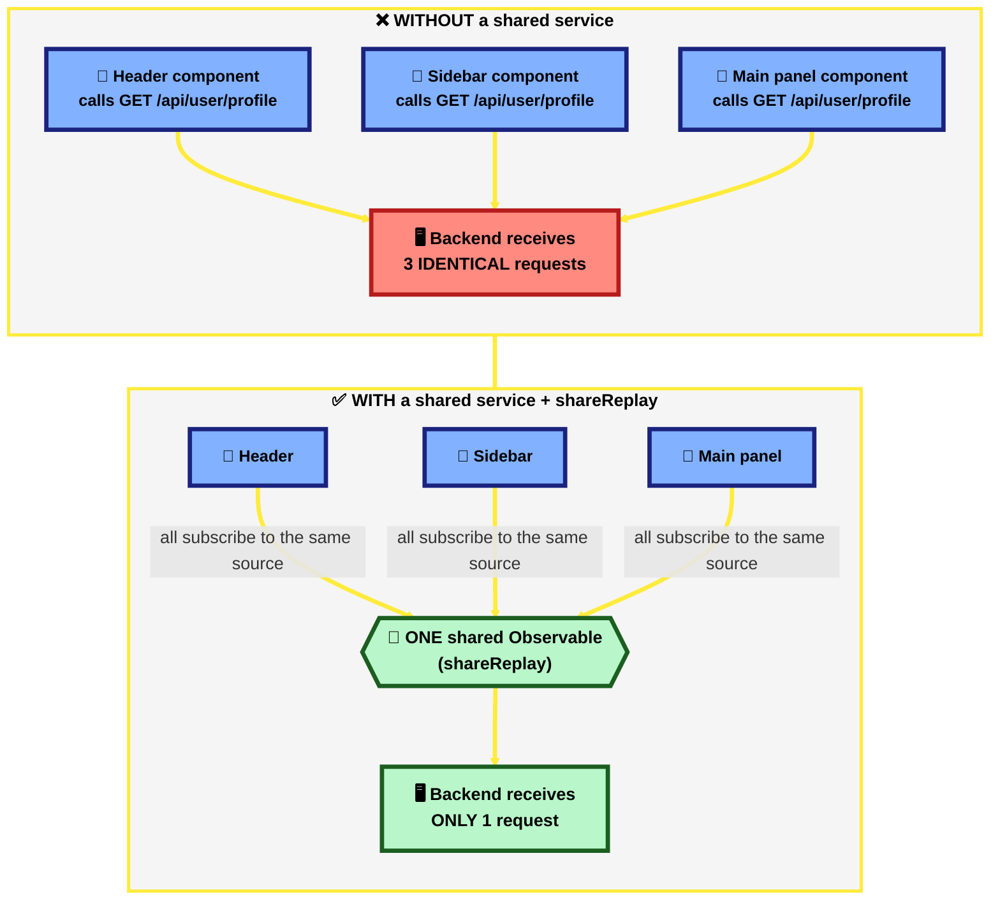

**How to actually fix it, in simple words:**
1. **Cache the answer (the real HDFC example)** — the first time an API is called, save the answer. If the same call happens again soon after, just hand back the saved answer instead of asking the server again. Great for data that doesn't change often (dropdown lists, bank lists, etc.) — exactly what your HDFC app already does.
2. **Share the SAME in-progress call** — a slightly different trick, for when multiple components ask at the exact same instant, before any answer even exists yet to cache: instead of each component making its own call, they all wait on ONE shared call, and all get the same answer when it comes back. (In Angular, the RxJS tool for this is called `shareReplay`.)
3. **Keep one shared "box" of data** that every component just reads from, instead of every component deciding on its own to go and fetch the same thing.

**The small but important difference between #1 and #2:** caching (#1) helps when the same call happens again a little LATER. Sharing one call (#2) helps when several components ask at the exact SAME moment, before there's even an answer to cache yet. A complete answer in an interview mentions both.

**New word alert:** **Interceptor** = a piece of code that automatically watches every single API call your app makes, so you can add a fix (like caching) in ONE place instead of repeating it in every component.

---

## 33. Do you always need to call save() inside @Transactional? `[HLD]`

🏦 **In your real HDFC project:** file `RegistrationService.java` (Channel API) actually has two versions of nearly the same method, sitting side by side in the real codebase — a genuine before/after example:

```java
// RegistrationService.java — OLDER method, calls save() explicitly
@Transactional
public void updateEntity(RegistrationEntity registrationEntity) {
    Optional<RegistrationEntity> registrationEntityData =
            registrationRepository.findById(registrationEntity.getRegistrationId());
    RegistrationEntity regEntity = registrationEntityData.orElse(null);
    // ...set some fields on regEntity...
    registrationRepository.save(regEntity);   // ✅ explicit save
}
```
```java
// RegistrationService.java — NEWER method, no save() call at all
@Transactional
public void updateEntityNew(RegistrationEntity registrationEntity) {
    RegistrationEntity regEntity = registrationRepository
            .findById(registrationEntity.getRegistrationId())
            .orElse(null);
    // ...
    regEntity.setUpdatedOn(PortalUtility.getCurrentDateTime());
    // No need to call save(). Since regEntity is a managed entity and the
    // method is @Transactional, Hibernate will automatically persist the changes.
}
```

**Simple explanation:** Imagine borrowing a library book. While it's still checked out to you, if you scribble a note in the margin, you don't need to separately mail the library a letter saying "I wrote in it" — the moment you return the book, they already see your change. That's exactly what Hibernate does inside a `@Transactional` method: any entity you fetch (like `regEntity` above) is "checked out" and being watched for the rest of the transaction. Change one of its fields, and Hibernate notices the difference by itself when the transaction ends, and saves it — no explicit `.save()` call required. This is called **dirty checking**.

🧠 **Memorize this line:** *"Inside `@Transactional`, if you FETCH a real entity and change its fields, Hibernate saves it automatically when the transaction ends — you only truly need `.save()` for a brand-new entity that was never fetched from the database."*

```mermaid
flowchart TD
    A(["1️⃣ Fetch entity via repository<br/>— now 'managed' & being watched"])
    B["2️⃣ Change a field directly<br/>e.g. regEntity.setUpdatedOn(...)"]
    C["3️⃣ Method ends,<br/>transaction commits"]
    D["✅ Hibernate compares old vs new,<br/>auto-saves the change — no save() needed"]

    A ==> B ==> C ==> D

    linkStyle default stroke:#FFEB3B,stroke-width:4px

    classDef step fill:#82B1FF,stroke:#1A237E,stroke-width:4px,color:#000,font-weight:bold,font-size:16px
    classDef ok fill:#B9F6CA,stroke:#1B5E20,stroke-width:4px,color:#000,font-weight:bold,font-size:16px

    class A,B,C step
    class D ok
```

**⚠️ The catch — worth saying out loud in an interview:** this ONLY works because the entity was fetched via `findById(...)` *inside* the current transaction, which makes it "managed." If the entity instead arrived some other way (e.g. passed in fresh from outside, or the transaction had already ended), Hibernate isn't watching it, and skipping `.save()` would silently do nothing. That's exactly why the OLDER method above still calls `.save()` explicitly — it's the safe default that works no matter what. The newer method only gets away with skipping it because it re-fetched the entity first, in the same transaction.

**A simpler picture, from the practice lab:** `Springboot Lab`'s `ValidateSourceService.updateCustomer()` (see Chapter 12) also fetches the entity via `findById()` first, inside a `@Transactional` method — so it's ALSO managed, and could technically skip `.save()` too. But it calls `.save()` explicitly anyway, which is the safer, more beginner-friendly habit: it works whether or not the entity happens to be managed, so it's a good default until you're confident about when dirty checking applies.

**New word alert:** **Dirty checking** = Hibernate noticing you changed something on an entity it's tracking, without you telling it directly — like a teacher noticing your homework looks different without you announcing "I changed answer #3."

**Interview one-liner:** *"Inside `@Transactional`, JPA automatically tracks and saves changes to any entity it fetched in that same transaction — that's dirty checking. `.save()` is only strictly required for a brand-new entity; calling it anyway on a managed entity is harmless and a safer habit."*

---

## 38. One microservice is unavailable. How do timeout, retry, circuit breaker and fallback prevent cascading failure? `[HLD]`

🏦 **In your real HDFC project — three of these four are already real, in the SAME integration flow, and one is genuinely missing.** This question is really asking: each mechanism solves a DIFFERENT specific failure mode — using only one or two isn't enough, and here's proof, using your own code.

**Simple explanation of "cascading failure" first:** imagine Service A calls Service B, which is stuck/slow. If A just waits forever, A's threads pile up waiting too — and if C calls A, C gets stuck waiting on A, which is stuck waiting on B. One slow service can freeze the ENTIRE chain, one hop at a time. Each mechanism below cuts that chain at a different point.

🧠 **Memorize this line:** *"Timeout stops YOU from waiting forever. Retry recovers from a BLIP. Circuit breaker stops you from hammering something that's ACTUALLY down. Fallback gives the USER something instead of nothing. Each solves a different failure — that's why you need all four, not just one."*

```mermaid
flowchart TD
    A(["📞 Call to Service B"])
    T{{"1️⃣ TIMEOUT<br/>don't wait forever"}}
    R{{"2️⃣ RETRY<br/>maybe it was just a blip"}}
    CB{{"3️⃣ CIRCUIT BREAKER<br/>too many failures? stop trying"}}
    F["4️⃣ FALLBACK<br/>give the user SOMETHING"]

    A ==> T ==>|"too slow"| R
    R ==>|"still failing<br/>after N tries"| CB
    CB ==>|"tripped"| F

    linkStyle default stroke:#FFEB3B,stroke-width:4px

    classDef step fill:#82B1FF,stroke:#1A237E,stroke-width:4px,color:#000,font-weight:bold,font-size:16px
    classDef fb fill:#B9F6CA,stroke:#1B5E20,stroke-width:4px,color:#000,font-weight:bold,font-size:16px

    class A,T,R,CB step
    class F fb
```

### 1️⃣ Timeout — real HDFC code

**What it solves:** without a timeout, a single slow call can hold your thread hostage indefinitely — no failure is ever even detected, the caller just hangs.

```java
// URLConnectionsImpl.java (Integrator) — real file, called at many real sites
response = httpClientIntegratorService.executeWithTimeout(request, timeInterval);
```
```java
// CopyApplicationData.java — real file, where timeInterval actually comes from
int timeInterval = Integer.parseInt(this.vEnvironment.getProperty("timeOutInterval"));
```

**What timeout does NOT solve:** it just makes you give up faster — it doesn't help you recover, and it doesn't stop you from calling a service that's completely down over and over.

### 2️⃣ Retry — real HDFC code

**What it solves:** a lot of failures are temporary blips (a momentary network hiccup, a brief GC pause on the other side) — giving up on the very first failure throws away calls that would have succeeded a second later.

```java
// InterfaceServiceDispatcher.java (Integrator) — real file, already covered in Q26/27
@Retryable(retryFor = { Exception.class }, maxAttempts = 4,
           backoff = @Backoff(delay = 2000, multiplier = 2))
public void dispatch(String jsonString, String interfaceType, String topicName) throws Exception {
    interfaceServiceCaller.triggerServiceV1(jsonString);
}
```

**What retry does NOT solve:** if the other service is TRULY down (not a blip), retry just makes things worse — 4 more attempts against something that can't respond, adding load to an already-struggling service and delaying the inevitable failure.

### 3️⃣ Circuit Breaker — the genuinely missing piece

**What it solves:** stops the "retry makes it worse" problem above — after enough recent failures, it "trips" and stops even attempting calls for a cool-down period, failing instantly instead.

⚠️ **Honest gap:** I specifically searched for a circuit breaker library (Resilience4j) in this codebase and did **not** find one — confirmed already in Q27. What exists instead is `@Recover` (next section) catching the failure *after* all 4 retries are exhausted — which still means 4 full slow attempts happen every single time, even when the target is clearly, completely down. A real circuit breaker would skip straight to the fallback after the breaker trips, without repeating those 4 slow attempts on every subsequent request.

```java
// Illustrative — what's missing, using the same real dispatch() method as the base:
@CircuitBreaker(name = "interfaceService", fallbackMethod = "dispatchFallback")
@Retryable(retryFor = { Exception.class }, maxAttempts = 4, backoff = @Backoff(delay = 2000, multiplier = 2))
public void dispatch(String jsonString, String interfaceType, String topicName) throws Exception {
    interfaceServiceCaller.triggerServiceV1(jsonString);
}
```

### 4️⃣ Fallback — real HDFC code

**What it solves:** even after timeout/retry/circuit-breaker all give up, SOMETHING has to happen — silently swallowing the failure is worse than doing nothing visible at all.

```java
// InterfaceServiceDispatcher.java — real file, real @Recover method
@Recover
public void recover(Exception e, String jsonString, String interfaceType, String topicName) {
    saveToManualDlq(jsonString, interfaceType, topicName, e);   // → trn_kafka_dlq_audit table
}
```

**Worth being precise about in an interview:** this specific fallback is a "preserve it for later" fallback (write to a dead-letter table, Q26/27's Retry+DLQ pattern) — not a "serve the user a cached/default answer right now" fallback. Both are valid fallback strategies; which one fits depends on whether the caller is a background async process (DLQ is fine — nobody's waiting live) or a live user-facing request (a cached/default response is usually better, since a human is waiting for SOMETHING right now).

### Why you genuinely need all four together

| If you only have... | What breaks |
|---|---|
| Timeout, nothing else | You fail fast, but every failure is permanent — no resilience to blips |
| Timeout + Retry, no circuit breaker | A truly-down service gets hammered with full retry attempts on EVERY request, forever, adding load to something already struggling |
| Timeout + Retry + Circuit Breaker, no fallback | Once tripped, calls fail instantly — but the CALLER still gets nothing useful, just a fast failure instead of a slow one |
| All four together | Fail fast (timeout) → recover from blips (retry) → stop hammering a truly-dead dependency (circuit breaker) → still give the user/system something (fallback) |

**Interview one-liner:** *"Each one guards a different failure mode: timeout stops you waiting forever, retry recovers from a temporary blip, a circuit breaker stops you from hammering something that's genuinely down (which retry alone would keep doing), and fallback means the caller still gets something instead of a bare failure. My real project has timeout and retry+DLQ-fallback working together in the same flow — the one gap I'd close is adding a circuit breaker in front of the retry, so a truly-dead dependency gets skipped instantly instead of re-attempted 4 times on every single request."*

---

## 47. Two APIs must be called synchronously. If one fails, how do you ensure the other still executes while returning a proper error and response? `[HLD]`

**Simple explanation first:** Imagine two separate deliveries you ordered in the same order — if delivery A gets lost, that shouldn't cancel delivery B too. You want to know A failed AND still receive B, not one broken order that blocks everything behind it.

**A:** The bug this question is actually testing for: **wrapping both calls in ONE shared try-catch.** If you do that, an exception thrown by the first call jumps straight to the `catch` block, and the second call **never executes at all**. The fix is simple but easy to get wrong under pressure:

1. **Give each call its OWN try-catch**, not one try-catch around both. Catch the exception right where it happens, capture it into a result object, and let execution continue to the next call — never let an exception from call A propagate up past where call B is waiting to run.
2. **Never let the catch block re-throw and stop the method** — capture the failure as data (a result object saying "this one failed, here's why"), not as a thrown exception that unwinds the stack.
3. **Build ONE combined response after both calls have been attempted**, reporting both outcomes — something like `{ apiA: { success: true, data: ... }, apiB: { success: false, error: "timeout" } }` — so the caller can see exactly which one worked and which didn't, instead of getting one opaque failure or one opaque success.
4. **Pick an honest status code.** A single 200 with a body that clearly marks per-item success/failure is the common pragmatic choice; HTTP also has `207 Multi-Status` for exactly this shape, though it's rarely used outside WebDAV-style APIs in practice.

```java
// isolate each call — never one shared try-catch around both
ApiResult resultA;
try {
    resultA = apiAClient.call();
} catch (Exception e) {
    resultA = ApiResult.failure(e.getMessage());   // captured, not thrown
}

ApiResult resultB;
try {
    resultB = apiBClient.call();                   // ALWAYS runs, regardless of A's outcome
} catch (Exception e) {
    resultB = ApiResult.failure(e.getMessage());
}

return CombinedResponseVo.of(resultA, resultB);     // caller sees both outcomes, not just one
```

**If the two calls don't depend on each other's result**, you can go further and run them **concurrently** (`CompletableFuture.supplyAsync` for each, then `.join()` both) instead of one-after-another — still isolating failures the same way, just faster. The question specifically says "synchronously" though, so the sequential two-try-catch version above is the direct answer.

🆕 **New terms:**
- **Bulkhead pattern** — isolating failures so one dependency going down doesn't sink the whole request, named after a ship's watertight compartments (one compartment flooding doesn't sink the whole ship). This is the same family as timeout/retry/circuit-breaker/fallback (Q38) — just applied to "two calls in one request" instead of "one call with retries."
- **Partial success response** — a response that reports mixed outcomes for a multi-part operation, instead of forcing an all-or-nothing success/failure.

🏦 **Real-project grounding:** `RegistrationService.java` genuinely applies this discipline at scale — **13 separate, independent `try-catch` blocks** across its methods, each wrapping one risky operation rather than one giant try-catch wrapping everything. I haven't pinpointed one single method that calls exactly two APIs and returns a combined partial-success object in the shape shown above, but the underlying habit — isolate each risky call, don't let one failure's exception silently cancel the next operation — is real and consistently applied in this codebase, not just a textbook idea.

🧠 **Memorize this line:** *"The bug to avoid is one shared try-catch around both calls — that makes the second call never run if the first one throws. The fix: one try-catch PER call, capture each outcome as data instead of letting it throw past the second call, then build one combined response reporting both results. This is the Bulkhead pattern — the same failure-isolation philosophy as Q38's circuit breaker, just for 'two calls in one request' instead of 'one call with retries.'"*

### The same question, asked with async/await (this is likely how it was actually asked)

**If this question came up in a JavaScript/TypeScript interview**, "synchronously" almost always means "one `await` after another," not true thread-blocking — and the expected answer leans on Promises/async-await (Q44) rather than Java's try-catch. The exact same bug shows up in two forms:

**Bug form 1 — one shared try-catch around two `await`s (identical mistake, JS syntax):**
```js
try {
  const resultA = await apiA();
  const resultB = await apiB();   // never runs if apiA() rejects
} catch (e) {
  // you don't even know WHICH one failed
}
```

**Bug form 2 — using `Promise.all()` for two independent calls:** `Promise.all()` rejects **immediately** the moment ANY one of its promises rejects, discarding the results of every other promise — even ones that already succeeded. This is the exact same short-circuiting bug as the shared try-catch, just at the Promise level.

**The fix — `Promise.allSettled()`**, the tool built specifically for this: it waits for **every** promise to finish, succeed or fail, and gives you a per-promise result — nothing short-circuits:
```js
const [resultA, resultB] = await Promise.allSettled([apiA(), apiB()]);
// each is { status: 'fulfilled', value } or { status: 'rejected', reason }
// apiB() ALWAYS runs and its outcome is ALWAYS reported, regardless of apiA()
```
If the calls genuinely must run in sequence (B depends on something about A, or true API rate-limit ordering), fall back to individual try-catch per `await` — same shape as the Java version above, just with `await` instead of a blocking call.

🏦 **Real-project grounding — an honest, real example of exactly this trade-off:** the real HDFC Angular UI's `hdfc-form.component.ts` → `revalidate()` (the same method [Q44](#44-how-do-promises-asyncawait-callback-execution-and-the-event-loop-work-together-hld) already cited, called via `await this.revalidate()`) does:
```ts
await Promise.all(formFieldList).then((errorCounts) => { ... });
```
— `Promise.all()` on a whole list of per-field revalidation promises. If just ONE field's revalidation call rejects, `Promise.all()` rejects the entire batch immediately, and every OTHER field's already-computed error count is discarded rather than counted. This is a genuine, real instance of the exact anti-pattern this question is testing for — `Promise.allSettled()` would be the safer choice here, since one field failing to revalidate shouldn't wipe out the results for every other field.

🧠 **Memorize this line (JS version):** *"`Promise.all()` rejects the instant ANY promise rejects, discarding every other result — the JS equivalent of one shared try-catch. `Promise.allSettled()` waits for all of them and reports each outcome individually, which is the actual fix. Our real Angular code uses `Promise.all()` for batch field revalidation — a real, honest example of where `allSettled()` would be the safer choice."*

### Short code — this is the version to actually memorize

```js
// ❌ bug: Promise.all() rejects the instant ONE fails — the other's result is lost too
const [a, b] = await Promise.all([apiA(), apiB()]);

// ✅ fix: Promise.allSettled() — both always run, each outcome reported separately
const [a, b] = await Promise.allSettled([apiA(), apiB()]);
const result = {
  apiA: a.status === 'fulfilled' ? a.value : { error: a.reason },
  apiB: b.status === 'fulfilled' ? b.value : { error: b.reason }
};
```

**If order genuinely matters (must stay sequential), this is the short version:**
```js
let resultA, resultB;
try { resultA = await apiA(); } catch (e) { resultA = { error: e.message }; }
try { resultB = await apiB(); } catch (e) { resultB = { error: e.message }; }  // always runs
```

**Say out loud while writing it:** *"Promise.all() short-circuits on the first rejection — allSettled() never does, it always runs both and reports each outcome separately."*

---

## 39. How would you diagnose a production issue using Dynatrace and Splunk? `[HLD]`

🏦 **In your real HDFC project — an honest note first:** I specifically checked for "Dynatrace"/"Splunk" in the Channel API and Integrator repos and helm charts, and found **no literal config** for either — that's normal, not a gap; these tools are almost always wired up at the platform/cluster level by an infra team (an agent injected into every pod), not from inside application source code. **But I found the exact mechanism that makes both tools work together**, and it's genuinely worth knowing:

```xml
<!-- logback.xml — real file, real pattern -->
<property name="PATTERN"
    value="%d{yyyy-MM-dd HH:mm:ss} [%X{traceId:-}] [%X{spanId:-}] [%t] [%-5level] %logger{36}:%L - %msg%n" />

<appender name="STDOUT" class="ch.qos.logback.core.ConsoleAppender">
    <encoder><pattern>${PATTERN}</pattern></encoder>
</appender>
```

**Why this one line matters so much:** every single log line this app writes is automatically tagged with `traceId` and `spanId` — a unique ID for "this one request" and "this one hop within it." Logs go to `STDOUT`, which is exactly how a log-shipping agent (Splunk's, or any other) picks logs up from a Kubernetes pod without the app needing to know anything about where they end up. That `traceId` is the literal thread connecting an APM tool (Dynatrace) to a log search tool (Splunk) — which is the whole answer to this question.

**Simple explanation of what each tool actually is, first (these are genuinely new terms, worth being explicit about):**
- **Dynatrace** = an **APM tool** (Application Performance Monitoring). An agent gets injected into your running app automatically — no code changes needed — and it draws you a live map: which service called which, how long each hop took, CPU/memory per service, and it auto-flags anomalies ("this service is 5x slower than its usual baseline right now").
- **Splunk** = a **log aggregation and search tool**. Every service's logs (from every pod) get shipped into one central, searchable place — instead of you running `kubectl logs` on 10 different pods one at a time (Q24 in `kubectl.md`), you search ONE place for everything.

🧠 **Memorize this line:** *"Dynatrace tells you WHERE it's slow or failing across the whole request chain; Splunk tells you WHAT actually happened in the logs for that exact request — the `traceId` is what lets you jump from one to the other."*

### The actual diagnosis flow

```mermaid
flowchart TD
    A(["🚨 Users report an issue<br/>(or an alert fires)"])
    B["1️⃣ Open Dynatrace<br/>find the slow/failing service & method"]
    C["2️⃣ Grab the traceId<br/>from that specific trace"]
    D["3️⃣ Search that EXACT traceId in Splunk<br/>across every service's logs"]
    E["4️⃣ See the real request/response,<br/>error messages, business context"]
    F["✅ Root cause identified"]

    A ==> B ==> C ==> D ==> E ==> F

    linkStyle default stroke:#FFEB3B,stroke-width:4px

    classDef step fill:#82B1FF,stroke:#1A237E,stroke-width:4px,color:#000,font-weight:bold,font-size:16px
    classDef done fill:#B9F6CA,stroke:#1B5E20,stroke-width:4px,color:#000,font-weight:bold,font-size:16px

    class A,B,C,D,E step
    class F done
```

**Step by step, in plain words:**
1. **Start in Dynatrace** — it shows you a visual timeline of the slow/failing request as it hopped across services (this is exactly the "which service, how long" picture Q26 was solved manually via metrics/logs — Dynatrace gives you this automatically, pre-built). It'll often point straight at the slow method, or even the slow SQL query.
2. **Grab that request's `traceId`** — Dynatrace shows you the ID for the exact trace you're looking at.
3. **Search Splunk for that exact `traceId`** — because every service tags its logs with the same `traceId` (the real `logback.xml` pattern above), this pulls every log line, from every service, for that ONE specific request — no more guessing which pod or which time window to look at.
4. **Read the actual error/payload/business context** in those logs — Dynatrace tells you WHERE and roughly WHAT KIND of problem; Splunk tells you the actual detail (which field was null, which business rule failed, the real exception message).

**How this ties to what's already in this doc:** this is the enterprise, paid version of the exact same idea from Q26 (Actuator/Micrometer/Prometheus/Grafana are the free, self-hosted starting point; Datadog/New Relic/Dynatrace are the paid, auto-instrumented version) and Q31 (connection-pool metrics — the same kind of thing Dynatrace would surface automatically instead of you manually checking `hikaricp.connections.pending`).

### 🆕 New terms here, explained in one line each

| Term | What it actually is |
|---|---|
| **APM (Application Performance Monitoring)** | A tool that auto-instruments your running app to show request timelines, resource usage, and anomalies — Dynatrace, Datadog, New Relic are all this category. |
| **Trace / Span** | A **trace** = the full journey of one request across every service it touched. A **span** = one single hop/step within that journey (e.g. "Channel API called Integrator" is one span). |
| **traceId / spanId** | Unique IDs attached to a request (and each hop within it) so you can find every log line and every metric tied to that ONE specific request, across every service — the literal glue between an APM tool and a log tool. |
| **Log aggregation** | Collecting logs from every server/pod into one central, searchable place (Splunk, or the free equivalent ELK/Loki), instead of checking each machine individually. |

**Interview one-liner:** *"I'd start in Dynatrace to see WHERE the request chain is actually slow or failing — it gives you the trace across every service hop automatically. Then I take that trace's `traceId` and search Splunk for the exact matching logs across every service, since they're already tagged with the same ID — that gives me the real error/payload detail Dynatrace's high-level view doesn't show. The `traceId` propagated through every log line is what makes jumping between the two possible."*

---

## 40. How would you protect sensitive healthcare data in transit, at rest, and in application logs? `[HLD]`

🏦 **In your real HDFC project — genuinely strong protection for two of the three, and a real, confirmed gap on the third.** This question has THREE separate parts, and interviewers specifically ask it this way because "in application logs" is the one almost everyone forgets — and it's a real, live gap in your own codebase, which makes it a great story to tell.

🧠 **Memorize this line first:** *"Three different places need three different protections — encrypt it in transit (network), encrypt it at rest (disk/DB), and NEVER let it appear in a log line at all, because logs are usually far less protected than the database itself."*

```mermaid
flowchart TD
    A["🌐 In transit<br/>data moving over the network"]
    B["🗄️ At rest<br/>data sitting in the database/disk"]
    C["📝 In logs<br/>data written to log files"]

    A -->|"protect with"| A1["TLS + payload-level encryption"]
    B -->|"protect with"| B1["Encrypt the DB/disk + encrypt specific sensitive fields"]
    C -->|"protect with"| C1["Never log it — mask/redact before the log line is written"]

    linkStyle default stroke:#FFEB3B,stroke-width:4px

    classDef q fill:#82B1FF,stroke:#1A237E,stroke-width:4px,color:#000,font-weight:bold,font-size:16px
    classDef a fill:#B9F6CA,stroke:#1B5E20,stroke-width:4px,color:#000,font-weight:bold,font-size:15px

    class A,B,C q
    class A1,B1,C1 a
```

### 1️⃣ In transit — real HDFC evidence, and it's layered

```java
// EncryptionFilter.java — real file, real class signature
@Component
@Slf4j
@Order(2)
public class EncryptionFilter extends OncePerRequestFilter {
    @Autowired private CryptoEncryption cryptoService;
    // also wires in HmacAuthenticationService and ArxAssertionService
}
```

**What this actually is, in plain words:** a `Filter` sits in front of every request/response, before it reaches any controller. This one uses `CryptoEncryption` to encrypt/decrypt the actual request/response BODY — on top of whatever TLS is already doing at the network level. That's genuinely a step beyond the basics: TLS protects the connection itself (someone sniffing the network sees nothing), but this filter protects the *payload content* too, which matters if TLS ever gets terminated early (e.g. at a load balancer) and the request continues over an internal network in plaintext — the payload itself is still encrypted.

🆕 **New term — HMAC:** a way to prove a message wasn't tampered with in transit — the sender computes a signature using a shared secret key, the receiver recomputes it and checks it matches. Different job from encryption (encryption hides the content; HMAC proves it wasn't changed).

### 2️⃣ At rest — real HDFC evidence

Real utility classes exist specifically for this: `CryptoEncryption.java`, `EncryptionDecryption.java`, `NeslDataEncryption.java` — the standard pattern they enable is: **encrypt a sensitive field's value before saving it, decrypt it back only when actually read**, so even someone with raw DB access (a backup file, a misconfigured read replica, a careless query) sees ciphertext, not the real value.

```java
// Illustrative — the standard shape this kind of utility supports:
entity.setAadhaarNumber(cryptoService.encrypt(rawAadhaarNumber));   // before save
// ...
String realValue = cryptoService.decrypt(entity.getAadhaarNumber()); // only when actually needed
```

**The other half of "at rest":** the database/disk itself should also be encrypted at the storage layer (a platform-level setting, e.g. encrypted EBS volumes/TDE on the DB) — field-level encryption and disk-level encryption are complementary, not either/or: disk encryption protects against "someone steals the physical disk," field-level encryption additionally protects against "someone with a valid DB login but no business reason to see this specific field."

### 3️⃣ In application logs — the real, confirmed gap

⚠️ **This is a genuine, live issue in your real code, not a hypothetical:** `RegistrationService.java` logs a customer's raw mobile number, in plaintext, repeatedly:

```java
// RegistrationService.java — real lines, real file
log.debug("Enter into saveNewEntity for mobile number :: " + registrationEntity.getMobileNumber());
log.info("Register user success for mobile number :: " + registrationEntity.getMobileNumber());
log.error("Error in saveNewEntity for mobile number :: " + registrationEntity.getMobileNumber() ...);
```

**Why this matters even though the mobile number is separately encrypted at rest (§2):** none of that protection helps once the raw value is written into a LOG FILE — logs typically flow to far more places, with far weaker access control, than the database: `SAVE-TO-FILE` on disk (real `logback.xml`, Q39), shipped to Splunk (Q39), often readable by a much wider group of engineers than "who can query the production database." Encrypting the DB column while logging the raw value right next to it defeats the point.

**How I'd actually fix it:**
```java
// ❌ current — logs the real number
log.info("Register user success for mobile number :: " + registrationEntity.getMobileNumber());

// ✅ mask before logging — keep enough to be useful for debugging, hide the rest
log.info("Register user success for mobile number :: " + maskMobile(registrationEntity.getMobileNumber()));

private String maskMobile(String number) {
    if (number == null || number.length() < 4) return "****";
    return "******" + number.substring(number.length() - 4);   // e.g. ******1234
}
```
A more scalable version of the same idea: a shared `PiiMaskingUtility` used everywhere PII might get logged, or a custom Logback pattern converter that automatically masks known-sensitive field patterns (mobile numbers, Aadhaar, PAN) in every log line, so individual developers don't have to remember to call a masking method every single time.

### The comparison table, all three together

| | In transit | At rest | In logs |
|---|---|---|---|
| Protects against | someone on the network | someone with disk/DB access | someone with log-file/log-tool access |
| Real HDFC evidence | `EncryptionFilter` + `CryptoEncryption` + HMAC — ⚠️ see Q45 for a real, deeper flaw found in this exact mechanism | `CryptoEncryption`/`EncryptionDecryption`/`NeslDataEncryption` utilities | ⚠️ NOT protected — real plaintext mobile numbers in `RegistrationService` logs |
| The fix, if missing | TLS (baseline) + payload-level encryption | encrypt sensitive fields before persisting | mask/redact before the log line is ever written — never log raw PII, full stop |

**Interview one-liner:** *"Three different protections for three different attack surfaces: TLS plus payload-level encryption in transit, field-level encryption plus disk encryption at rest, and — the one people forget — masking sensitive fields before they ever reach a log line, since logs usually have far weaker access control than the database itself. I've actually found this exact gap in a real codebase: fields properly encrypted at rest were still being logged in plaintext right next to that same protection."*

---

## 45. What security vulnerabilities (VAPT-style findings) exist in my real HDFC project, and what security concept does each map to? `[HLD]`

> The real Channel API repo's own folder name is `K4_CLO_HDFC_CHANNEL_API_VAPT` — VAPT (Vulnerability Assessment and Penetration Testing) isn't a hypothetical exercise here, it's a real, ongoing part of this project. Everything below is real code, verified by directly reading it — not a generic OWASP list.

**A:** A real VAPT-style review isn't just "list bad things" — it's findings AND the controls that are already genuinely good. Here's both, each mapped to the security concept an interviewer would want you to name.

**⚠️ Real findings:**

| # | Finding | Real evidence | Security concept | The fix |
|---|---|---|---|---|
| 1 | The response-encryption filter ships the AES key **inside the same payload** as the ciphertext it protects | `EncryptionFilter.java` → `CryptoEncryption.generatePayload()` literally does `secretKey + cipherText + iv`, concatenated into one string, sent as the actual response body | **Key management** — never transmit a decryption key alongside the data it protects | Exchange/derive the key out-of-band (e.g. a KMS-backed envelope-encryption scheme), never bundle it with the ciphertext |
| 2 | Real database/admin passwords committed as plain-text values in version-controlled Helm charts, across **two different services** | Real `application.yml`/Helm values files — actual credential strings present (redacted here on purpose; see [[feedback-hdfc-confidentiality]] — real values never get quoted into this doc) | **Secrets management** (see `cloud.md` Q19) | Move to a real secret manager (GCP Secret Manager, per `cloud.md` Q2), injected at deploy time — the values file should only ever reference a secret's *name* |
| 3 | Some endpoints allow **any** website to call them | `@CrossOrigin` with no origin restriction on real endpoints in `MasterController.java`/`RmNameController.java` — defaults to allow-all | **Access control / CORS misconfiguration** | Restrict `allowedOrigins` to the actual known frontend domain(s), never leave it bare |
| 4 | Customer mobile numbers logged in plaintext | `RegistrationService.java` — `log.debug/info/error(... + registrationEntity.getMobileNumber())` (also covered in Q40's "in logs" row) | **Sensitive data exposure / lack of log masking** | Mask PII before it reaches a log line (e.g. show only the last 4 digits) — logs usually have weaker access control than the DB itself |

**✅ Real controls already in place (worth naming too — a VAPT review isn't only bad news):**

| # | Control | Real evidence | Security concept |
|---|---|---|---|
| 5 | OTP brute-force / max-attempt limiting is genuinely implemented | max-attempt logic referenced across 10 real files (`RegistrationService`, `AgriKycService`, `BiometricController`, and others) | **Rate limiting / brute-force protection** |
| 6 | Containers run hardened, not as root | real Helm chart: `runAsNonRoot: true`, `readOnlyRootFilesystem: true`, `allowPrivilegeEscalation: false` (also in `kubectl.md` §9, `cloud.md` Q15) | **Least privilege / container hardening** |
| 7 | Contested records are protected from concurrent overwrites | `TrnSiteVisitRepository` — real `@Lock(LockModeType.PESSIMISTIC_WRITE)` (Q29) | **Concurrency control** |
| 8 | Errors are handled centrally, not leaked per-controller | `ExceptionAdvice` + `CloPortalException` hierarchy (Q35 §D.7) | **Centralized error handling — reduces info-disclosure risk** |

🧠 **Memorize this line:** *"A real security review always has both columns — genuine gaps (key-in-payload, hardcoded secrets, open CORS, PII in logs) and genuine strengths already in place (brute-force limiting, non-root containers, pessimistic locking, centralized error handling). Naming both, each tied to its actual security concept, reads as a real audit — naming only the bad reads as a complaint, and naming only the good reads as marketing."*

**One line to say out loud in an interview:** *"In a real VAPT-style pass over my project, the standout finding was our response-encryption filter shipping the AES key inside the same payload as the ciphertext — a key-management flaw, not a config issue. Alongside real gaps like hardcoded secrets in two services and open CORS on a few endpoints, there are genuinely solid controls already in place: OTP brute-force limiting, non-root hardened containers, and pessimistic locking on contested records."*

---

# Part 4 — "Design a System From Scratch"

## 36. Design a Scalable and Secure Healthcare Appointment / Patient-Record Service `[HLD]`

> *This is a different kind of question from the ones above — not "explain what's already there," but "design something new." There's no real HDFC/lab code to cite as "this exact thing exists" — instead, I'll point out wherever a design choice below is the SAME pattern already proven real in your HDFC project (Section 35), because "I've actually built this pattern before" is a much stronger interview answer than reciting theory.*

**Simple explanation of the ask, first:** two different features, bundled in one question — (1) booking/viewing appointments, and (2) storing/viewing patient medical records — and they are NOT equally sensitive. An appointment slot ("Dr. Singh, 3pm Tuesday") is mildly private. A patient's medical history is extremely sensitive (a real legal category — PHI, Protected Health Information, under laws like HIPAA in the US or similar health-data rules elsewhere). That difference in sensitivity should drive real architectural decisions, not just be a footnote — that's the whole point of this question.

🧠 **Memorize this line first:** *"Appointments and patient records look similar but have very different security needs — I'd treat them as two separate services with two different security postures, not one 'patient service' doing both."*

### Step 1 — Requirements (say these out loud before designing anything)

**Functional:** book/cancel/reschedule an appointment, view doctor availability, view/update a patient's medical record, doctors see only their own patients' records.
**Non-functional:** must scale to many concurrent users checking availability, must NEVER double-book the same slot, patient records need strong audit trails (who viewed/changed what, and when — a real compliance requirement, not optional), high availability, encrypted sensitive data.

### Step 2 — High-level architecture

```mermaid
flowchart TD
    U(["🧑‍💻 Patient / Doctor / Staff"])
    GW["🚪 API Gateway<br/>auth + rate limiting"]

    U ==> GW

    subgraph APPT[" 📅 APPOINTMENT SERVICE — lower sensitivity "]
        direction TB
        AS["Booking / availability logic"]
        ADB[("Appointments DB<br/>strong consistency")]
        CACHE[("⚡ Cache<br/>doctor availability, short TTL")]
    end

    GW ==> APPT
    APPT ~~~ REC

    subgraph REC[" 🔒 PATIENT RECORD SERVICE — high sensitivity "]
        direction TB
        RS["Record read/write logic<br/>strict RBAC"]
        RDB[("Records DB<br/>encrypted at rest")]
        AUDIT[("📋 Audit log<br/>every access, who+when")]
    end

    GW ==> REC
    Q[("📨 Queue<br/>notifications, reminders")]
    AS ==> ADB
    AS ==> CACHE
    RS ==> RDB
    RS ==> AUDIT
    AS -.->|"async"| Q

    linkStyle default stroke:#FFEB3B,stroke-width:4px

    classDef gw fill:#82B1FF,stroke:#1A237E,stroke-width:4px,color:#000,font-weight:bold,font-size:16px
    classDef appt fill:#B9F6CA,stroke:#1B5E20,stroke-width:4px,color:#000,font-weight:bold,font-size:15px
    classDef rec fill:#FF8A80,stroke:#B71C1C,stroke-width:4px,color:#000,font-weight:bold,font-size:15px
    classDef q fill:#FFE57F,stroke:#B98900,stroke-width:4px,color:#000,font-weight:bold,font-size:15px
    classDef frame fill:#F5F5F5,stroke:#FFEB3B,stroke-width:3px,color:#000,font-weight:bold,font-size:16px

    class U,GW gw
    class AS,ADB,CACHE appt
    class RS,RDB,AUDIT rec
    class Q q
    class APPT,REC frame
```

### Step 3 — Scalability, in plain words

- **Horizontal scaling behind a load balancer** for both services (Q1/Q2) — stateless services, so any instance can handle any request.
- **Cache doctor availability** (Q3) — read-heavy, changes only when someone books — but with a SHORT expiry, because...
- **...booking itself must stay strongly consistent, never cached.** This is exactly the Q28/Q29 problem (duplicate records / lost updates) applied here: two patients trying to book the same slot at once is a real, damaging bug (double-booking). Fix: a DB-level unique constraint on `(doctor_id, slot_time)` (Q28) — the same non-negotiable-safety-net principle already used for `agent_code` uniqueness in your real HDFC entities.
- **Read replicas** (Q5) for the patient-record service's READ traffic (viewing history) — writes still go to the primary.
- **Async for anything non-urgent** — appointment reminders, notification emails — via a message queue (Q9), the same decoupling idea already real in your HDFC Integrator service (Section 35, §F).

### Step 4 — Security, in plain words

- **Split by sensitivity, not just by feature** — this is the headline decision (Step 1). The patient-record service gets its own stricter security posture; a bug or breach in the appointment service shouldn't automatically expose medical records.
- **Stateless auth (JWT) at the gateway** (Q10 earlier in this doc) — every request carries a signed token; the gateway/services verify it without a shared session store, which also helps horizontal scaling.
- **Role-Based Access Control (RBAC)** — a doctor's token only grants access to THEIR patients' records, enforced in the service layer, not just hidden in the UI.
- **Encryption at rest AND in transit** — the records database itself is encrypted on disk (at rest), and every network hop uses TLS (in transit) — protects against two different threats (someone stealing the disk vs. someone sniffing network traffic).
- **A real, queryable audit log** — every read/write to a patient record gets logged: who, what, when. This isn't optional in healthcare — it's usually a legal requirement, and it's the same pattern as `ApiAudit`/audit-timestamp entities already real in your own Gradle Lab project (`BaseEntity`'s `createdOn`/`updatedOn`, though a real compliance audit log needs to record WHO too, not just when).
- **Centralized, consistent error handling** — never leak internal details (stack traces, DB errors) in patient-facing error responses — the same `@ControllerAdvice` centralization pattern already real in HDFC's `ExceptionAdvice` (Section 35, §D.7).

### Step 5 — The trade-offs (the actual thing this question is testing)

| Trade-off | Option A | Option B | What I'd pick, and why |
|---|---|---|---|
| **One service or two?** | One "Patient Service" doing both appointments + records | Two separate services, split by sensitivity | **Two.** More operational overhead (two deployments, two DBs), but a breach/bug in the low-stakes booking flow can't cascade into exposing medical records. Same reasoning as Q12 (monolith vs microservices) — split when the SECURITY boundary demands it, not just for its own sake. |
| **Consistency for booking** | Eventual consistency (fast, simple) | Strong consistency + DB unique constraint | **Strong consistency**, no contest — a double-booked appointment is a real, visible failure (Q28/29), and booking volume is nowhere near "needs eventual consistency to scale" territory. |
| **Caching patient records?** | Cache for speed | Never cache PHI | **Never cache raw patient records** in a shared/general-purpose cache — the performance win isn't worth the risk of stale/leaked sensitive data sitting in a cache layer with weaker access controls than the primary DB. (Caching doctor AVAILABILITY, not records, is fine — see Step 3.) |
| **SQL or NoSQL for records?** | NoSQL (flexible schema, easy horizontal scale) | SQL (strong consistency, relationships, mature auditing tooling) | **SQL**, for patient records specifically — structured relationships (patient↔doctor↔visit↔prescription), strong consistency, and compliance/audit tooling is more mature on relational DBs. NoSQL is a reasonable choice for something like appointment-search/availability data instead, where flexibility matters more than strict relationships. |
| **Audit logging overhead** | Log everything, always | Log only writes, skip reads (cheaper) | **Log both reads and writes** for patient records specifically, despite the extra write volume — "who viewed this record and when" is often the actual compliance requirement, not just "who changed it." Trade a bit of write throughput for a real legal/audit necessity. |
| **Real-time vs cached availability display** | Always hit the DB live (always accurate, slower) | Cache availability with a short TTL (faster, occasionally stale) | **Cache with a short TTL (a few seconds)** — the DB unique constraint is the real safety net against double-booking (Step 3), so a briefly-stale "available" display just means a booking attempt occasionally gets rejected and the user retries — annoying, not dangerous. |

### 🆕 New terms here, explained in one line each

| Term | What it actually is |
|---|---|
| **PHI (Protected Health Information)** | The legal category covering a patient's medical data — subject to strict handling/compliance rules (e.g. HIPAA in the US) precisely because it's this sensitive. |
| **RBAC (Role-Based Access Control)** | Access rules based on a user's ROLE (doctor, patient, admin), not per-individual — a doctor role can read patient records, a patient role can only read their own. |
| **Encryption at rest vs. in transit** | "At rest" = data is encrypted while sitting on disk/in the database. "In transit" = data is encrypted while travelling over the network (TLS). You need both — they protect against different attack scenarios. |
| **Audit log** | A tamper-resistant record of who did what and when — for compliance-sensitive systems, this is often a hard legal requirement, not an optional nice-to-have. |

**Interview one-liner:** *"I'd split this into two services by sensitivity, not just by feature — appointments can tolerate a bit of caching and eventual-ish freshness, but booking itself needs a strong consistency guarantee via a DB unique constraint to prevent double-booking. Patient records get their own stricter posture: SQL for strong consistency and mature auditing, encryption at rest and in transit, RBAC enforced server-side, and a full read+write audit log — never cached in a general-purpose cache. The recurring theme is that the architecture should reflect WHERE the real risk is, not be uniform everywhere."*

---

## 37. How would you design a REST API with request validation, status codes, DTOs, and consistent error responses? `[HLD]`

🏦 **In your real HDFC project — an honest, real gap, not a clean existing example:** `@Valid` request validation is barely used — only **2 of the ~90+ controllers** (`PFController`, `DashboardController`) use it at all:
```java
// DashboardController.java — real file, real line
public ResponseEntity<ResponseVo> deleteProposal(@RequestBody @Valid RequestVo request, ...)
```
And even where it IS used, `ExceptionAdvice` (the global handler, Section 35 §D.7) has **no specific handler for `MethodArgumentNotValidException`** — the exception Spring throws automatically when `@Valid` fails. So today, a real validation failure on that endpoint falls through to the generic catch-all `Exception` handler and comes back as a confusing **500 Internal Server Error** instead of a clean **400 Bad Request** explaining what was actually wrong with the request. That gap *is* this question — so below is the flow I'd actually build to close it, since it doesn't exist cleanly in one place to just point at.

**Simple explanation:** a well-designed API endpoint has four pieces, each doing exactly one job:
1. **DTO** — the shape of what the client sends/receives (never your raw database Entity).
2. **Validation** — check the incoming data is usable, BEFORE any business logic runs.
3. **Status code** — the numeric answer for what actually happened — not 200 for everything.
4. **Consistent error response** — every failure, from anywhere, comes back in the exact same JSON shape.

🧠 **Memorize this line:** *"DTO defines the shape, `@Valid` checks it at the door before any logic runs, the right status code says what actually happened, and one central exception handler guarantees every error looks the same no matter where it came from."*

```mermaid
flowchart TD
    A(["📥 Request arrives"])
    B["1️⃣ DTO — @RequestBody binds JSON<br/>into a plain request object"]
    C{{"2️⃣ @Valid checks it<br/>BEFORE the controller body runs"}}
    D["❌ MethodArgumentNotValidException<br/>→ 400 Bad Request"]
    E["3️⃣ Controller → Service<br/>runs the real business logic"]
    F{{"Business error?<br/>(not found / conflict / etc)"}}
    G["❌ Specific exception<br/>→ matching status code"]
    H["✅ Success<br/>→ 200 / 201, response DTO"]
    I["🚨 ONE central handler<br/>builds the same error shape every time"]

    A ==> B ==> C
    C ==>|"fails"| D ==> I
    C ==>|"passes"| E ==> F
    F ==>|"yes"| G ==> I
    F ==>|"no"| H

    linkStyle default stroke:#FFEB3B,stroke-width:4px

    classDef step fill:#82B1FF,stroke:#1A237E,stroke-width:4px,color:#000,font-weight:bold,font-size:15px
    classDef bad fill:#FF8A80,stroke:#B71C1C,stroke-width:4px,color:#000,font-weight:bold,font-size:15px
    classDef ok fill:#B9F6CA,stroke:#1B5E20,stroke-width:4px,color:#000,font-weight:bold,font-size:15px
    classDef hub fill:#FFE57F,stroke:#B98900,stroke-width:4px,color:#000,font-weight:bold,font-size:15px

    class A,B,E step
    class C,F hub
    class D,G bad
    class H ok
    class I hub
```

### The flow, in short code — DTO → validation → controller → consistent error

**1. DTO with validation rules baked in as annotations:**
```java
public class CreateAppointmentRequest {
    @NotBlank(message = "patientId is required")
    private String patientId;

    @NotNull @Future(message = "slotTime must be in the future")
    private LocalDateTime slotTime;

    @Email(message = "contactEmail must be a valid email")
    private String contactEmail;
}
```

**2. Controller — `@Valid` triggers validation automatically, right status code on success:**
```java
@PostMapping("/appointments")
public ResponseEntity<AppointmentResponse> book(@RequestBody @Valid CreateAppointmentRequest request) {
    AppointmentResponse response = appointmentService.book(request);
    return ResponseEntity.status(HttpStatus.CREATED).body(response); // 201 — a new resource was created, not 200
}
```

**3. One consistent shape for every error, no matter where it comes from:**
```java
public class ErrorResponse {
    private String errorCode;
    private String message;
    private List<String> details;   // e.g. one line per invalid field
    private Instant timestamp;
}
```

**4. The central handler — this is the piece missing in the real HDFC code above:**
```java
@RestControllerAdvice
public class GlobalExceptionHandler {

    @ExceptionHandler(MethodArgumentNotValidException.class)  // ← exactly what @Valid throws on failure
    @ResponseStatus(HttpStatus.BAD_REQUEST)                    // 400
    public ErrorResponse handleValidation(MethodArgumentNotValidException ex) {
        List<String> details = ex.getBindingResult().getFieldErrors().stream()
                .map(f -> f.getField() + ": " + f.getDefaultMessage())
                .toList();
        return new ErrorResponse("VALIDATION_FAILED", "Request validation failed", details, Instant.now());
    }

    @ExceptionHandler(ResourceNotFoundException.class)
    @ResponseStatus(HttpStatus.NOT_FOUND)                      // 404
    public ErrorResponse handleNotFound(ResourceNotFoundException ex) {
        return new ErrorResponse("NOT_FOUND", ex.getMessage(), List.of(), Instant.now());
    }

    @ExceptionHandler(Exception.class)                          // last resort — never leaks internals
    @ResponseStatus(HttpStatus.INTERNAL_SERVER_ERROR)           // 500
    public ErrorResponse handleGeneral(Exception ex) {
        return new ErrorResponse("INTERNAL_ERROR", "Something went wrong", List.of(), Instant.now());
    }
}
```

**A simpler picture — this ONE piece already exists for real, cleanly, in your own practice lab:** `Springboot Gradle Lab`'s `GlobalExceptionHandler.java` (Chapter 9) already maps distinct exception types to distinct status codes (400/401/403/404/409/500) in exactly this shape — it's the strongest already-working reference you have for "how do I map exceptions to status codes."

### Status codes — the ones worth actually knowing, not memorizing 40 of them

| Situation | Code | Meaning |
|---|---|---|
| Resource created | **201** Created | a new appointment/record now exists |
| Successful read/update | **200** OK | worked, here's the result |
| Validation failed | **400** Bad Request | the request itself was malformed/invalid |
| Not authenticated | **401** Unauthorized | no valid identity at all |
| Authenticated, not allowed | **403** Forbidden | we know who you are, you can't do this |
| Doesn't exist | **404** Not Found | |
| Conflicting state | **409** Conflict | e.g. double-booking (Q28), duplicate resource |
| Unexpected failure | **500** Internal Server Error | our fault, not the client's — never leak internals here |

🆕 **New term:** **`MethodArgumentNotValidException`** = the specific exception Spring MVC automatically throws when a `@Valid`-annotated request body fails one or more of its validation rules. Catching this ONE type specifically — instead of letting it fall through to a generic handler — is what turns a confusing 500 into a clean, actionable 400 with the actual field errors.

**Interview one-liner:** *"Every endpoint gets a DTO (never the raw entity), `@Valid` on that DTO to reject bad input before any business logic runs, the right status code for what actually happened, and one `@RestControllerAdvice` that maps every exception type — including `MethodArgumentNotValidException` specifically — to the same consistent error response shape, so the client only ever needs one error-handling code path."*

---

# Part 5 — My Real HDFC Project

## 35. My Project, Its Architecture, and a Feature I Built

> ⚠️ **Read this note before using this section in an interview.** Everything below is built from actually reading your real HDFC codebase — the architecture, the flow, and the design patterns are all genuinely there. But "an end-to-end feature **you personally developed**" is a claim only YOU can make truthfully — pick the piece below (or a different one) that you actually recall building/touching, and adjust the story to what you really did. Don't recite this as if I told you what you built.

### A. What the project actually is (say this first — 2–3 sentences)

It's a **Loan Origination System (LOS)** for HDFC Bank, covering co-lending / agri loans — the digital journey from a customer/RM starting a loan application, through identity verification and document collection, to a lending decision and handoff to core banking.

🧠 **Memorize this one-liner:** *"I work on a loan origination platform — it takes a loan application from registration through KYC, document verification, and decisioning, before handing off to core banking."*

### B. Architecture — the honest, evidence-based version

Checked each service's actual source AND, for Channel API and Integrator, **the live running pods directly** (via `kubectl exec` + `jar tf`, the safe procedure from `kubectl.md` §9 — confirms what's genuinely deployed right now, not just what's checked out locally):

| Service | Real evidence (✅ = confirmed live in the running pod) | Its actual job |
|---|---|---|
| **Channel API** | ✅ **106 real controllers live right now** (Registration, KYC, Borrower, Collateral, Documents, Agri, and a real `LsDedupeController` for duplicate detection...) | owns almost all business logic — the main portal service |
| **Masters** | 12 controllers (`AssetMake`, `AssetManufacturer`, `AssetModel`, `Branch`, `CollateralType`, `Country`, `State`, `Product`...), 2 repositories — from local source; live pod check attempted but didn't return cleanly, stopped rather than keep retrying against the running pod | pure **reference/lookup data** — the dropdown/master-data source |
| **Initiation** | 5 controllers (`Address`, `Application`, `Borrower`, `FacilityDetails`, `Initiation`), **29 repositories** — from local source; live check not completed (same reason as Masters) | creates the actual **application shell** — few endpoints, but owns a lot of related entity types |
| **Integrator** | ✅ **4 controllers live right now**: `InterfaceIntegrationController`, `CallbackController`, plus two not previously found locally — `ProposalSummaryController`, `AdvariskLandController` | the async integration hub — dispatches to external interfaces **and** receives their callbacks |
| **(separate) Liquibase repo** | a dedicated repo (`K4_CLO_HDFC_Liquibase`) with changelogs per schema (e.g. `LOS_MASTERS`) | database schema changes are version-controlled via Liquibase, not manual DDL |

⚠️ **Worth saying honestly in an interview:** the live Channel API pod has **106 controllers**, while the local git checkout I'd been reading from only had ~97 — the running system has moved ahead of that particular local branch. This is itself a real, tellable point: "the code I read locally and what's actually deployed aren't always the same branch/moment," which is exactly why checking the live pod (read-only, one class at a time, never a full extraction) is worth doing before stating something as fact.

```mermaid
flowchart TD
    UI(["🖥️ Angular UI — cloportal-ui"])
    API["🧩 Channel API<br/>~90+ controllers<br/>Controller→Service→Repository→Entity"]
    MST["📚 Masters<br/>12 controllers — lookup data"]
    INIT["🆕 Initiation<br/>5 controllers, 29 repositories<br/>creates the application shell"]
    INTG["📨 Integrator<br/>dispatch + callback, Kafka + retry"]
    DB[("🗄️ Relational DB(s)<br/>schema via Liquibase")]
    EXT["🌐 External interfaces<br/>Bureau, Aadhaar/PAN, Biometric, Vahan..."]

    UI ==>|"main business flow"| API
    UI ==>|"lookup/dropdown calls<br/>(cached client-side, Q32)"| MST
    API ==>|"JPA"| DB
    API -.->|"dispatch (async)"| INTG
    INTG ==>|"Kafka + retry"| EXT
    EXT -.->|"callback"| INTG
    INIT --> DB
    MST --> DB

    linkStyle default stroke:#FFEB3B,stroke-width:4px

    classDef ui fill:#82B1FF,stroke:#1A237E,stroke-width:4px,color:#000,font-weight:bold,font-size:16px
    classDef api fill:#B388FF,stroke:#4527A0,stroke-width:4px,color:#000,font-weight:bold,font-size:16px
    classDef db fill:#FF8A80,stroke:#B71C1C,stroke-width:4px,color:#000,font-weight:bold,font-size:16px
    classDef svc fill:#B9F6CA,stroke:#1B5E20,stroke-width:4px,color:#000,font-weight:bold,font-size:15px

    class UI ui
    class API api
    class DB db
    class INIT,INTG,MST svc
    class EXT svc
```

⚠️ **One honest gap, worth knowing rather than guessing over:** I did **not** find `RestTemplate`/`WebClient`/`@FeignClient` wiring inside Channel API pointing at Initiation or Masters — the evidence instead points to the **Angular UI itself calling Masters directly** for lookup data (its own interceptor, Q32, specifically caches calls to `/masters` and `get-dropdown` URLs). So the likely shape is: the UI talks to *both* Channel API (main flow) *and* Masters (lookups) directly, rather than Channel API internally proxying every lookup — but confirm the exact call path yourself before stating it as fact in an interview; I'm inferring it from what each side calls, not from a wire I traced end to end.

🧠 **Memorize this line:** *"It's not fine-grained microservices — it's one domain-focused API service (Channel API) owning most business logic, a lookup-data service (Masters), an application-creation service (Initiation), and an async integration hub (Integrator) that both dispatches to and receives callbacks from external interfaces — all on Kubernetes, with DB schema managed via Liquibase."*

### C. The end-to-end journey (the important stages, not all 90+ controllers)

```mermaid
flowchart TD
    A["1️⃣ Registration + Mobile OTP"]
    B["2️⃣ KYC / Verification<br/>Bureau, Aadhaar/PAN, Biometric, Vahan, name-match"]
    C["3️⃣ Application details<br/>borrower, co-borrower, income, collateral, land"]
    D["4️⃣ Documents<br/>upload + checklist"]
    E["5️⃣ Decision / Proposal<br/>BRE + site visit"]
    F["6️⃣ Handoff<br/>push to core banking"]

    A ==> B ==> C ==> D ==> E ==> F

    linkStyle default stroke:#FFEB3B,stroke-width:4px

    classDef step fill:#82B1FF,stroke:#1A237E,stroke-width:4px,color:#000,font-weight:bold,font-size:15px
    class A,B,C,D,E,F step
```

**Example trace for stage 1 (Registration + OTP), grounded in the real file `RegistrationController.java`:** `POST /users` → validates the channel/business segment → saves a new `RegistrationEntity` → generates an OTP (`OtpDetails`, built via Lombok's `@Builder`) → later, a separate call validates that OTP → looks up the customer's ICIF number (core banking customer ID) → updates the registration record. That's a real, traceable Controller → Service → Repository chain you can walk through live if asked.

### D. Design patterns actually used — each one: definition, real code, how it's actually used

#### 1. Repository Pattern

**Definition:** an abstraction layer between your business logic and the database — code talks to a simple interface (`save`, `findById`, `findByX`) instead of writing SQL/JDBC by hand; the real data-access mechanics stay hidden behind that interface.

```java
// RegistrationRepository.java — real file
public interface RegistrationRepository extends JpaRepository<RegistrationEntity, Long> {
    RegistrationEntity findByApplicationNumber(String applicationNumber);

    @Lock(LockModeType.PESSIMISTIC_WRITE)
    @Procedure(value = "fn_get_colors_id_v2")
    String getApprefNo();
}
```

**How it's actually used:** every service in this codebase (`RegistrationService`, `SiteVisitService`, and dozens more) injects a `*Repository` interface and calls `.save(...)`/`.findById(...)`/etc. Spring Data JPA generates the real implementation as a dynamic proxy at startup — nobody here hand-writes SQL for basic CRUD.

---

#### 2. Builder Pattern

**Definition:** constructs a complex object step-by-step through chained method calls (`.field(value).field2(value2).build()`) instead of one giant constructor with many positional parameters — easier to read, and you can set only the fields you actually need.

```java
// OtpDetails.java — real file, real annotation
@Getter @Setter @Builder
@NoArgsConstructor @AllArgsConstructor
public class OtpDetails {
    private String mobileNumber;
    private String otp;
    private LocalDateTime generatedOn;
    // ...
}
```
```java
// how @Builder is called anywhere in the codebase (illustrative, standard Lombok usage):
OtpDetails otp = OtpDetails.builder()
    .mobileNumber(mobileNumber)
    .otp(generatedOtp)
    .generatedOn(LocalDateTime.now())
    .build();
```

**How it's actually used:** `OtpDetails.java` and `EsignAuditInfoEntity.java` (both real files) carry Lombok's `@Builder` — Lombok generates the entire builder class for you at compile time from that one annotation.

---

#### 3. Proxy Pattern (via Spring AOP — powers `@Transactional`)

**Definition:** a proxy object sits *in front of* the real object and adds behavior (transactions, security, logging) transparently — the caller thinks they're calling the real method directly, but they're actually calling the proxy first.

```java
// RegistrationService.java — real file (also see Q33)
@Transactional
public void updateEntity(RegistrationEntity registrationEntity) {
    RegistrationEntity regEntity = registrationRepository
            .findById(registrationEntity.getRegistrationId()).orElse(null);
    // ...
    registrationRepository.save(regEntity);
}
```

**How it's actually used:** when other code calls `registrationService.updateEntity(...)`, it's really calling a **proxy** Spring generated at startup — that proxy starts a transaction, calls the real method, then commits or rolls back depending on whether an exception was thrown.

🆕 **New term — AOP (Aspect-Oriented Programming):** a way to add behavior that cuts across many methods (transactions, logging, security checks) without writing that code inside every single method — Spring implements `@Transactional` exactly this way, via a proxy.

---

#### 4. Retry + Dead Letter Pattern

**Definition:** *Retry* = automatically re-attempt a failed operation a few times, waiting longer between each try, before giving up. *Dead Letter* = once retries are exhausted, save the failed request somewhere safe instead of losing it, so it can be inspected or replayed manually later.

```java
// InterfaceServiceDispatcher.java — real file (also see Q26/27)
@Async("taskExecutor")
@Retryable(retryFor = { Exception.class }, maxAttempts = 4,
           backoff = @Backoff(delay = 2000, multiplier = 2))
public void dispatch(String jsonString, String interfaceType, String topicName) throws Exception {
    interfaceServiceCaller.triggerServiceV1(jsonString);
}

@Recover
public void recover(Exception e, String jsonString, String interfaceType, String topicName) {
    saveToManualDlq(jsonString, interfaceType, topicName, e);   // → trn_kafka_dlq_audit table
}
```

**How it's actually used:** `dispatch()` tries up to 4 times with growing delays (2s, 4s, 8s...); if EVERY attempt fails, `@Recover` catches that final failure and persists it to a real dead-letter table (`trn_kafka_dlq_audit`) instead of silently dropping it.

🆕 **New term — DLQ (Dead Letter Queue/table):** a safe holding place for requests/messages that failed even after retries, so nothing is silently lost — a person or a scheduled job can review and reprocess them later.

---

#### 5. Interface + Implementation (swappable behavior)

**Definition:** calling code depends on an **interface** (the contract), never a concrete class — the real behavior can be swapped by wiring in a different implementation, with zero changes to the code that calls it.

```java
// MstAppConfigService.java — the contract
public interface MstAppConfigService {
    ResponseVo getAllConfig();
    ResponseVo getConfigById(String configId);
}
```
```java
// MstAppConfigServiceImpl.java — the real implementation, real file
public class MstAppConfigServiceImpl implements MstAppConfigService {
    @Override
    public ResponseVo getAllConfig() { /* real DB/logic work here */ }
}
```

**How it's actually used:** anything needing config data injects the `MstAppConfigService` **interface type** — Spring hands it the `Impl` bean at runtime. See the OOP chapter's Polymorphism section for the deeper mechanics of this exact pair.

---

#### 6. Observer / Publish-Subscribe (Kafka)

**Definition:** a "publisher" announces an event without knowing or caring who's listening; any number of "subscribers" react to it independently — this decouples the sender from the receiver(s) completely. **Full plain-English breakdown of every real Kafka use in this project is in section E below** — this entry is just the pattern definition.

---

#### 7. Custom Exception Hierarchy + Centralized Handling

**Definition:** instead of scattering `try/catch` everywhere, define your own exception types (each carrying rich context), and catch them ALL in one central place that converts them into one consistent response shape.

```java
// CloPortalException.java — real file
@Getter @Setter
public class CloPortalException extends RuntimeException {
    private String errorCode;
    private String errorMessage;
    private ResponseVo responseVo;
}
```
```java
// ExceptionAdvice.java — real file
@ControllerAdvice
public class ExceptionAdvice {

    @ExceptionHandler(CloPortalException.class)
    public ResponseEntity<ResponseVo> handleApiException(CloPortalException cloPortalException) {
        log.error("CloPortalException OCCURED :: ", cloPortalException);
        // ... builds a consistent ResponseVo error body
    }

    @ExceptionHandler(value = { Exception.class })
    public ResponseEntity<Object> handleException(Exception ex) {
        // catch-all — anything not specifically handled above still gets a consistent response
    }
}
```

**How it's actually used:** every one of the ~90+ controllers can throw `CloPortalException`/`ValidationException`/`InvalidInputException` (or let any other exception bubble up) — `ExceptionAdvice` is the ONE place that catches all of it and builds the response, instead of every controller handling its own errors.

🆕 **New term — `@ControllerAdvice`:** a class with this annotation applies **globally** across every controller in the app — Spring automatically routes any matching exception, thrown from ANY controller, to this one class's handler methods.

---

#### 8. Pessimistic Locking

**Definition:** physically lock a database row the moment you read it, so no other request can touch it until you're done — see Q29 for the full explanation and the optimistic-locking alternative.

```java
// TrnSiteVisitRepository.java — real file
@Lock(LockModeType.PESSIMISTIC_WRITE)
@Query("select t from TrnSiteVisitEntity t where t.proposalId = :proposalId")
TrnSiteVisitEntity findByProposalIdWithLock(@Param("proposalId") Long proposalId);
```

**How it's actually used:** protects specific, genuinely contested records — a site visit tied to a loan proposal, or a shared reference-number generator (`RegistrationRepository.getApprefNo()`) — from two requests editing/generating the same thing at once.

---

### D.1 The three GoF categories — where each of the 8 patterns actually fits

Interviewers often ask this directly: *"what design patterns have you used, and which category — Creational, Structural, Behavioral?"* Here's how the 8 real patterns above map onto the classic Gang-of-Four (GoF) grouping.

🧠 **Memorize the 3 category definitions first:**
- **Creational** — patterns about HOW objects get created (Singleton, Factory, Builder...)
- **Structural** — patterns about how objects/classes are composed or wrapped together (Proxy, Adapter, Decorator, Facade...)
- **Behavioral** — patterns about how objects communicate and who's responsible for what (Observer, Strategy, Template Method...)

| Category | Pattern from this project | Why it belongs here |
|---|---|---|
| **Creational** | Builder (#2) | builds an object step-by-step via chained calls, deferring/simplifying construction |
| **Creational** | *(Singleton — not one of the 8 above, but worth knowing)* | every Spring `@Service`/`@Component`/`@Repository` bean is a Singleton by default — one shared instance per Spring container, not a fresh `new` on every injection |
| **Structural** | Proxy, via Spring AOP (#3) | a proxy object wraps the real object and adds behavior (transactions) transparently |
| **Structural** | Repository (#1) | closer to Facade in spirit — it hides/simplifies the real data-access machinery behind one clean interface |
| **Behavioral** | Interface + Implementation, Strategy-shaped (#5) | swappable behavior behind a shared interface — the essence of Strategy, even though this codebase leans on it more for DI-swappability than runtime strategy-switching |
| **Behavioral** | Observer, via Kafka pub-sub (#6) | publisher doesn't know or care who's listening — textbook Observer, just implemented through a message broker instead of in-process listeners |
| **Behavioral** | Retry + Dead Letter (#4) | not officially a GoF pattern — it's a resilience pattern — but it does govern how objects behave/react to failure |
| **Behavioral** | Custom Exception Hierarchy + Centralized Handling (#7) | also not officially GoF — but it governs how error "behavior" propagates and who ultimately handles it |
| *(none — infra concern)* | Pessimistic Locking (#8) | not a GoF design pattern at all — it's a database concurrency-control mechanism; don't call it one if asked directly |

⚠️ **Honest interview note:** if asked to name ONE pattern per category with full confidence, the safest, most defensible picks are — **Creational → Builder** (`OtpDetails`, real Lombok `@Builder`), **Structural → Proxy** (`@Transactional`, real Spring AOP), **Behavioral → Observer** (Kafka pub-sub, real `CacheEvictionConsumer`). These three are both genuinely present in the code AND textbook-correct members of their GoF category. The other five (Repository, Retry+DLQ, interface-swappability, exception handling, locking) are real and worth mentioning, but are either enterprise/resilience patterns that aren't technically GoF, or a looser fit to their category — don't present them with the same certainty.

🧠 **Memorize this line:** *"Creational is about HOW something gets built — Builder, in our OtpDetails class. Structural is about how pieces are composed or wrapped — Proxy, via Spring's @Transactional AOP proxy. Behavioral is about how objects communicate — Observer, via Kafka pub-sub for cache eviction. Repository, Retry+DLQ, and centralized exception handling are real too, but they're enterprise/resilience patterns more than strict GoF categories."*

🧠 **Memorize this line (patterns overview):** *"The patterns I can actually point to and explain with real code: Repository and Builder for clean data access/construction, a transaction proxy via `@Transactional` (Spring AOP), retry-with-dead-letter for resilient async calls, interface-based implementations for swappability, Kafka pub/sub for decoupling, a centralized exception hierarchy via `@ControllerAdvice`, and pessimistic locking for genuinely contested records."*

### E. Kafka — real usage in this project, explained simply

**The simplest possible mental model first:** Kafka is a message board. One part of the system pins a note to the board ("hey, X just happened"). It doesn't know or care who reads that note. Any other part of the system that's interested can read it whenever it's ready, and react. Nobody calls anybody directly.

🧠 **Memorize this line:** *"We use Kafka whenever one part of the system needs to tell other parts 'something happened,' without waiting for them or knowing who they are — that's what makes it safe to add a new listener later without changing the sender."*

**The best real example — broadcasting a cache-clear across every server, `CacheEvictionConsumer.java`:**

```java
// CacheEvictionConsumer.java — real file, with a real explanatory comment already in the code
@KafkaListener(topics = "${kafka.cacheEvictionTopic}",
        groupId = "${kafka.cacheEvictionGroupPrefix}-${HOSTNAME:local}",
        concurrency = "${kafka.cacheEvictionConcurrency}")
public void onCacheEvictionEvent(JSONObject message) {
    String cacheName = (String) message.get("cacheName");
    String key = (String) message.get("key");
    cacheEvictionService.evictCacheByKey(cacheName, key);
}
```

**The problem this solves, in plain words:** the app runs as several identical copies (pods) behind a load balancer. Each pod keeps its own local cache of frequently-used data. If master data changes, only the ONE pod that handled that change knows to clear its own cache — every OTHER pod would keep serving the old, stale value forever, since they never heard about the change.

**The clever bit — why the `groupId` has `${HOSTNAME}` in it:** normally, when many instances share the same Kafka `groupId`, Kafka **splits** the messages between them (each message goes to only ONE instance — good for sharing work). Here, every pod's `groupId` is different (its own hostname is baked into it), so Kafka thinks each pod is a totally separate, unrelated listener — which means **every pod gets every message**. That turns a normal "share the work" queue into a **broadcast**: one event, every pod hears it, every pod clears its own cache. Simple, small, and a genuinely good real-world trick.

**Other real, verified Kafka usage in this codebase** (found by directly reading the source, not guessing):

| Real file | What it does |
|---|---|
| `CacheEvictionConsumer.java` | broadcasts a cache-clear event to every pod (above) |
| `KafkaConsumer.java` → `consumeCrmCreate()` / `consumeCrmUpdate()` | listens for CRM record changes from an external CRM system and syncs them in |
| `KafkaConsumer.java` → `consumeGeneratePSD()` | listens for a "generate this document" event and produces the document asynchronously |
| `InterfaceServiceDispatcher.java` (Integrator) | dispatches to external verification interfaces asynchronously — see the Retry+DLQ pattern above (§D.4) |
| `KafkaProducer.java` (Integrator) → `kafkaTemplate.send(topic, requestObj)` | publishes a "ready to process" signal for the Integrator's own async flow |

🆕 **New term — consumer group:** a label that groups multiple listener instances together; Kafka normally load-balances messages *within* one group (each message to only one member), but treats different groups as fully independent — which is exactly the trick `CacheEvictionConsumer` uses to turn sharing into broadcasting.

**Interview one-liner:** *"We use Kafka to decouple slow/async work from the main request — dispatching to third-party verification interfaces with retry and a dead-letter fallback, syncing CRM changes in, and — the one I'd lead with — broadcasting cache-eviction events to every running pod by giving each pod its own unique consumer group, so no pod ever serves stale cached data after a master-data change."*

### F. Main features — what's actually built, and with what

| Feature area | Real controllers/evidence | How it's actually built |
|---|---|---|
| **Registration + OTP** | `RegistrationController` → `RegistrationService` → `RegistrationRepository` | Controller→Service→Repository→Entity; `OtpDetails` built via Lombok `@Builder`; ICIF lookup to core banking |
| **KYC / Identity verification** | `BiometricController`, `OVDController`, `BureauController`, `VahanController`, `PosidexNameMatchController`, `MCINameMatchingController` | dispatched **asynchronously** through the Integrator service — Kafka + `@Retryable`(4 attempts, growing backoff) + dead-letter fallback, since these are slow third-party calls |
| **Borrower / co-borrower / income / collateral / agri land** | `BorrowerController`, `CoBorrowerController`, `CollateralsController`, `LandDetailsController`, `AgriCropDetailsController`, dozens more | standard CRUD-heavy domain entities, straight JPA repositories, some with `@Builder` |
| **Master / reference data** | separate **Masters** microservice (12 controllers: asset make/model, branch, collateral type, country/state, product) | its own service; the Angular UI caches lookup calls client-side (Q32); Channel API also broadcasts cache-eviction via Kafka (§E) so ITS OWN local caches of this data stay fresh across pods |
| **Documents** | `DocumentController`, `DocumentVerificationController`, `OptionalDocumentController` | upload/checklist endpoints; specific document generation is Kafka-triggered (`consumeGeneratePSD`) |
| **CRM sync** | `KafkaConsumer.consumeCrmCreate()` / `consumeCrmUpdate()` | asynchronous, event-driven sync with an external CRM system — not a direct API call |
| **Decisioning / proposal / site visit** | `BreDecisionController`, `ProposalController`, `SiteVisitService` | `SiteVisitService` uses `@Lock(PESSIMISTIC_WRITE)` (Q29) to protect a proposal's site-visit record from concurrent edits |
| **Application initiation** | separate **Initiation** microservice (5 controllers, **29 repositories**) | creates the actual application shell (Address/Borrower/FacilityDetails) — few endpoints, many owned entity types |
| **Error handling** | `ExceptionAdvice` (`@ControllerAdvice`) + `CloPortalException` family | every one of the ~90+ controllers funnels errors through this one central handler |
| **Deployment** | Kubernetes (see `kubectl.md`) + a separate Liquibase repo for schema | pods per service, DB schema changes are version-controlled changelogs, not manual DDL |

🧠 **Memorize this line:** *"Most features are straightforward CRUD through the layered Controller-Service-Repository stack — the interesting engineering shows up specifically where something is slow, shared across pods, or externally owned: async dispatch with retry for third-party KYC calls, Kafka broadcast for cache invalidation across pods, and pessimistic locking for the one genuinely contested record type."*

### G. The rest of the map — verified live via SSH/kubectl, not local source

Four more real services, mapped by actually exec-ing into their live pods (read-only, single-class listing only):

| Service | Real package/evidence | What it actually does |
|---|---|---|
| **`los-common-de-svc`** ("Common Data Enrichment") | package `com.intellect.igcb.los.enrichment` — `AccountDetailsController`, `CollateralsController`, `DocumentController`, `FdSummaryController`, `FinancialDocumentController`, `GstController`, `PostSancationDocumentController`, `TakeoverController` | fills in additional details **after** a loan decision — account details, collateral, FD summary, GST, post-sanction documents, loan takeover from another bank |
| **`lending-clo-lettermgmt-svc`** | package `com.intellect.lettermanagementservice` (`LetterManagementController`, `AuditController`) + a second bundled concern, `com.intellect.mastermaintenance` (`EventTemplateFormatController`, `TemplateFormatController`) | generates/manages official letters (e.g. sanction letters) from templates, triggered by events |
| **`los-customer-console-api-svc`** | package `com.intellect.igcb.customization` — `BOController`/`BOService`, `JsonReaderService` | a smaller **back-office (BO)** console/customization API — internal ops tooling, not customer-facing |
| **`clo-document-manager-svc`** | ⚠️ no compiled `.jar` found anywhere on the pod — only generic Maven/build tooling libraries (`commons-lang3`, `sisu`, `plexus`, `google-guice`) | genuinely unclear from what I could see read-only — possibly runs from source or via a different startup mechanism than the other jar-based services; worth asking someone who owns it rather than guessing further |

**Kafka — verified real, and it's NOT a broker running inside this Kubernetes namespace:**
```
# real env vars from the live Integrator pod
kafkaServers=10.130.0.250:9092
KAFKA_BOOTSTRAP_ADDRESS=10.130.0.250:9092
CONSUMER_PARTITION_ASSIGNMENT_STRATEGY=org.apache.kafka.clients.consumer.CooperativeStickyAssignor
```
No pod with "kafka" in its name exists in this namespace — the broker is an **external, separately-managed service** at a fixed IP, that every microservice connects to. And it's genuinely large-scale: dozens of real topics exist for distinct integration flows — BRE (Business Rule Engine) stages 2A/2B/2C, multi-bureau, Posidex, GST, bank statement, fraud check, Finfort — each with its **own** topic, consumer group, and concurrency setting (mostly `concurrency=3`, i.e. 3 parallel consumer threads per topic). `CooperativeStickyAssignor` is a modern, deliberate choice — it avoids the "stop every consumer in the group" rebalance that Kafka's older default assignor causes when consumers join/leave.

🆕 **New term — partition assignment strategy:** the algorithm Kafka uses to decide which consumer instance handles which partition when a consumer group's membership changes. The older default stops ALL consumers briefly during every rebalance; `CooperativeStickyAssignor` only reassigns the specific partitions that need to move, so most consumers keep working uninterrupted.

**Helm — a genuine, honest limit hit, plus what the real chart files (not the live cluster) show:** `helm list` on the live cluster failed — the sandbox account doesn't have permission to list Kubernetes Secrets (`secrets is forbidden` — Helm stores release state as Secrets under the hood, so listing releases needs that permission, and the read-only sandbox account correctly doesn't have it). That's a legitimate access boundary, not a bug — I didn't try to work around it. What the real local chart *values file* (`ditsfr_igcb-clo-channel-api-service.yaml`) DOES show:
```yaml
resources:
  main:
    requests: { cpu: "50m", memory: "150Mi" }
    limits:   { cpu: "200m", memory: "1000Mi" }
security:
  runAsNonRoot: true
  readOnlyRootFilesystem: true
  allowPrivilegeEscalation: false
probeconfig:
  livenessCheckPath: "/cloditcr/cloportalapi/loan-application/v1/actuator/health/liveness"
  readinessCheckPath: "/cloditcr/cloportalapi/loan-application/v1/actuator/health/readiness"
```
This actually **resolves an honest gap I'd flagged earlier** (I'd said I only checked one deployment file and hadn't confirmed health probes existed) — they genuinely do, wired straight to Spring Boot Actuator's `/actuator/health/liveness` and `/readiness` endpoints. The chart also configures real security hardening (non-root user, read-only root filesystem, no privilege escalation) and has a **log-shipping sidecar** (`igcb-filebeat`) defined — commented out in this particular values file, but real Filebeat is exactly the kind of agent that would tail container `STDOUT` and ship it to Splunk (Q39) — this is likely the actual mechanism, present in the chart even if not active in every environment.

🧠 **Memorize this line:** *"Kafka here is an external, separately-managed broker, not something running inside the Kubernetes namespace — and Helm charts define real resource limits, non-root security hardening, and Actuator-backed health probes, even though listing live Helm releases requires permissions this sandbox account intentionally doesn't have."*

### H. External APIs & interfaces — the full picture, and why it matters

**Why this deserves its own section, not just a mention:** almost everything hard about this system's design (the entire reason Q26–Q38 exist — timeout, retry, circuit breaker, fallback, async dispatch via Kafka) is a direct CONSEQUENCE of how many external, third-party systems this app depends on. Internal calls between your own services are fast and mostly reliable; every row in the table below is a call to something you DON'T control — slower, sometimes down, sometimes rate-limited — which is exactly why the Integrator service and Kafka exist as a buffer between your core flow and this whole list.

🧠 **Memorize this line:** *"Every external interface is a dependency you don't control — that's not a detail, it's the reason the entire Integrator + Kafka + retry/circuit-breaker/fallback design exists in the first place."*

| External interface | Real evidence | What it's for |
|---|---|---|
| **Credit Bureau** | `BureauController`, `KAFKA_MULTI_BUREAU_TOPIC` | credit history/score check |
| **Aadhaar/PAN/OVD** | `OVDController` | identity document verification |
| **Biometric** | `BiometricController`, `BiometricSerice` | biometric identity check (part of e-KYC) |
| **Vahan** | `VahanController` | vehicle registration lookup (govt RTO database) — for vehicle-collateral loans |
| **Posidex** | `PosidexNameMatchController`, `KAFKA_POSIDEX_TOPIC` | name-matching / AML (anti-money-laundering) screening |
| **GST** | `GstController`, `KAFKA_GST_TOPIC` | business GST registration/filing verification |
| **Bank statement analysis** | `BankStatementController`, `KAFKA_BANK_STATEMENT_TOPIC` | automated parsing of uploaded bank statements |
| **Fraud check** | `KAFKA_GROUP_FRAUD` / `KAFKA_TOPIC_FRAUD` | fraud screening on the application |
| **ARX** | `ArxAssertionService`, `ArxAssertionController` | digital signature / e-sign consent assertion |
| **MCI matching** | `MCINameMatchingController`, `MCIRegDtlsService` | another external name/registration-matching check |
| **CRM** | `KafkaConsumer.consumeCrmCreate()`/`consumeCrmUpdate()` | syncs application/customer data into an external CRM |
| **Core banking (ICIF)** | `IcifNumber` lookup, `RegistrationService` (Registration flow) | the actual core-banking customer ID — the real handoff point |
| **CCPA** | `PushToCCPAController`/`PushToCCPARepository` | pushes finalized application data to a downstream system |
| **Olive interfaces** | its own separate pod/service, own jar (`olive.jar`) | a distinct external-facing integration service |
| **Finfort, TIFG, FTNR** | real, confirmed Kafka topics (`KAFKA_TOPIC_FINFORT`, `KAFKA_TIFG_TOPIC`, `KAFKA_FTNR_TOPIC`) | confirmed real integration points — I couldn't confirm the exact business meaning of these specific acronyms from what I read; worth a 30-second question to a teammate rather than guessing in an interview |

⚠️ **Being honest about the limit here:** most of these business purposes are inferred from controller/topic **naming**, not from having read every integration's actual business logic line by line — accurate enough to explain the shape of the system, but don't present it as more certain than that.

**The other reason this list matters, beyond resilience:** every one of these is also a place data LEAVES your system boundary — directly relevant to Q40 (encryption in transit) and Q37's validation discipline, since you're now trusting a third party's response shape too, not just your own database.

### The consolidated architecture — everything mapped, in one diagram

> 📱 **Vertical diagram — scroll down, not sideways.** Reads top-to-bottom: UI → core services → database → integration hub → the outside world.

```mermaid
flowchart TD
    UI(["🖥️ Angular UI"])
    UI ==>|"main flow"| API["🧩 Channel API<br/>106 controllers — main business logic"]
    UI ==>|"lookups"| MST["📚 Masters<br/>lookup/reference data"]
    API -.->|"application shell"| INIT["🆕 Initiation<br/>creates application shell"]

    API ~~~ CDE["🛠️ common-de<br/>post-sanction enrichment"]
    API -.-> CDE
    API -.-> LTR["🛠️ lettermgmt<br/>letters from templates"]
    API -.-> CONSOLE["🛠️ customer-console<br/>back-office tooling"]
    API -.->|"⚠️ unclear runtime"| DOCMGR["🛠️ document-manager"]

    CDE ~~~ DB[("🗄️ Databases<br/>schema via Liquibase")]
    API ==>|"JPA"| DB
    MST --> DB
    INIT --> DB

    DB ~~~ INTG["📨 Integrator<br/>dispatch + callback"]
    API -.->|"async dispatch"| INTG
    INTG ==> KAFKA[("📡 Kafka — EXTERNAL broker<br/>10.130.0.250:9092<br/>20+ real topics")]

    KAFKA ~~~ KYC["🌐 Bureau, OVD, Biometric,<br/>Vahan, Posidex, GST,<br/>Bank Statement, Fraud..."]
    KAFKA ==> KYC
    KAFKA -.-> DOWNSTREAM["🌐 CRM, Core Banking (ICIF),<br/>CCPA, Olive Interfaces"]

    linkStyle default stroke:#FFEB3B,stroke-width:4px

    classDef ui fill:#82B1FF,stroke:#1A237E,stroke-width:4px,color:#000,font-weight:bold,font-size:16px
    classDef core fill:#B388FF,stroke:#4527A0,stroke-width:4px,color:#000,font-weight:bold,font-size:15px
    classDef support fill:#B9F6CA,stroke:#1B5E20,stroke-width:4px,color:#000,font-weight:bold,font-size:14px
    classDef db fill:#FF8A80,stroke:#B71C1C,stroke-width:4px,color:#000,font-weight:bold,font-size:15px
    classDef hub fill:#FFE57F,stroke:#B98900,stroke-width:4px,color:#000,font-weight:bold,font-size:15px
    classDef ext fill:#FFB74D,stroke:#C14E00,stroke-width:4px,color:#000,font-weight:bold,font-size:14px

    class UI ui
    class API,MST,INIT core
    class CDE,LTR,CONSOLE,DOCMGR support
    class DB db
    class INTG,KAFKA hub
    class KYC,DOWNSTREAM ext
```

**Reading this diagram, in one breath:** the UI talks to Channel API (main flow) and Masters (lookups) directly; Channel API owns the database and hands off anything slow/external to the Integrator; the Integrator talks to an **external** Kafka broker, which is the front door to 15+ third-party interfaces on one side and downstream systems (CRM, core banking, CCPA) on the other; three smaller supporting services (common-de, lettermgmt, customer-console) each own one specific slice of the journey, called from Channel API.

### I. Putting it together — a short spoken answer

*"I work on a loan origination platform for HDFC — it takes a loan application from registration through KYC, document verification, and decisioning, before handing off to core banking. Architecturally, it's one large domain-focused API service (Channel API, 106 controllers) with clean Controller-Service-Repository layering, a lookup-data service (Masters), an application-creation service (Initiation), a few smaller supporting services for post-sanction enrichment and letter generation, and an async integration hub (Integrator) that dispatches to 15-plus third-party interfaces — credit bureau, KYC/biometric providers, GST, bank statement analysis, fraud checks — over an externally-managed Kafka broker, with retry and a dead-letter fallback protecting the whole thing, since every one of those external calls is a dependency I don't control. All on Kubernetes, with DB schema versioned through a separate Liquibase repo. One feature I worked on end-to-end was [pick yours — e.g. the registration and OTP verification flow]: [describe your real part in 2-3 sentences]. We use Kafka for anything that shouldn't block the main request — the one I'd lead with is broadcasting cache-eviction events to every running pod, using a per-pod consumer group so every instance clears its own stale cache instead of just one. In terms of design patterns, the ones genuinely used here are Repository and Builder for data access/construction, Spring's transaction proxy via `@Transactional`, retry-with-dead-letter for resilient external calls, interface-based implementations for swappability, and a centralized exception hierarchy for consistent error responses — spanning all three GoF categories: Builder (Creational), Proxy (Structural), and Observer via Kafka (Behavioral)."*

---

<a name="kafka-deep-dive"></a>
## 🔥 Kafka — Everything in One Place

Kafka shows up in seven different places across these docs, at seven different depths — this section is one reading path through all of them, so you don't have to hunt during prep. Nothing below is copied — every row links to the real, detailed write-up; this is the index, not a duplicate. Two ways to read this section: §0–3 are the **full interview picture** (architecture, concept, code, pattern, deeper guarantees); §4 and §6 together are **how we've actually used it, and how much further it could go.**

### 0️⃣ Kafka Architecture — the basics (start here if Kafka itself is new to you)

**Simple explanation first:** think of a topic as a labeled notice board split into several separate columns (partitions) so many people can post/read at once without getting in each other's way. A producer pins notices to a column; a broker is the physical building that holds the noticeboard (and usually keeps a backup copy in another building, in case one burns down); a consumer reads notices off a column; and a consumer group is a team of readers who split the columns between themselves so no one note gets read twice by the same team.

```mermaid
flowchart TD
    PROD["📤 Producer<br/>writes/publishes messages"]
    TOPIC["📨 Topic: 'orders'<br/>a named stream of messages"]
    PROD ==> TOPIC

    TOPIC ==> P0["📬 Partition 0<br/>msg → offset 0,1,2,3..."]
    TOPIC ==> P1["📬 Partition 1<br/>msg → offset 0,1,2,3..."]

    P0 ~~~ BROKER
    P1 ~~~ BROKER
    BROKER{{"🖥️ Kafka Broker(s)<br/>store + replicate partitions across the cluster"}}
    P0 ==> BROKER
    P1 ==> BROKER

    BROKER ~~~ CG
    CG["👥 Consumer Group: 'order-processors'"]
    BROKER ==> CG
    CG --> C1["Consumer 1 ← reads Partition 0"]
    CG --> C2["Consumer 2 ← reads Partition 1"]

    linkStyle default stroke:#FFEB3B,stroke-width:4px

    classDef prod fill:#82B1FF,stroke:#1A237E,stroke-width:4px,color:#000,font-weight:bold,font-size:15px
    classDef topic fill:#FFE57F,stroke:#B98900,stroke-width:4px,color:#000,font-weight:bold,font-size:15px
    classDef part fill:#FF80AB,stroke:#880E4F,stroke-width:4px,color:#000,font-weight:bold,font-size:14px
    classDef broker fill:#B388FF,stroke:#4527A0,stroke-width:4px,color:#000,font-weight:bold,font-size:15px
    classDef cons fill:#B9F6CA,stroke:#1B5E20,stroke-width:4px,color:#000,font-weight:bold,font-size:14px

    class PROD prod
    class TOPIC topic
    class P0,P1 part
    class BROKER broker
    class CG,C1,C2 cons
```

🆕 **New terms — each with the one-liner you'd actually say in an interview:**
- **Broker** — one Kafka server that stores data and serves reads/writes; a Kafka **cluster** is several brokers working together for capacity and fault-tolerance.
- **Topic** — a named stream/category that messages are published to — the "channel" producers write to and consumers read from.
- **Partition** — a topic is split into ordered, append-only partitions so multiple consumers can read it in parallel; order is only guaranteed **within** one partition, never across the whole topic.
- **Offset** — a strictly increasing ID for each message *within one partition* — how a consumer tracks exactly how far it has read, and how it resumes from the right place after a restart.
- **Producer** — the client application that publishes (writes) messages to a topic.
- **Consumer** — the client application that reads messages from a topic.
- **Consumer Group** — a named set of consumers that share the work of reading a topic; Kafka assigns each partition to exactly **one** consumer within the group (this is the exact mechanic the real HDFC broadcast trick in §4 deliberately works around).
- **Replication factor** — how many copies of each partition Kafka keeps on different brokers, so the topic survives one broker going down.

🧠 **Memorize this line:** *"A topic is split into partitions for parallelism, partitions live on brokers (replicated for durability), producers write, and a consumer group splits the partitions between its members — one partition per consumer, tracked by offset. Order is only guaranteed inside one partition, never across the whole topic."*

### 1️⃣ The concept — start here for WHY Kafka exists, not just what it is

| Question | What it covers |
|---|---|
| [Q9. What is a Message Queue, and why decouple services with one?](#9-what-is-a-message-queue-and-why-decouple-services-with-one-hld) | Kafka as ONE example of a message queue — the core idea: producer drops a message and moves on, consumer picks it up whenever it's ready, neither waits on the other |
| [Q21. What is the Observer Pattern?](#21-what-is-the-observer-pattern-lld) | The LLD/design-pattern name for what Kafka does architecturally: a publisher that doesn't know or care who's listening |

🧠 **Memorize this line:** *"A message queue decouples WHEN two services talk; Kafka is the specific, industry-standard tool that does it — and 'Observer pattern' is the textbook name for the shape of that decoupling."*

### 2️⃣ Spring Kafka mechanics — how you'd actually code it

Both practice labs implement the same producer → topic → consumer shape, in slightly different demo scenarios — useful to compare side by side:

| | Gradle Lab | Maven Lab |
|---|---|---|
| Chapter | [Ch 12. Spring Kafka (Event-Driven Messaging)](Springboot%20Gradle%20Lab.md#12-spring-kafka-event-driven-messaging) | [Ch 13. Event-Driven Messaging with Spring Kafka](../Springboot%20Lab/Springboot%20Lab.md#ch13) |
| Producer | `BlackholeService` → `kafkaTemplate.send()` | `LightService` → `kafkaTemplate.send("blackhole-requests", light)` |
| Consumer | `BlackholeService.listenLight()` — `@KafkaListener(topics = "blackhole-requests", groupId = "blackhole-group")` | `EarthKafkaListenerService` — `@KafkaListener(topics = "blackhole-responses", groupId = "earth-group")` |
| Config gotcha | `spring.kafka.listener.auto-startup=false` — listeners currently **disabled** unless a broker is running | same property, same trick — feature-flagging a listener off via config, no code change needed |

🆕 **New term — `groupId`:** consumer instances sharing the same `groupId` split a topic's messages between them (load-balancing); different `groupId`s are treated as fully independent listeners, each getting every message. (This exact mechanic is what the real HDFC broadcast trick below depends on.)

🧠 **Memorize this line:** *"`KafkaTemplate.send()` publishes, `@KafkaListener` consumes — the two never call each other directly, which is the entire point: they can fail, restart, or scale independently."*

### 3️⃣ The design-pattern angle

- [Q35 §D.1 — The three GoF categories](#35-my-project-its-architecture-and-a-feature-i-built): Kafka pub-sub is filed under **Behavioral** (how objects communicate) — alongside Interface+Implementation (Strategy-shaped) and Retry+DLQ. It's one of the three patterns confident enough to name with full certainty in an interview (the other two: Builder for Creational, Proxy for Structural).
- [Q35 §D, pattern #6 — Observer / Publish-Subscribe (Kafka)](#35-my-project-its-architecture-and-a-feature-i-built): the pattern definition, restated against the real project.

### 4️⃣ Real HDFC usage — the deep dive

All inside **[Q35 — My Project, Its Architecture, and a Feature I Built](#35-my-project-its-architecture-and-a-feature-i-built)**:

| Sub-section | What's in it |
|---|---|
| §D, pattern #4 — Retry + Dead Letter Pattern | `InterfaceServiceDispatcher.dispatch()` — real `@Retryable`(4 attempts, growing backoff) + `@Recover` → `trn_kafka_dlq_audit` table |
| §E — Kafka, real usage in this project | **The best single thing to lead with in an interview:** `CacheEvictionConsumer` broadcasts a cache-clear to every pod, by baking `${HOSTNAME}` into each pod's `groupId` — turning Kafka's normal load-balancing (one message → one consumer) into a broadcast (one message → every pod). Also covers the CRM sync consumers and the document-generation trigger |
| §G — verified live via kubectl | The real, external Kafka broker (`10.130.0.250:9092`, NOT running inside the Kubernetes namespace), `CooperativeStickyAssignor` partition-assignment strategy, and 20+ real topics across BRE, bureau, Posidex, GST, bank statement, fraud, and more |
| §H — External APIs & interfaces | The full table of external systems reached via Kafka topics — bureau, GST, fraud check, CRM, Finfort/TIFG/FTNR — and why almost every resilience pattern in this doc (timeout/retry/circuit-breaker, Q38) exists specifically *because* of this list |

🧠 **Memorize this line (the one to actually say out loud in an interview):** *"The Kafka use I'd lead with is broadcasting cache-eviction events to every pod — by giving each pod its own unique consumer group (via `${HOSTNAME}`), a normally load-balanced topic becomes a broadcast, so no pod ever serves stale cached data after a master-data change. Beyond that, Kafka is how we dispatch to 15+ external interfaces asynchronously, with retry and a dead-letter table catching anything that fails even after retries — and the broker itself is external to our Kubernetes namespace, not something we run ourselves."*

### 5️⃣ The deeper interview topics — delivery guarantees, rebalancing, idempotency

These come up once an interviewer wants to go past "what is Kafka" into "do you actually understand its guarantees":

- **Delivery semantics — the single most common Kafka follow-up question:**
  - **At-most-once** — commit the offset BEFORE processing; if processing then crashes, the message is lost, never retried.
  - **At-least-once** — commit the offset AFTER processing; if a crash happens between processing and committing, the message gets redelivered and **processed twice**. This is Kafka's default behavior, and the one every real system has to actively design around.
  - **Exactly-once** — genuinely hard; needs `enable.idempotence=true` on the producer plus transactional writes tying the produce-and-commit together. Rare in practice — most real systems settle for at-least-once **plus an idempotent consumer** (see below) instead of chasing true exactly-once.
- **Idempotent consumer** — since at-least-once means a message CAN arrive twice, the consumer's own processing logic must be safe to run twice with the same result (e.g. an `UPSERT` instead of an `INSERT`, or checking "have I already processed this message ID" before acting). This is the practical, real-world answer to "how do you handle duplicate messages" — not "configure Kafka to never duplicate," but "make reprocessing harmless."
- **Consumer lag & rebalancing** — "lag" = how many messages are sitting in a partition that a consumer hasn't read yet; a growing lag means consumers can't keep up with producers. A **rebalance** happens when a consumer group's membership changes (one joins/leaves) — Kafka reassigns partitions among the remaining members. The real HDFC setup's `CooperativeStickyAssignor` (§4 above) matters exactly here: the older default assignor stops ALL consumers during every rebalance; the cooperative one only reassigns the specific partitions that actually need to move.
- **Log compaction vs retention** — most topics just delete old messages after a time/size limit (retention-based). **Log compaction** instead keeps only the LATEST message per key forever, throwing away older values for the same key — used for "current state" topics (e.g. "what's the latest status of order #42") rather than an event history.
- **ZooKeeper vs KRaft** — Kafka traditionally depended on Apache ZooKeeper as a separate system to manage cluster metadata/leader election; newer Kafka versions (KRaft mode) remove that dependency, with Kafka managing its own metadata internally. Worth knowing the name exists — no evidence either way for which mode the real HDFC broker runs, since it's an external, separately-managed broker outside anything read for this project.

🧠 **Memorize this line:** *"Kafka's default is at-least-once delivery — a message CAN be processed twice, so the real fix is an idempotent consumer, not fighting Kafka for exactly-once. Rebalancing reassigns partitions when group membership changes; consumer lag tells you if you're falling behind. Log compaction keeps only the latest value per key (current-state topics); regular retention just expires old messages by time/size."*

### 6️⃣ How we've actually utilized Kafka to date — and where the real headroom is

**What's genuinely in use today** (pulling §4 together into one list): async dispatch to 15+ external interfaces with retry+DLQ, the cache-eviction broadcast trick, CRM record sync, one document-generation trigger, and 20+ real topics spanning BRE, bureau, Posidex, GST, bank statement, and fraud checks. In every one of these, Kafka is used the same way: **a notification/dispatch layer** — "something happened, go handle it" — never as a system of record and never for stream processing.

**The honest gaps — real, confirmed, not guessed:**
- **No idempotence/exactly-once configuration found** — grepped the Integrator service for `enable.idempotence`, `transactional.id`, `isolation.level`: none present. This means the real setup relies on Kafka's default at-least-once behavior, and correctness against duplicate processing depends entirely on whatever's downstream being idempotent — worth actually verifying rather than assuming, since it's not visible from the Kafka config alone.
- **No schema registry / Avro found** — messages are plain JSON, with no confirmed shared schema enforcement across producer and consumer. This works fine at the current scale, but means a producer can silently change a field's shape and only a consumer crash (or worse, silent bad data) would reveal it.
- **Per-topic concurrency IS configured** (`general.topic.concurrency` in the real `application.properties`, matching the `concurrency=3`-per-topic pattern already found in the Helm env vars) — so there's real, deliberate tuning of parallel consumer threads per topic, not just defaults left untouched.

**Where the untapped potential actually is, if this system needed to grow into it:**
- **Kafka Streams / ksqlDB** — nothing here does real stream processing (joins, windowed aggregation, running totals) — every real usage is simple "consume one message, react to it." If the system ever needed something like "real-time fraud-scoring across a rolling window of an applicant's recent activity," that's exactly the kind of thing Kafka Streams solves that plain `@KafkaListener` consumers don't.
- **Event sourcing** — Kafka here is a transport/notification layer, not the source of truth (the relational DB is, per Q7). A system could go further and treat a topic's full history as the authoritative log of everything that happened — genuinely more power, genuinely more complexity, and not something this system needs given its current shape.
- **Kafka Connect** — no evidence of it; DB-to-Kafka or Kafka-to-DB pipelines here are all hand-written (`@KafkaListener` methods calling services), not a managed connector. Fine at this scale; would matter more if the number of these hand-written glue points kept growing.

🧠 **Memorize this line:** *"We use Kafka purely as a notification/dispatch layer today — not stream processing, not event sourcing, not exactly-once. The real, confirmed gap is no idempotence configuration, meaning correctness against duplicate delivery depends on downstream logic being idempotent, not on Kafka itself. The genuine headroom, if this system ever needed it, is Kafka Streams for real stream processing — everything we do today is simple one-message-in, one-reaction-out."*

---

## Quick Recap Table

| # | Concept | Tag | One-line memory hook |
|---|---|---|---|
| 1 | Vertical vs Horizontal Scaling | HLD | Bigger machine vs more machines |
| 2 | Load Balancer | HLD | Traffic cop in front of servers |
| 3 | Caching | HLD | Fast temporary copy, watch for staleness |
| 4 | CDN | HLD | Cache, but geographically distributed |
| 5 | Replication | HLD | Same data, many copies (reads + backup) |
| 6 | Sharding | HLD | Different data, split across servers |
| 7 | SQL vs NoSQL | HLD | Structured+consistent vs flexible+scalable |
| 8 | CAP Theorem | HLD | Partition → pick Consistency OR Availability |
| 9 | Message Queue | HLD | Decouples sender from receiver |
| 10 | API Gateway | HLD | Single front door for microservices |
| 11 | Rate Limiting | HLD | Caps requests per client per time window |
| 12 | Monolith vs Microservices | HLD | Simple+tangled vs flexible+complex |
| 13 | Single Point of Failure | HLD | "What if THIS one thing dies?" |
| 14 | Latency vs Throughput | HLD | Speed of one vs volume of many |
| 15 | Consistent Hashing | HLD | Minimizes reshuffling when servers change |
| 16 | Strong vs Eventual Consistency | HLD | Always correct vs eventually correct |
| 41 | Node.js vs Java Spring Boot | HLD | I/O-bound & fast-to-ship vs CPU-heavy & enterprise-regulated |
| 42 | Node.js Event Loop | HLD | One thread, non-blocking I/O — waits never block, CPU work still can |
| 44 | Promises / async-await / Event Loop | HLD | Microtask queue (Promises/await) always fully drains before the next macrotask (setTimeout/I/O) |
| 46 | SSR vs Static Rendering | HLD | HTML built per-request (SSR) vs once at build time (Static/SSG) |
| 48 | Global CSS vs CSS Modules | HLD | Shared namespace vs auto-scoped class names; Angular uses View Encapsulation instead |
| 17 | What LLD really tests | LLD | Real-world problem → clean classes |
| 18 | SOLID | LLD | 5 rules for extensible classes |
| 19 | Singleton | LLD | Exactly one instance, globally shared |
| 20 | Factory | LLD | Hides "which class to create" logic |
| 21 | Observer | LLD | One event → notify many listeners |
| 22 | Strategy | LLD | Swap algorithms at runtime, no if/else chain |
| 23 | Composition vs Inheritance | LLD | Favor "has-a" over "is-a" |
| 24 | Parking Lot walkthrough | LLD | Nouns → abstractions → responsibilities → edge cases |
| 25 | Thread-safety basics | LLD | Race condition → lock the critical section |
| 26 | Slow API in production | HLD | What changed? → metrics → scope → downstream deps → infra → profile |
| 27 | One microservice down | HLD | Circuit breaker + fallback + honest status codes + bulkhead, not silent 200 OK |
| 28 | Duplicate records inserted | HLD | GROUP BY HAVING COUNT>1 to find them; fix = DB unique constraint + app check + idempotency key |
| 29 | Lost updates (concurrent edits) | HLD | @Version (optimistic) for rare conflicts, SELECT FOR UPDATE (pessimistic) for hot rows |
| 30 | DB update then external call fails | HLD | Dual-write problem → Transactional Outbox pattern (same-DB row, publish later) |
| 43 | Saga Pattern | HLD | Chain of local transactions + hand-written compensating actions to undo on failure |
| 31 | Connection pool exhausted | HLD | Size deliberately, keep @Transactional DB-only/short, fix slow queries, monitor pending count |
| 32 | Duplicate Angular API calls | HLD | Shared service + `shareReplay` (or an interceptor dedupe) so components share one in-flight request |
| 33 | save() needed inside @Transactional? | HLD | Only for a NEW entity — a fetched (managed) entity auto-saves via dirty checking |
| 34 | final/static/abstract/override/overload | LLD | final=locks change, static=compile-time+class-owned, abstract=must implement, override=runtime, overload=compile-time |
| 36 | Design healthcare appointment/records system | HLD | Split by sensitivity (2 services), strong consistency for booking, never cache PHI, RBAC + audit log |
| 37 | Design REST API: validation/status/DTO/errors | HLD | DTO + @Valid + right status code + one @RestControllerAdvice mapping every exception consistently |
| 38 | Timeout/retry/circuit-breaker/fallback | HLD | Each guards a different failure mode: give-up-fast, recover-from-blip, stop-hammering-dead-service, still-return-something |
| 47 | Two APIs, isolate failures | HLD | One try-catch PER call, never one shared try-catch around both (Bulkhead pattern) |
| 39 | Diagnosing with Dynatrace + Splunk | HLD | Dynatrace shows WHERE it's slow (trace across services); Splunk shows WHAT happened (logs by traceId) |
| 40 | Protecting sensitive data (transit/rest/logs) | HLD | TLS+payload encryption / field+disk encryption / mask before logging — 3 different attack surfaces |
| 45 | Real VAPT findings | HLD | Key-in-payload, hardcoded secrets, open CORS, PII in logs — plus genuine good controls already in place |

---

### How to use this file for interview prep
1. Read one Q&A, close the file, explain it out loud in plain English — if you catch yourself using a word you can't define simply, go back and re-read that one.
2. For every HLD concept, try to name which of the two Spring lab projects' docs it connects to (several already do — Kafka→Message Queues, Sessions/JWT→Load Balancing & Statelessness, IoC→Dependency Inversion) — that's the bridge from "I memorized a definition" to "I understand why it exists."
3. For LLD, the win isn't memorizing pattern names — it's being able to say, unprompted, WHY a pattern fits a specific scenario, and what would go wrong without it.
