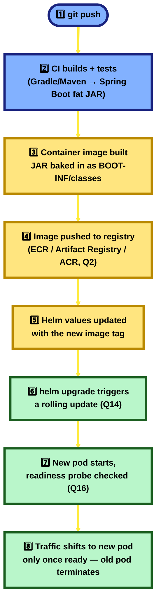
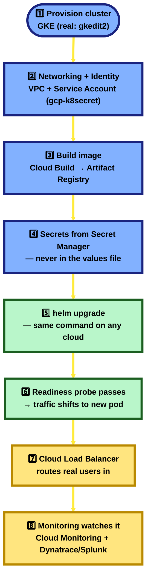

# Cloud Concepts — AWS / GCP / Azure Interview Notes

> Format: **Question → simple-English Answer → diagram/table (only when it genuinely helps)**.
> Every question is tagged `[CLOUD]`. Goal: read this once, understand it, be able to explain it out loud — not memorize jargon.
> Every new term gets a one-liner definition, phrased the way you'd actually say it in an interview.

---

## Table of Contents — by Umbrella (click any question to jump to it)

Every question sits under ONE of these 5 umbrellas — knowing the umbrella tells you *why* a question exists and what comes conceptually before/after it. Click any question to jump straight to it.

<pre>
Cloud Concepts (this doc)
│
├── 🧭 ORIENTATION
│   ├── <a href="#c1">1. What is Cloud Computing — IaaS / PaaS / SaaS?</a>
│   └── <a href="#c2">2. AWS vs GCP vs Azure — service equivalence</a>
│
├── 🌍 CORE INFRASTRUCTURE CONCEPTS
│   ├── <a href="#c3">3. Region vs Availability Zone</a>
│   ├── <a href="#c4">4. What is a VPC (Virtual Private Cloud)?</a>
│   └── <a href="#c5">5. What is IAM, and why least-privilege?</a>
│
├── 🧩 COMPUTE, CONTAINERS & STORAGE
│   ├── <a href="#c6">6. Managed Kubernetes (EKS / GKE / AKS)</a>
│   ├── <a href="#c7">7. Object vs Block vs File Storage</a>
│   └── <a href="#c8">8. Serverless / FaaS</a>
│
├── 📨 MESSAGING & SCALING
│   ├── <a href="#c9">9. Managed Message Queues vs self-hosted Kafka</a>
│   └── <a href="#c10">10. Auto-Scaling in the cloud vs Kubernetes HPA</a>
│
├── 🔒 SECURITY & COST
│   ├── <a href="#c11">11. The Shared Responsibility Model</a>
│   └── <a href="#c12">12. Cost optimization — on-demand vs reserved vs spot</a>
│
└── 🚀 CI/CD, DEVOPS & DEPLOYMENT  (most interview-relevant — grounded in our real app)
    ├── <a href="#c13">13. What is CI/CD, and what does each stage do?</a>
    ├── <a href="#c14">14. Rolling vs Blue-Green vs Canary deployments</a>
    ├── <a href="#c15">15. Infrastructure as Code — our Helm charts</a>
    ├── <a href="#c16">16. Liveness vs Readiness Probes</a>
    ├── <a href="#c17">17. Resource requests/limits in CI/CD</a>
    ├── <a href="#c18">18. git push → pod running — the full walkthrough</a>
    ├── <a href="#c19">19. Secrets management — a real gap found</a>
    └── <a href="#c20">20. Full deployment from scratch — GCP vs AWS vs Azure</a>
</pre>

🧠 **Memorize this line:** *"Orientation first (what cloud even means, and how the Big 3 map to each other), then core infrastructure (region/AZ, VPC, IAM), then compute/containers/storage, then messaging/scaling, then security/cost, then CI/CD & deployment — the last umbrella is the one to lean on hardest, since it's the part most directly grounded in our real application's actual deployment artifacts."*

*(Ordering and service-equivalence terms checked against how AWS, GCP, and Azure's own documentation categorize these concepts, plus standard cloud-certification study guides — not guessed.)*

---

<a name="c1"></a>
## 1. What is Cloud Computing, and what do IaaS/PaaS/SaaS actually mean? `[CLOUD]`

**Simple explanation first:** Instead of buying, racking, and maintaining your own physical servers, you rent computing power, storage, and services from a provider (AWS/GCP/Azure) who owns and runs giant datacenters — you pay for what you use, and you can get more (or less) of it in minutes instead of months.

**A:** Cloud computing comes in three common "how much do I manage myself" layers:

| Layer | You manage | Provider manages | Real-world example |
|---|---|---|---|
| **IaaS** (Infrastructure as a Service) | OS, runtime, app, data | Physical hardware, virtualization, network | A raw virtual machine (EC2, Compute Engine, Azure VM) |
| **PaaS** (Platform as a Service) | App code, data | OS, runtime, patching, scaling infra | A managed database (RDS), or a managed Kubernetes control plane (GKE) |
| **SaaS** (Software as a Service) | Just your data/config | Literally everything else | Gmail, Salesforce, Slack — you never see a server at all |

🆕 **New terms:**
- **IaaS** — "here's a virtual machine, you install and configure everything on top of it yourself."
- **PaaS** — "here's a ready-to-use platform (a database, a runtime), you just bring your code/data."
- **SaaS** — "here's a finished application, you just use it."

🧠 **Memorize this line:** *"IaaS/PaaS/SaaS is a sliding scale of how much YOU manage vs the provider manages — raw VM, to managed platform, to finished product. Most real architectures mix all three: a VM here, a managed DB there, a SaaS email tool for notifications."*

---

<a name="c2"></a>
## 2. AWS vs GCP vs Azure — how do their core services map to each other? `[CLOUD]`

**A:** The three major clouds solve the same problems with different names. Knowing the mapping is what actually gets tested in interviews — the underlying concept is identical across all three.

| Concept | AWS | GCP | Azure |
|---|---|---|---|
| Virtual Machine | EC2 | Compute Engine | Virtual Machines |
| Managed Kubernetes | EKS | GKE | AKS |
| Object Storage | S3 | Cloud Storage | Blob Storage |
| Managed Relational DB | RDS | Cloud SQL | Azure SQL Database |
| Managed NoSQL DB | DynamoDB | Firestore / Bigtable | Cosmos DB |
| Serverless Functions | Lambda | Cloud Functions | Azure Functions |
| Message Queue | SQS | Pub/Sub | Service Bus / Queue Storage |
| CDN | CloudFront | Cloud CDN | Azure CDN |
| Identity & Access | IAM | Cloud IAM | Azure AD / Entra ID |
| Load Balancer | ELB / ALB | Cloud Load Balancing | Azure Load Balancer |
| DNS | Route 53 | Cloud DNS | Azure DNS |
| Container Registry | ECR | Artifact Registry | Azure Container Registry |
| CI/CD | CodePipeline | Cloud Build | Azure DevOps / Pipelines |
| Secrets Management | Secrets Manager | Secret Manager | Key Vault |

🏦 **Real-project grounding:** the real HDFC infra genuinely runs on **GKE (Google Kubernetes Engine)** for at least one environment — confirmed directly from a real Helm values file (`gkedit2_igcb-hdfc-olive-interfaces.yaml`): `serviceAccountName: gcp-k8secret`, and the environment is literally named `gkedit2` ("GKE, DIT env 2"). The SIT sandbox documented in `kubectl.md` (a different environment, reached via SSH to a private IP) looks more like an on-prem/private setup by contrast — so the real picture across environments is a mix, not one single cloud everywhere. I haven't found genuine evidence of AWS- or Azure-specific services in this codebase, so don't claim those as real usage — the table above is general knowledge, grounded only where explicitly marked.

🧠 **Memorize this line:** *"Same concepts, different brand names — EC2/Compute Engine/VM, S3/GCS/Blob, EKS/GKE/AKS. <mark>Interviewers care that you know the mapping exists and can reason about ANY of the three</mark>, not that you've memorized one provider's console."*

---

<a name="c3"></a>
## 3. What is a Region and an Availability Zone, and why do they matter? `[CLOUD]`

**Simple explanation first:** A **Region** is a whole geographic area (e.g. "Mumbai," "US East"). Inside one region, the cloud provider runs several physically separate, independently-powered **Availability Zones (AZs)** — think of them as different buildings on different power grids, close enough for fast networking between them, but far enough apart that one building catching fire doesn't take out the others.

**A:** You place resources across multiple AZs **within** a region for high availability (if one AZ has a power outage, your app keeps running from the others) — this is the cloud version of Q13's "Single Point of Failure" and Q1's "horizontal scaling," just applied to physical infrastructure instead of application servers. You place resources across multiple **regions** when you need disaster recovery from a region-wide event, or when you need data to physically live close to users in different parts of the world (lower latency — see Q14).

🆕 **New terms:**
- **Region** — a geographic area containing multiple data centers, treated as one cloud "location" (e.g. `ap-south-1` on AWS).
- **Availability Zone (AZ)** — one or more physically distinct data centers within a region, with independent power/cooling/networking — the smallest unit you'd distribute across for real fault tolerance.

🧠 **Memorize this line:** *"Multi-AZ protects you from ONE building failing; multi-region protects you from an entire geographic area failing (or gets you closer to a distant user base) — most systems need multi-AZ, few need multi-region, and it costs more the wider you spread."*

---

<a name="c4"></a>
## 4. What is a VPC (Virtual Private Cloud), and how does it relate to on-prem networking? `[CLOUD]`

**Simple explanation first:** A VPC is your own private, isolated slice of the cloud provider's network — like renting a floor in a shared office building, but the walls are actually soundproof: your resources inside it can talk to each other privately, and nothing from outside can see in unless you explicitly open a door.

**A:** Inside a VPC you define:
- **Subnets** — smaller address ranges inside the VPC, usually split into "public" (reachable from the internet, e.g. a load balancer) and "private" (not directly reachable, e.g. a database).
- **Route tables** — rules for where traffic is allowed to go.
- **Security groups / NACLs** — firewall rules controlling exactly what traffic is allowed in/out, down to the port level.

This maps directly onto concepts you already know from Kubernetes networking (`kubectl.md` §3) — a VPC is the cloud-provider-level version of the same idea: isolate, then deliberately open only what's needed.

🆕 **New term — Subnet:** a subdivided range of IP addresses inside a VPC, typically used to separate "things the internet can reach" from "things that should never be reachable directly" (like a database).

🧠 **Memorize this line:** *"A VPC is your own private network inside someone else's datacenter — subnets split it into public-facing and private-only zones, and security groups/NACLs are the firewall rules deciding exactly what can talk to what."*

---

<a name="c5"></a>
## 5. What is IAM, and why is least-privilege access critical in the cloud? `[CLOUD]`

**Simple explanation first:** IAM (Identity and Access Management) is the cloud's system for answering two questions on every single request: **"who are you?"** (authentication) and **"are you allowed to do THIS specific thing?"** (authorization) — down to the level of "this one service account can read from this one storage bucket, and nothing else."

**A:** The core rule interviewers want to hear is **least privilege**: grant only the exact permissions a user/service needs to do its job, nothing more — never hand out broad "admin on everything" access as a shortcut, because a single leaked credential with excess permissions turns a small mistake into a full breach. Real IAM setups use:
- **Users/Groups** — for people.
- **Roles / Service Accounts** — identities assigned to applications/services themselves (not a person) — e.g. the real `gcp-k8secret` service account seen in the HDFC Helm chart (Q2) is exactly this: an identity for a workload, not a human.
- **Policies** — the actual documents that say "this identity can do X on resource Y."

🆕 **New terms:**
- **Least privilege** — grant the minimum permissions needed, nothing extra "just in case."
- **Service Account** — an identity for a piece of software (not a person) to authenticate and act with its own scoped permissions.

🧠 **Memorize this line:** *"IAM answers 'who are you, and are you allowed to do this specific thing' — least privilege means every identity, human or service, gets exactly the access it needs and no more, so one leaked credential doesn't become a full breach."*

---

<a name="c6"></a>
## 6. What is Managed Kubernetes (EKS/GKE/AKS), and how is it different from self-hosting Kubernetes yourself? `[CLOUD]`

**Simple explanation first:** Running Kubernetes yourself means YOU install, patch, upgrade, and keep the "control plane" (the brain that schedules and manages everything) alive and healthy. Managed Kubernetes (EKS/GKE/AKS) means the cloud provider runs and guarantees the control plane for you — you just show up with your containers and say "run these," the same `kubectl` commands you already know from `kubectl.md` still work exactly the same way.

**A:** What the provider takes off your plate: control-plane high availability, Kubernetes version upgrades, etcd (the cluster's internal database) backups, and API-server scaling. What you still own: your worker nodes' sizing (unless you also use a serverless-node option), your own workloads, your own RBAC/security configuration, and your own Helm charts.

🏦 **Real-project grounding:** the real HDFC `gkedit2` environment runs on genuine **GKE** — confirmed via a real Helm chart's `serviceAccountName: gcp-k8secret` (see Q2). Every concept you already know from `kubectl.md` (namespaces, pods, deployments, services, Helm charts) works identically whether the cluster is self-hosted or managed — managed Kubernetes changes who's on call for the control plane, not the `kubectl` interface itself.

🆕 **New term — Control plane:** the part of Kubernetes that makes decisions (scheduling pods, watching desired vs actual state) — as opposed to the "worker nodes," which is where your actual containers run. Managed Kubernetes services take the control plane off your hands.

🧠 **Memorize this line:** *"<mark>Managed Kubernetes (EKS/GKE/AKS) means the provider runs and guarantees the control plane</mark> — you still own your workloads, your Helm charts, and your own RBAC, exactly like self-hosted Kubernetes, just without babysitting the brain of the cluster yourself."*

---

<a name="c7"></a>
## 7. Object Storage vs Block Storage vs File Storage — when do you use each? `[CLOUD]`

**A:**

| Type | What it actually is | Real example | When to use it |
|---|---|---|---|
| **Object Storage** | Flat storage of whole files ("objects"), accessed by a key/URL, no folder hierarchy under the hood | S3, Cloud Storage, Blob Storage | Documents, images, backups, static assets, logs — anything you read/write as a whole file, at any scale |
| **Block Storage** | Raw storage chunked into fixed-size blocks, attached to ONE virtual machine like a hard drive | EBS, Persistent Disk, Azure Disk | A database's own data files, an OS boot volume — anything needing low-latency, direct disk-like access |
| **File Storage** | A shared filesystem multiple machines can mount and read/write at once, with real folders | EFS, Filestore, Azure Files | Shared config/data that many servers need to read/write concurrently (e.g. a shared upload directory across pods) |

🧠 **Memorize this line:** *"Object storage = whole files by key, scales infinitely, cheap (S3/GCS/Blob). Block storage = a virtual hard drive for ONE machine, fast (EBS/Persistent Disk). File storage = a shared network drive many machines mount at once (EFS/Filestore) — pick based on 'is this one whole file, a disk for one VM, or a folder many machines share.'"*

---

<a name="c8"></a>
## 8. What is Serverless / FaaS, and when does it beat running your own server? `[CLOUD]`

**Simple explanation first:** "Serverless" doesn't mean no servers exist — it means YOU never provision, patch, or scale one. You upload a small function; the provider runs it only when triggered (an HTTP call, a file upload, a queue message), and you pay only for the actual execution time — nothing while it's idle.

**A:** Pick serverless/FaaS (Function as a Service: Lambda, Cloud Functions, Azure Functions) when:
- The workload is short-lived, event-triggered, and bursty (a webhook handler, an image-resize-on-upload job) — you'd rather not pay for an always-on server sitting idle most of the day.
- You want zero infrastructure management for a small, self-contained piece of logic.

Stick with a normal server (Spring Boot on a VM/container, Q41) when:
- The workload is long-running, needs a persistent in-memory state/connection pool, or needs predictable low-latency without "cold start" delay (a serverless function that hasn't run recently pays a real startup cost the first time it's invoked).
- The system already has a full framework's worth of shared infrastructure (security, transactions, DI) that would be painful to re-build function-by-function.

🆕 **New term — Cold start:** the delay a serverless function pays the first time it runs after being idle, while the provider spins up a fresh execution environment for it — a real disadvantage the JVM's own startup cost (Q41) makes worse for Java-based serverless functions specifically, compared to lighter runtimes like Node.

🧠 **Memorize this line:** *"Serverless means you never manage the server, only the function — great for short, event-triggered, bursty work where you don't want to pay for idle time; a bad fit for long-running, stateful, low-latency-critical systems, which is exactly the profile of something like the real HDFC loan-origination platform (Q35)."*

---

<a name="c9"></a>
## 9. Managed Message Queues (SQS/Pub-Sub/Service Bus) vs self-hosted Kafka — when would you pick which? `[CLOUD]`

**A:** Both solve the same core problem covered in [System Design.md Q9](System%20Design.md#9-what-is-a-message-queue-and-why-decouple-services-with-one-hld) (decoupling sender and receiver) and the [Kafka deep-dive](System%20Design.md#kafka-deep-dive) — the choice is about operational ownership and the exact delivery guarantees you need:

| | Managed queues (SQS / Pub-Sub / Service Bus) | Self-hosted / managed Kafka |
|---|---|---|
| Who runs it | The cloud provider — zero servers for you to manage | You (or a managed-Kafka offering like Confluent Cloud) |
| Message replay | Usually NOT designed for replaying old messages once consumed | A core Kafka feature — consumers track their own offset (see §0 of the Kafka deep-dive) and can re-read history |
| Throughput/ordering model | Simple queue semantics (SQS), or topic-based pub/sub (Pub/Sub, Service Bus) | Partition-based, ordered-within-a-partition, built for very high sustained throughput |
| Best fit | Simpler event/task queues, glue between serverless functions, lower operational overhead | Event streaming at scale, multiple independent consumer groups reading the same history, systems already investing in Kafka expertise |

🏦 **Real-project grounding:** the real HDFC codebase uses **Kafka**, not a cloud-managed queue — confirmed as an **external, separately-managed broker** (`10.130.0.250:9092`, per Q35 §G), not something spun up inside the Kubernetes namespace itself, and not a managed cloud offering either as far as the evidence shows.

🧠 **Memorize this line:** *"Managed queues (SQS/Pub-Sub/Service Bus) trade some flexibility for zero operational overhead; Kafka trades operational ownership for replay, partition-based scale, and multiple independent consumer groups reading the same stream — the real HDFC project's external Kafka broker is exactly the kind of investment you make when you need that scale and control."*

---

<a name="c10"></a>
## 10. What is Auto-Scaling in the cloud, and how does it relate to Kubernetes' own HPA? `[CLOUD]`

**A:** There are two layers that both get called "auto-scaling," and interviewers expect you to tell them apart:
- **Infrastructure-level auto-scaling** (an AWS Auto Scaling Group, a GCP Managed Instance Group) — adds/removes whole **virtual machines** based on load, so you're not paying for idle capacity and don't fall over during a spike.
- **Kubernetes' own Horizontal Pod Autoscaler (HPA)** — adds/removes **pods** (copies of your app) within the machines you already have, based on CPU/memory/custom metrics.

In a cloud-managed Kubernetes setup (Q6), both often run together: HPA scales pods first; if the existing nodes run out of room for more pods, a **Cluster Autoscaler** kicks in underneath HPA and adds a whole new VM/node to make room — two layers of the same idea, stacked.

🆕 **New term — Cluster Autoscaler:** a Kubernetes add-on that adds/removes whole worker nodes (VMs) based on whether pods are unschedulable due to lack of room — the node-level counterpart to HPA's pod-level scaling.

🧠 **Memorize this line:** *"HPA scales pods on the machines you already have; Cluster Autoscaler (or a cloud Auto Scaling Group) scales the machines themselves. Real systems stack both — more pods first, and if there's no room left, more nodes underneath."*

---

<a name="c11"></a>
## 11. What is the Shared Responsibility Model in cloud security? `[CLOUD]`

**Simple explanation first:** Renting an apartment doesn't mean the landlord locks your front door for you every night — they're responsible for the building's structure and shared utilities; you're responsible for locking your own door and not leaving valuables in plain sight. Cloud security works the same way.

**A:** The cloud provider is responsible for **security OF the cloud** — physical datacenter security, the hardware, the underlying virtualization/network infrastructure, and (for managed services) the managed component itself (e.g. patching the Kubernetes control plane, Q6). YOU are responsible for **security IN the cloud** — how you configure IAM (Q5), how you set up your VPC/security groups (Q4), what you put in your containers, your own application-level authentication/authorization, and your own data encryption choices (this exact split is what `System Design.md` Q40 covers for encryption specifically). Exactly where the line sits shifts by service type: for a raw VM (IaaS) you own almost everything above the hypervisor; for a managed database (PaaS) the provider also patches the OS/DB engine; for SaaS you're mostly responsible for just your own data and user access.

🧠 **Memorize this line:** *"The provider secures the cloud itself — hardware, physical security, and the managed layers they control; you secure what you put IN it — IAM, network rules, application code, and your own data. The more 'managed' the service, the more the provider's slice grows, but it never goes to zero on your side."*

---

<a name="c12"></a>
## 12. Cloud cost optimization — on-demand vs reserved vs spot/preemptible instances `[CLOUD]`

**A:** Three ways to buy the same compute, at three different price/commitment trade-offs:

| Pricing model | What you're trading | Best for |
|---|---|---|
| **On-Demand** | Pay full price, per-second/hour, no commitment, can stop anytime | Unpredictable or short-term workloads, early-stage projects still finding their real usage pattern |
| **Reserved / Committed Use** | Commit to 1-3 years of usage upfront, in exchange for a large discount (often 30-70% off) | Steady, predictable, always-on workloads you're confident will keep running (e.g. a production database that's never turned off) |
| **Spot / Preemptible** | Deep discount (often 70-90% off), but the provider can reclaim the machine on short notice when it needs the capacity back | Fault-tolerant, interruptible batch work — background jobs, CI/CD runners, big data processing that can checkpoint and resume |

🧠 **Memorize this line:** *"On-demand for unpredictable/short-term work, reserved/committed-use for steady always-on workloads you're sure about, spot/preemptible for interruptible batch work where losing a machine mid-task is genuinely fine — real cost optimization usually blends all three across one system, not picking just one for everything."*

---

<a name="c13"></a>
## 13. What is CI/CD, and what does each stage actually do? `[CLOUD]`

**Simple explanation first:** Instead of one person manually building the app, copying files to a server, and restarting it by hand every time — which is slow and error-prone — a pipeline does it the same way, automatically, every single time code changes.

**A:**
- **CI (Continuous Integration)** — every time someone pushes code, it's automatically built and tested. The point: catch a broken build or failing test within minutes, not days later.
- **CD** has two common meanings, and interviewers expect you to know both: **Continuous Delivery** — every change that passes CI is automatically packaged and made ready to deploy, but a human still clicks "go" — vs. **Continuous Deployment** — every change that passes CI goes to production automatically, no human in the loop at all.
- **The typical stage chain:** Source → Build → Test → Package (build a container image) → Push (to a registry) → Deploy (roll it out) → Verify (health checks confirm it's actually working).

🏦 **Real-project grounding:** I haven't found the actual pipeline definition files (a Jenkinsfile, GitLab CI YAML, GitHub Actions workflow) in what I've read, so I can't claim to know the exact tool — but the real deployment ARTIFACTS this pipeline would produce genuinely exist: Spring Boot fat JARs packaged into container images (`kubectl.md` §8 — real pods run `BOOT-INF/classes/**/*.class`, a compiled JAR, not raw source), and separate, environment-specific Helm values files per service per environment (`dit2`, `sitcr2`, `gkedit2`, and more — real files, different config per environment). Database schema changes go through their OWN separate, versioned pipeline — a dedicated Liquibase repo (`K4_CLO_HDFC_Liquibase`) — which is itself a real, deliberate CI/CD pattern: **never let schema changes and app deploys be the same uncontrolled step.**

🆕 **New terms:**
- **Pipeline** — the automated chain of stages (build, test, deploy) code goes through on its way to production.
- **Artifact / Image registry** — where a built container image is stored after packaging, and pulled from during deployment (ECR/Artifact Registry/ACR, Q2).

🧠 **Memorize this line:** *"CI catches broken code early by building/testing every commit; CD is either 'ready to deploy on a click' (Delivery) or 'deploys itself' (Deployment) — our real project's evidence is Docker-packaged Spring Boot JARs and per-environment Helm values files, plus schema migrations kept in their OWN separate versioned pipeline (Liquibase), deliberately decoupled from the app deploy."*

---

<a name="c14"></a>
## 14. Rolling vs Blue-Green vs Canary deployments — which fits a system like ours? `[CLOUD]`

**A:** Three ways to roll out a new version without a hard outage:

| Strategy | How it works | Trade-off |
|---|---|---|
| **Rolling** (Kubernetes' own default) | Replace old pods with new ones a few at a time — some old, some new running simultaneously mid-rollout | Simple, no extra infra — but if the new version is bad, some real users already hit it before you notice |
| **Blue-Green** | Run two full environments ("blue" = current, "green" = new); switch ALL traffic over at once once green is verified | Instant rollback (just switch back), but needs double the infrastructure running at once |
| **Canary** | Send a small % of real traffic to the new version first, watch it closely, then gradually ramp up to 100% | Catches a bad release with minimal blast radius — but needs solid monitoring to actually notice a problem in that small slice |

🏦 **Real-project grounding:** the real HDFC Helm charts don't show an explicit blue-green/canary setup in what I've read — the evidence points to Kubernetes' own default **rolling update**, which is exactly what `kubectl rollout history deploy/<name>` (`kubectl.md` §5) is built to inspect. Canary/blue-green would need extra tooling (e.g. a service mesh, or a deployment controller like Argo Rollouts) on top of plain Kubernetes — no evidence of that here.

🧠 **Memorize this line:** *"Rolling is Kubernetes' free default — good enough for most systems if your health probes are solid. Blue-green gives instant rollback at double the infra cost; canary gives the smallest blast radius but needs real monitoring to actually catch a problem in that small slice of traffic — the real HDFC setup uses plain rolling updates, not the fancier two."*

---

<a name="c15"></a>
## 15. What is Infrastructure as Code (IaC), and how do our Helm charts already do this? `[CLOUD]`

**Simple explanation first:** Instead of clicking through a cloud console (or running one-off `kubectl` commands) to set up servers/resources — which nobody can perfectly repeat later, and nobody can review like a code change — you write the desired infrastructure down as version-controlled files, and a tool applies them consistently, every time.

**A:** IaC tools work in two broad styles: **declarative** (you describe the END state you want, e.g. "3 replicas, this image, these limits" — the tool figures out how to get there; Kubernetes YAML/Helm and Terraform both work this way) vs **imperative** (you script the exact steps to take, in order). Declarative is the industry default now specifically because it's safely re-runnable — applying the same file twice does nothing extra the second time.

🏦 **Real-project grounding:** the real HDFC Helm chart (`ditsfr_igcb-clo-channel-api-service.yaml`, per `kubectl.md` §9 and System Design.md Q35 §G) **is** Infrastructure as Code, already in your hands:
```yaml
resources:
  main:
    requests: { cpu: "50m", memory: "150Mi" }
    limits:   { cpu: "200m", memory: "1000Mi" }
security:
  runAsNonRoot: true
  readOnlyRootFilesystem: true
  allowPrivilegeEscalation: false
```
This is declarative, version-controlled, code-reviewable infrastructure — resource sizing and security hardening defined in a file, not clicked into existence by hand. The separate Liquibase repo does the exact same thing for database schema.

🆕 **New terms:**
- **Declarative vs imperative** — describing the end state you want vs scripting the exact steps to get there.
- **Helm chart/values file** — Kubernetes' own templated IaC format; the "values file" is where per-environment differences (like the resource limits above) actually live.

🧠 **Memorize this line:** *"IaC means infrastructure is a reviewable, version-controlled file, not a manual click — our real Helm chart is a genuine example: resource limits and security hardening declared in YAML, the same file applied identically to every environment it targets."*

---

<a name="c16"></a>
## 16. Liveness vs Readiness Probes — how Kubernetes uses them during a deployment `[CLOUD]`

**Simple explanation first:** Imagine a new employee's first day — **readiness** is "are they done with onboarding and actually able to take calls yet?" (don't route customers to them until yes); **liveness** is "are they still at their desk at all, or did they walk out and never come back?" (if they walked out, get a replacement).

**A:**
- **Liveness probe** — Kubernetes periodically checks: is this container still alive/responsive? If it fails repeatedly, Kubernetes **restarts** that container — this catches a hung process that's technically running but no longer doing anything useful.
- **Readiness probe** — Kubernetes checks: is this container ready to receive real traffic? If it fails, Kubernetes **stops routing traffic to it** (but doesn't restart it — it might just be starting up or temporarily busy).

**Why this matters specifically for CI/CD/deployments:** during a rolling update (Q14), Kubernetes will NOT send live traffic to a brand-new pod until its readiness probe passes — this is the actual mechanism that makes a rolling deployment safe. Without it, a new pod that's still starting up (DB connections not ready, cache not warmed) would get real user traffic immediately and fail requests.

🏦 **Real-project grounding:** the real HDFC Helm chart wires both probes directly to Spring Boot Actuator:
```yaml
probeconfig:
  livenessCheckPath: "/cloditcr/cloportalapi/loan-application/v1/actuator/health/liveness"
  readinessCheckPath: "/cloditcr/cloportalapi/loan-application/v1/actuator/health/readiness"
```
This resolves a gap this doc set flagged earlier (before these paths were confirmed) — health probes genuinely exist and are wired to Spring's own `/actuator/health/liveness`/`/readiness` endpoints, not a custom check.

🧠 **Memorize this line:** *"Liveness = 'restart me if I'm stuck,' readiness = 'don't send me traffic until I say I'm ready' — <mark>readiness is the specific mechanism that makes a rolling deployment safe</mark>, and our real Helm chart wires both straight to Spring Boot Actuator's own health endpoints."*

---

<a name="c17"></a>
## 17. Kubernetes resource requests/limits — and why CI/CD pipelines care `[CLOUD]`

**A:** Two separate numbers per container:
- **Requests** — what the scheduler guarantees is reserved for this pod when deciding which node to place it on. Under-setting this risks the pod landing on an already-busy node and getting starved.
- **Limits** — the hard ceiling; the container is throttled (CPU) or **killed** (`OOMKilled`, for memory) if it tries to go over.

**Why this belongs in a CI/CD conversation, not just a Kubernetes one:** a pipeline that deploys without deliberately-set requests/limits either wastes cluster capacity (everything defaults to "give it whatever's free") or causes surprise `OOMKilled` restarts in production the first time real traffic hits it — sizing these correctly, based on real observed usage, is itself part of a mature deployment process, not a one-time setting.

🏦 **Real-project grounding:** the real HDFC Helm chart sets genuine, deliberate numbers — `requests: { cpu: "50m", memory: "150Mi" }`, `limits: { cpu: "200m", memory: "1000Mi" }` — someone chose these on purpose; they aren't Kubernetes' defaults (there is no default — an unset container has no request/limit at all, which is itself a real risk this chart deliberately avoids).

🧠 **Memorize this line:** *"<mark>Requests = what's guaranteed for scheduling; limits = the hard ceiling before throttling/OOMKill.</mark> Our real Helm chart sets both deliberately (50m/150Mi requests, 200m/1000Mi limits) — leaving these unset is itself a real production risk, not a neutral default."*

---

<a name="c18"></a>
## 18. What actually happens between `git push` and a pod running in production? `[CLOUD]`

**A:** Tying Q13–Q17 together into one real, end-to-end walkthrough for a system shaped like ours:



**Honest note on this diagram:** the LAST four steps (D through H) are directly evidenced by real artifacts already found in this project — Helm values files per environment, real resource limits, real probe paths wired to Actuator. The FIRST three steps (the actual CI tool/pipeline script) are the standard, expected flow for a Docker-packaged Spring Boot app — not something I've directly confirmed in a pipeline definition file, so say it as "this is how it would work," not "I've seen the Jenkinsfile."

🧠 **Memorize this line:** *"Code becomes a JAR, the JAR becomes an image, the image gets pushed and referenced in a Helm values file, and a rolling update only shifts traffic to the new version once its readiness probe passes — that last part is the real safety net for the whole pipeline."*

---

<a name="c19"></a>
## 19. Secrets management in CI/CD — and the real gap worth knowing `[CLOUD]`

**Simple explanation first:** A pipeline needs credentials (DB passwords, API keys) to actually deploy and run the app — the question is whether those credentials live as plain text in a file anyone with repo access can read, or get injected at deploy time from somewhere that controls who can see them.

**A:** The right pattern: secrets live in a dedicated secret manager (Secrets Manager / Secret Manager / Key Vault, Q2) or a Kubernetes `Secret` backed by one, and the pipeline/pod pulls them at deploy/runtime — never committed as plain text in a values file that sits in source control.

🏦 **Real-project grounding — an honest, real gap found in this exact codebase:** real Helm values files across two different services (Channel API and Integrator) have actual DB/admin passwords committed in plain text as literal string values (redacted here on purpose — never write real credential values into a doc, even your own). One of them is also a genuinely weak, short, guessable value, not just "in the wrong place." This is a current violation of the pattern above, not a hypothetical — anyone with read access to these config files has working credentials. The fix is exactly what Q2's "Secrets Management" row names: move these into a real secret manager, and have the deploy step inject them, so the values file only ever references a secret's *name*, never its actual value.

🧠 **Memorize this line:** *"Secrets belong in a secret manager, injected at deploy time — never committed in a values.yaml. Our real project currently violates this in at least two services (plaintext passwords in Helm charts, at least one of them genuinely weak), which is exactly the kind of finding proper CI/CD secrets handling is supposed to prevent."*

---

<a name="c20"></a>
## 20. Walk me through deploying our application from scratch — GCP-first, compared across clouds `[CLOUD]`

**Why this exact question comes up:** interviewers love "you use GCP — walk me through standing this up from nothing." Answer it as ONE continuous story, naming the real GCP service at each step, then naming its AWS/Azure equivalent to show you understand the *concept*, not just one vendor's button.

| Step | What happens | GCP (what we actually use) | AWS equivalent | Azure equivalent |
|---|---|---|---|---|
| 1. Cluster | Stand up a managed Kubernetes cluster | <mark>**GKE**</mark> — real evidence: our `gkedit2` environment (Q2) | EKS | AKS |
| 2. Networking | An isolated network for the cluster to live in | VPC | VPC | VNet |
| 3. Identity | Give the app's pods a scoped identity | <mark>**Service Account**</mark> — real evidence: `serviceAccountName: gcp-k8secret` in our Helm chart (Q5) | IAM Role (via IRSA) | Managed Identity |
| 4. Build & package | App code becomes a container image | Cloud Build → Artifact Registry | CodeBuild → ECR | Azure Pipelines → ACR |
| 5. Secrets | Real credentials, kept OUT of the config file | Secret Manager (Q19 — a real gap we still have) | Secrets Manager | Key Vault |
| 6. Deploy | Roll the image onto the cluster | <mark>**Helm chart → `helm upgrade`**</mark> | *identical command* | *identical command* |
| 7. Health checks | Kubernetes decides when a new pod is safe for traffic | Liveness/Readiness probes (Q16) | *identical behavior* | *identical behavior* |
| 8. Expose to users | Route real traffic to the running pods | Cloud Load Balancing | ALB / ELB | Azure Load Balancer |
| 9. Watch it run | See what's actually happening in production | Cloud Monitoring/Logging + our real Dynatrace/Splunk (System Design.md Q39) | CloudWatch | Azure Monitor |



<mark>**The single most important point to make in this answer:** once you're inside the Kubernetes layer (step 5 onward), the mechanics are IDENTICAL no matter which cloud sits underneath — same Helm chart, same `helm`/`kubectl` commands, same probe behavior. Cloud choice only really changes steps 1–4 (how the cluster, identity, and secrets get provisioned) — that portability is the entire reason Kubernetes exists.</mark>

**The short spoken answer, ready to say out loud:** *"We deploy on GKE — Google's managed Kubernetes. From scratch, that means: provision the cluster, set up a VPC and a service account for the pods (we have a real one, `gcp-k8secret`), build the app into a container image via Cloud Build into Artifact Registry, keep real secrets in Secret Manager rather than in the Helm values file, then `helm upgrade` to roll it out — Kubernetes only shifts traffic to the new pods once their readiness probe passes. From there, a Cloud Load Balancer routes real traffic in, and we watch it with Cloud Monitoring plus Dynatrace and Splunk. The one thing I'd stress: everything from the Helm deploy onward is exactly the same regardless of cloud — GKE, EKS, or AKS — which is the whole point of building on Kubernetes instead of directly on one cloud's proprietary compute service."*

---

## Quick Recap Table

| # | Concept | One-line memory hook |
|---|---|---|
| 1 | Cloud Computing / IaaS-PaaS-SaaS | Sliding scale of how much YOU manage vs the provider |
| 2 | AWS vs GCP vs Azure | Same concepts, different brand names |
| 3 | Region vs Availability Zone | Multi-AZ = building fails; multi-region = whole area fails |
| 4 | VPC | Your own private, isolated slice of the cloud network |
| 5 | IAM / Least Privilege | Minimum access needed, nothing extra "just in case" |
| 6 | Managed Kubernetes (EKS/GKE/AKS) | Provider runs the control plane; you still own your workloads |
| 7 | Object vs Block vs File Storage | Whole file by key, vs disk for one VM, vs shared network drive |
| 8 | Serverless / FaaS | You manage the function, not the server; watch for cold starts |
| 9 | Managed Queues vs Kafka | Zero-ops simplicity vs replay + partition-based scale |
| 10 | Auto-Scaling vs HPA | HPA scales pods; Cluster Autoscaler/ASG scales the machines |
| 11 | Shared Responsibility Model | Provider secures the cloud; you secure what's IN it |
| 12 | Cost models | On-demand, reserved/committed, spot/preemptible |
| 13 | CI/CD | Build+test every commit (CI); ready-to-deploy or auto-deploys (CD) |
| 14 | Rolling/Blue-Green/Canary | Gradual replace vs instant switch vs small-% test first |
| 15 | Infrastructure as Code | Version-controlled, reviewable config, not manual clicks |
| 16 | Liveness vs Readiness Probes | Restart-if-stuck vs don't-route-traffic-until-ready |
| 17 | Resource Requests/Limits | Guaranteed scheduling floor vs hard ceiling (OOMKilled) |
| 18 | git push → pod running | JAR → image → registry → Helm → rolling update → traffic shift |
| 19 | Secrets in CI/CD | Vault-injected at deploy time, never committed in values.yaml |
| 20 | Full deployment, GCP vs AWS vs Azure | GKE/EKS/AKS differ; Helm/kubectl mechanics are identical everywhere |
