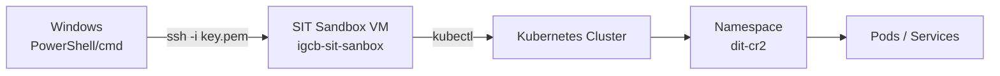
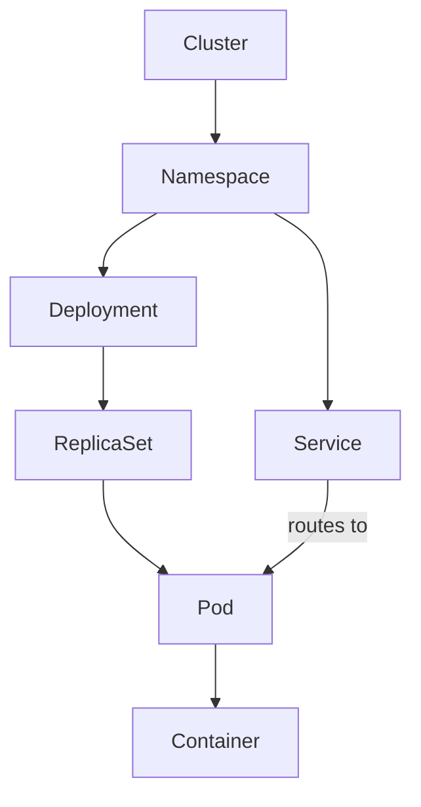

# kubectl & Linux Notes

Personal cheatsheet: SIT sandbox access, core Linux commands, and core
Kubernetes/`kubectl` basics. Kept short on purpose — only what's actually used.

## Index — by Umbrella (click any section to jump to it)

<pre>
kubectl.md
│
├── 🔑 ACCESS & SETUP
│   ├── <a href="#1-access-flow">1. Access Flow</a>
│   └── <a href="#2-connecting-to-the-sandbox">2. Connecting to the Sandbox</a>
│
├── 📚 CORE CONCEPTS  (background knowledge, no risk)
│   ├── <a href="#3-kubernetes-object-hierarchy">3. Kubernetes Object Hierarchy</a>
│   └── <a href="#4-linux-essentials">4. Linux Essentials</a>
│
├── 🛠️ COMMAND REFERENCE
│   └── <a href="#5-kubectl-essentials">5. kubectl Essentials</a>
│
├── 🏢 PROJECT-SPECIFIC
│   └── <a href="#6-project-notes-dit-cr2">6. Project Notes (dit-cr2)</a>
│
└── 🛡️ SAFETY & PROCEDURES  (read before touching a live pod)
    ├── <a href="#7-guardrails">7. Guardrails</a>
    ├── <a href="#8-deployed-image-vs-source-code">8. Deployed Image vs. Source Code</a>
    └── <a href="#9-safely-inspecting-a-class-inside-a-pod-javap">9. Safely Inspecting a Class Inside a Pod (javap)</a>
</pre>

---

## 1. Access Flow



---

## 2. Connecting to the Sandbox

```
ssh -i D:\putty\igcb-sit-sanbox-devuser.pem devuser@10.130.0.31
```

Key was converted once from PuTTY's `.ppk` via PuTTYgen → *Conversions → Export
OpenSSH key*. Original: `D:\putty\igcb-sit-sanbox-devuser.ppk`.

Shortcut — add to `%USERPROFILE%\.ssh\config`:

```
Host sitsandbox
    HostName 10.130.0.31
    User devuser
    IdentityFile D:\putty\igcb-sit-sanbox-devuser.pem
```

Then just: `ssh sitsandbox`

**One-off remote command** — bash functions (aliases) in `~/.bashrc` don't
load in a plain non-interactive `ssh host "cmd"`. Force interactive bash:

```
ssh sitsandbox "bash -ic getpods_ditcr2"
```

---

## 3. Kubernetes Object Hierarchy



- **Namespace** — logical partition (e.g. `igcb-hdmvp1-p28349-dit-cr2`)
- **Deployment** — desired state (image, replica count) for a set of pods
- **ReplicaSet** — ensures N pod copies are running (managed by Deployment)
- **Pod** — smallest unit; one or more containers sharing network/storage
- **Service** — stable network endpoint routing traffic to matching pods

---

## 4. Linux Essentials

| Command | Use |
|---|---|
| `ls -la` | list files incl. hidden, with permissions |
| `cd`, `pwd` | change/print directory |
| `cat file` / `less file` | view file contents |
| `tail -f file` | follow a growing log file live |
| `grep -r "text" .` | search text recursively |
| `ps aux` / `top` | running processes / live resource usage |
| `df -h` / `du -sh *` | disk space free / folder sizes |
| `chmod`, `chown` | change permissions / ownership |
| `kill -9 <pid>` | force-kill a process |
| `history` | recent command history |

---

## 5. kubectl Essentials

Namespace shorthand used below: `-n igcb-hdmvp1-p28349-dit-cr2`

```
# list pods / deployments / services
kubectl -n <ns> get pods
kubectl -n <ns> get deploy -o wide
kubectl -n <ns> get svc

# inspect
kubectl -n <ns> describe pod <pod-name>

# logs
kubectl -n <ns> logs <pod-name> -c <container> --tail=200
kubectl -n <ns> logs <pod-name> -c <container> --previous   # last crashed run

# rollout / image info
kubectl -n <ns> rollout history deploy/<name>
kubectl -n <ns> get deploy <name> -o jsonpath='{.spec.template.spec.containers[*].image}'
```

<span style="color:red">🔴 **RISK — requires explicit sign-off before running, every time (see §7 Guardrails):**</span>
```
kubectl -n <ns> exec -it <pod-name> -- /bin/sh    # or /bin/bash if the image has it
```
This opens a live interactive shell inside a real pod — never run it as part of the routine `get`/`describe`/`logs` flow above.

**Gotcha — the pod exists but you get `Error from server (NotFound): pods "..." not found`:**
This happens when you skip `-n <namespace>` and your shell has no default namespace set — kubectl looks in `default`, doesn't find your pod there, and reports it as missing even though `get pods` clearly showed it running. Every command needs an explicit `-n <namespace>` unless you've run `kubectl config set-context --current --namespace=<ns>` first. Real example: `kubectl exec -it <pod> -- /bin/bash` failed with `NotFound`; adding `-n igcb-hdmvp1-p28349-dit-cr2` immediately worked.

---

## 6. Project Notes (dit-cr2)

Namespace: `igcb-hdmvp1-p28349-dit-cr2`

Saved alias: `getpods_ditcr2` (defined in `~/.bashrc` on the sandbox)

Services running there:

- `ditcr2-igcb-clo-channel-api` — backend API for this repo
- `ditcr2-igcb-cloportal-ui` — this Angular CLO channel UI
- `ditcr2-igcb-clo-document-manager-svc`
- `ditcr2-igcb-clo-integrator-svc`
- `ditcr2-igcb-hdfc-olive-interfaces-svc`
- `ditcr2-igcb-lending-clo-lettermgmt-svc`
- `ditcr2-igcb-los-common-de-svc`
- `ditcr2-igcb-los-customer-console-api-svc`
- `ditcr2-igcb-los-masters-svc`
- `ditcr2-igcb-rlo-initiation-svc`

---

## 7. Guardrails

- **Read-only only**: `get`, `describe`, `logs`, `rollout history`. Never run any of these without explicit sign-off first, every time:
  <span style="color:red">🔴 `delete`</span> · <span style="color:red">🔴 `exec`</span> · <span style="color:red">🔴 `apply`</span> · <span style="color:red">🔴 `scale`</span> · <span style="color:red">🔴 `edit`</span> · <span style="color:red">🔴 `rollout restart`</span>
- Key file permissions locked down via:
  ```
  icacls "D:\putty\igcb-sit-sanbox-devuser.pem" /inheritance:r
  icacls "D:\putty\igcb-sit-sanbox-devuser.pem" /grant:r "%USERNAME%:(R)"
  ```

---

## 8. Deployed Image vs. Source Code

A pod runs a **built artifact**, not the source repo — `exec`-ing into a pod (even if it were allowed) would not surface `.java`/`.ts` files:

- **Java pods** run a packaged JAR. Unzip one and you get `BOOT-INF/classes/**/*.class` — compiled bytecode, not `.java`. The real source is only in the git repo.
- **Angular pods** run nginx serving a production build — `main.<hash>.js`, `polyfills.<hash>.js`, minified and bundled. Not the original `.component.ts` files.

What a pod IS genuinely useful for (all within the read-only guardrail above):
- `kubectl logs` — real runtime errors/warnings (e.g. an actual connection-pool exception, not just theory)
- `kubectl describe pod` — real resource limits, restart counts, env vars, image tag actually running
- `kubectl get deploy -o jsonpath='{.spec.template.spec.containers[*].image}'` — confirms exactly which build is live
- With <span style="color:red">🔴 `exec`</span> (sign-off required) + `javap`, method signatures and bytecode-level call flow of a specific class — see §9. Still not the original source, but genuinely more than logs/describe alone give you.

One-liner: **the pod tells you how the code is *behaving*; the git repo is the only place that has the code itself.**

---

## 9. Safely Inspecting a Class Inside a Pod (`javap`)

**Goal:** check a compiled class's method signatures (and optionally bytecode) — without touching `app.jar`, without extracting the whole JAR, without restarting/modifying anything. <span style="color:red">🔴 Requires `exec` sign-off (see §7)</span> since it needs a shell in the pod.

**Why `javap -classpath app.jar <FQCN>` alone fails with `class not found`:** a Spring Boot fat JAR nests classes under `BOOT-INF/classes/...`, not at the JAR root — `javap` doesn't treat that nested path as a classpath root on its own.

**The safe procedure — extract ONE class only, inspect, delete immediately:**
```
# 1. find the class path
jar tf /opt/app/app.jar | grep -i "<keyword>"

# 2. extract ONLY that one class, into /tmp (never /opt/app)
cd /tmp
jar xf /opt/app/app.jar BOOT-INF/classes/<package/path>/<ClassName>.class

# 3. inspect
javap -p /tmp/BOOT-INF/classes/<package/path>/<ClassName>.class        # signatures only
javap -p -c /tmp/BOOT-INF/classes/<package/path>/<ClassName>.class     # + bytecode (shows which methods it calls)

# 4. clean up immediately, verify
rm -rf /tmp/BOOT-INF
ls -la /tmp   # confirm nothing left behind
```

One-liner (extract → inspect → cleanup atomically, so a copy-paste mistake can't skip step 4):
```
cd /tmp && jar xf /opt/app/app.jar BOOT-INF/classes/<path>.class && javap -p -c /tmp/BOOT-INF/classes/<path>.class; rm -rf /tmp/BOOT-INF
```

**Hard rules:**
- <span style="color:red">🔴 **Never run `jar xf app.jar` with no path**</span> — extracts the ENTIRE JAR (100+ MB) into the current directory. Always give `jar xf` the one specific class path, never the bare command.
- Always work in `/tmp`, never `/opt/app`.
- Always `rm -rf /tmp/BOOT-INF` right after, verify with `ls -la /tmp`.
- <span style="color:red">🔴 Never modify `app.jar`, never restart/redeploy</span> — read-only inspection only, no exceptions.

**Honest limit, stated plainly:** running `jar`/`javap` inside the container uses a small amount of real CPU/memory while it executes — any process does. This procedure minimizes and bounds that (one small file, briefly, in `/tmp`, deleted immediately) — it does not make the impact literally zero, and it doesn't claim to. It never touches the running JVM's own heap or restarts anything.

**What you actually get vs. real source:** `javap -p` shows method signatures; `-c` adds raw bytecode — enough to confirm, e.g., that `ControllerX.someMethod()` calls `ServiceY.otherMethod()` (real call-flow tracing). It is NOT the original `.java` — no real variable names beyond what bytecode retains, no comments, low-level control flow. For anything beyond "does this exist, what does it call," the git repo source (already available, read-only) is far more readable — use this technique to confirm what's actually *deployed*, not as the primary way to read code.
